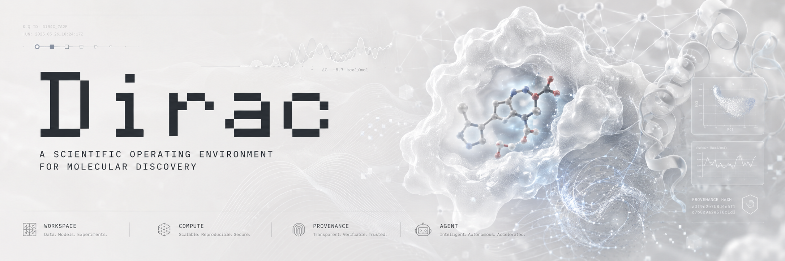
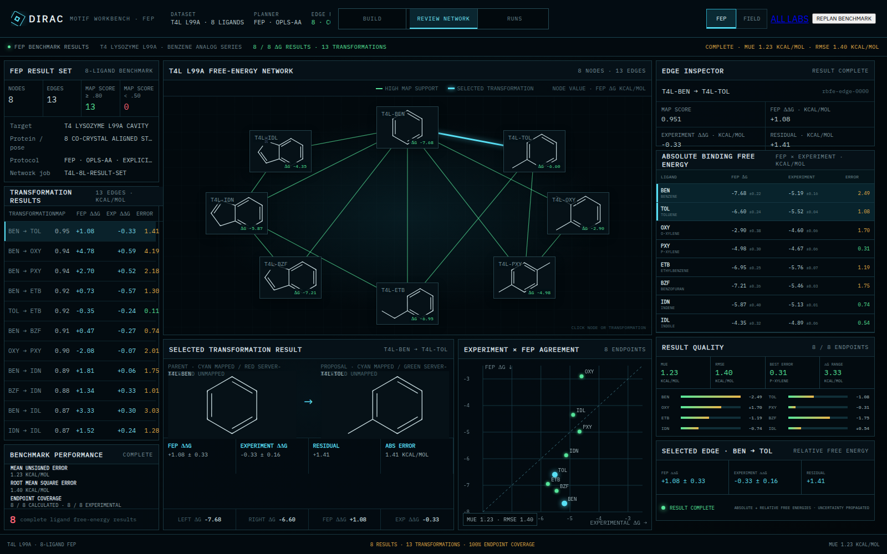
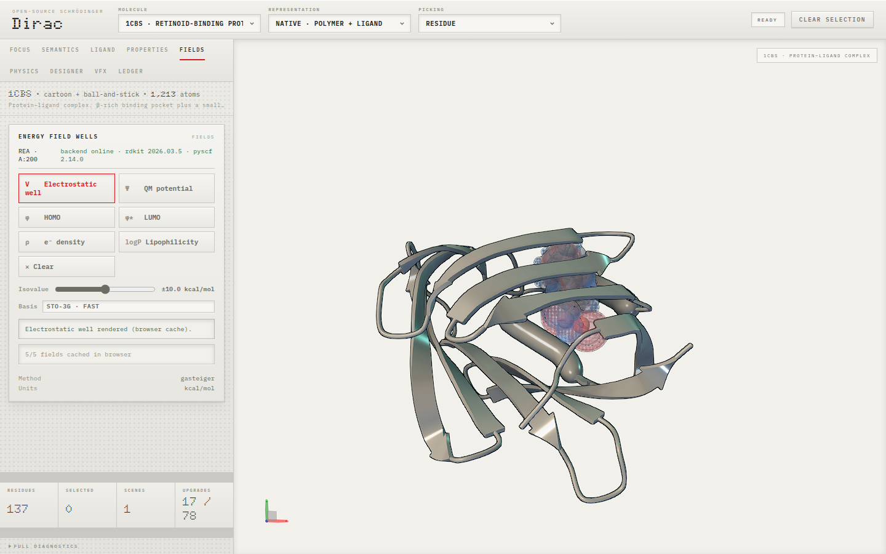
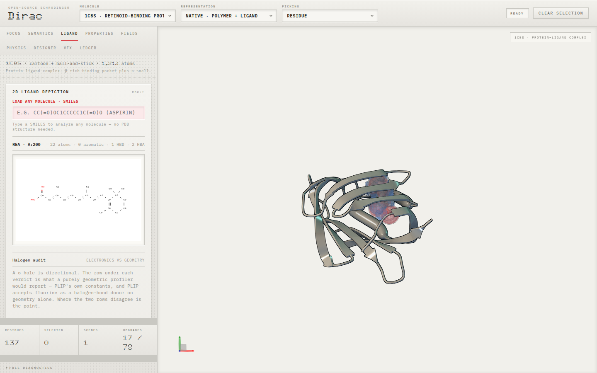
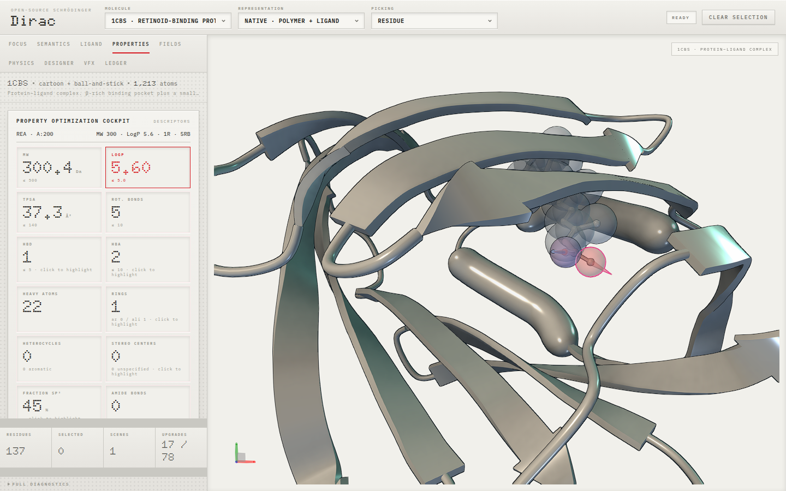
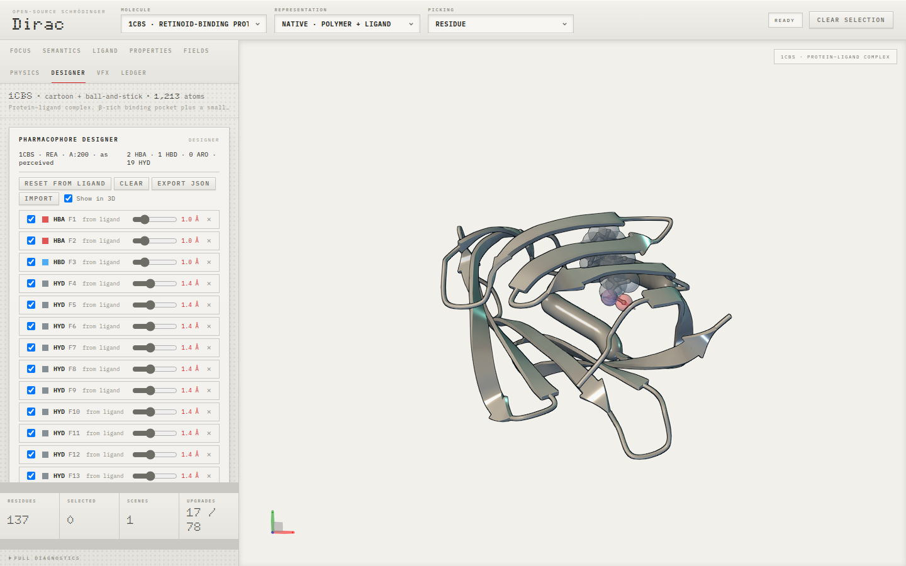
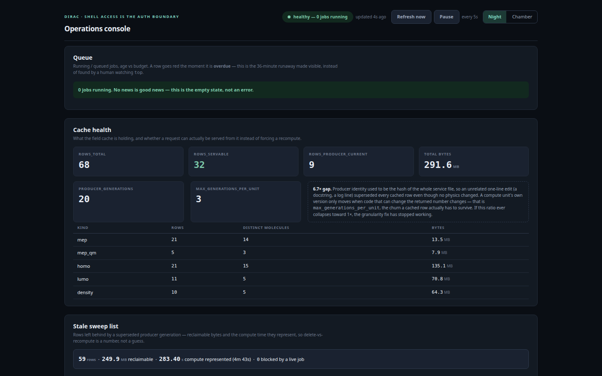

# Dirac

[](https://github.com/ivanicu/Dirac/actions/workflows/node.yml)
[](https://github.com/ivanicu/Dirac/actions/workflows/dirac.yml)
[](LICENSE)

**An open molecular discovery environment for interactive design, scientific computation,
molecular ML, and traceable scientific workflows.**

> **Dirac is to Schrödinger's molecular-design platform what the Dirac equation is to
> the Schrödinger equation: an open-source, browser-native upgrade.**



*An electrostatic field around a ligand in the 1CBS binding pocket, computed by the
scientific runtime and rendered into the shared molecular scene.*

[Product](#product) · [Workflows](#scientific-workflows) ·
[Motif Workbench](#motif-workbench--fep) ·
[Architecture](#architecture) · [Verification](#verification) ·
[Run locally](#run-locally) · [Status](STATUS.md)

## Product

Dirac is one continuous molecular workspace rather than a collection of disconnected
tools. A molecule selected in structural context remains the same scientific object as it
moves through 2D chemistry, property analysis, pharmacophore design, molecular fields,
free-energy qualification, model-driven prioritization and downstream evidence.

The browser preserves that context while versioned Commands connect interactive work to
scientific Methods, durable Jobs, content-addressed Artifacts and provenance. Scientists,
automation and programmatic clients therefore operate on the same objects and semantics
instead of rebuilding the workflow behind each interface.

## In the workspace

> [!NOTE]
> **Dirac is under active development.** It currently has two deliberately separate
> browser frontends so product architecture and scientific instruments can evolve without
> silently replacing one another. Both use the same backend contracts, scientific
> identities, Jobs and Artifacts.

| Development frontend | Role | Local entry |
|---|---|---|
| **Dirac Workspace** | The broad product shell: structures, design, programs, campaigns, evidence and operations | `:1360` |
| **Motif Workbench** | A focused scientific-instrument surface, initially joining **FEP** and **Field** | `:1370` |

These are two development surfaces for one product—not two backends and not two competing
scientific systems. Their separation is explicit while the interaction model is still
being developed.

### Motif Workbench · FEP



*An eight-ligand T4 lysozyme FEP result workspace: the complete transformation network,
calculated and experimental binding free energies, endpoint uncertainties, selected-edge
ΔΔG and benchmark error metrics remain visible in one frame.*

| Stage | What the frontend makes inspectable |
|---|---|
| **Define** | receptor source, bound reference, ligand identities, stereochemistry, charge and decision context |
| **Prepare** | assembly, missing structure, protonation, waters, cofactors, metals and force-field policy witnesses |
| **Review** | same-camera receptor-frame poses, shared-core coverage, atom-pair distances, contacts and clashes |
| **Plan** | OpenFE network, complete compound IDs, mapping chemistry, direction and rejected-edge evidence |
| **Qualify** | exact receptor/pose/network references, scientific generation and execution eligibility before START unlocks |
| **Run** | durable RunSet receipt, per-leg state, cancellation/retry boundary and aggregation provenance |

The frontend is intentionally strict: stale campaign generations, incomplete chemical
identity, missing preparation witnesses, hard clashes and unverified mappings keep physical
execution locked. Human review can accept a pose hypothesis; it cannot manufacture a
scientific result or override missing machine evidence.

### Motif Workbench · Field



*A real electrostatic field Artifact rendered around the ligand and binding pocket. Motif
Workbench is developing the focused parent/proposal comparison surface over this same
Method and Artifact contract; an unavailable-field state is documented, but is not used as
the product showcase.*

### Dirac Workspace

| Molecular context | Property analysis |
|---|---|
|  |  |
| **Lab** — one ligand identity across RDKit 2D chemistry and the mol\* 3D structure, with bidirectional atom selection. | **Properties** — medicinal-chemistry descriptors and design constraints evaluated against the molecule already in structural context. |

| Pharmacophore design | Molecular fields |
|---|---|
|  |  |
| **Designer** — derived pharmacophore features projected into the binding site and retained as an editable design object. | **Fields** — runtime-backed electrostatic evidence rendered with its molecular context and visual decoder intact. |

## Scientific workflows

| Workflow | Dirac provides |
|---|---|
| **Explore** | Protein–ligand structures, synchronized 2D/3D chemistry, molecular semantics, electrostatic fields and structural evidence |
| **Design** | Molecular properties, medicinal-chemistry constraints, pharmacophore construction, candidate comparison and FEP campaign qualification |
| **Compute** | Embedding, conformational analysis, fields, surface electrostatics, torsion, docking, MD, OpenFE and RBFE Methods with explicit refusal conditions |
| **Learn** | Immutable datasets and features, molecular prediction, uncertainty, applicability, governed model releases and acquisition |
| **Decide** | Programs, hypotheses, evidence, work items, runs, artifacts and traceable scientific decisions |

Individual capabilities are composable views over the same molecular and program context,
not isolated applications. [Motif v3](docs/product/motif-v3/README.md) carries the governed
molecular-ML lifecycle from observations through model release, prediction, simulation and
the next decision.

### Motif Workbench

The focused Motif Workbench is a separate development frontend for two initial instruments:

- **FEP** builds campaigns, reviews receptor-aligned poses and mapping evidence, and
  qualifies governed OpenFE execution without presenting a plan as a result.
- **Field** compares parent and proposal through linked 2D, 3D, receptor-pocket, MEP and
  MLP views.

Both instruments share one navigation contract, backend boundary and visual language. The
broader Dirac Workspace remains separately deployable during development.

## Scientific runtime

Fast molecular perception stays in the browser. Heavier computation crosses the semantic
Command boundary into the Python runtime, where the selected Method, parameters, runtime,
actor and outputs remain identifiable.

Scientific success is separate from execution success: unsupported inputs, unconverged
calculations, stale campaign generations and insufficient evidence produce typed refusals
rather than placeholder scientific output.

## Durable computation



Long-running scientific work is not tied to the browser request that launched it. Dirac
records it as durable execution state, keeps large results as content-addressed Artifacts,
and makes queued, running, completed, retried, reclaimed, refused and cancelled work
inspectable independently of the UI. The operations view is a read-only projection of Job,
service and artifact state.

## Architecture

```text
                         Browser
                            │
Python SDK ──────┐           │           ┌────── CLI
                 ├────── Commands ──────└
Agent / MCP ─────┘           │
                         Invocation
                            │
               ┌────────────┼────────────┐
               │            │            │
            Methods        Jobs       Artifacts
               │            │            │
               │        Executor         │
               │   thread / process /    │
               │   local GPU / cluster   │
               └────────────┼────────────┘
                            │
                       Provenance
```

A scientific action is defined once and projected across browser, SDK, CLI and agent
interfaces. Transport layers do not own parallel scientific behavior. Long-running Methods
cross the Job boundary; large results cross the Artifact boundary. Execution placement can
change without changing the scientific operation's identity.

### System invariants

- **One scientific command, regardless of surface.** Browser, Python, CLI and agent
  interfaces share contracts and application behavior.
- **Long work becomes durable work.** Computation that outlives a request crosses the Job
  boundary and retains a recoverable receipt.
- **Results keep their identity.** Content-addressed Artifacts link outputs to the exact
  method invocation, actor and inputs that produced them.
- **Scientific state has one browser owner.** Navigation changes the visible projection,
  not the underlying molecule, Program or execution context.
- **Atom identity survives the 2D/3D boundary.** Molfile construction, RDKit perception,
  SVG interaction and mol\* selection share an explicit atom-index contract.
- **Unverified is not success.** A workflow may refuse or remain unverified; neither state
  is silently promoted to a scientific result.

### Molecular visual language

Dirac assigns chemistry semantics to orthogonal visual channels—atom color, bond form,
labels, rings, halos and field surfaces—so annotations can coexist without overwriting one
another. See [DESIGN.md](DESIGN.md) for the visual-channel and uncertainty contract.

## Verification

Dirac exercises its architecture as behavior rather than documenting structure alone.
Current gates cover:

- browser navigation that preserves one SceneService-owned molecular scene and shared
  scientific context;
- deterministic cache paths where computation and retrieval resolve to the same result and
  Artifact identity;
- the same semantic Command through HTTP, Python, CLI and the safe agent projection;
- durable Jobs with exact Method and production execution identity, cancellation, recovery
  and fenced completion;
- forward-only database migrations checked for content drift, schema alignment and
  tampering;
- remote-mode requests failing closed on missing authentication, TLS, scope, quota or
  Artifact authorization;
- a source-derived architecture twin checked for drift, bypasses, duplicate ownership and
  dependency cycles.

The continuously re-derived capability and evidence boundary lives in
[STATUS.md](STATUS.md). CI runs the portable source/build gates on every push; database and
live-runtime checks remain explicitly dependency-bound.

## Run locally

Prerequisites: Node.js 22 or newer and npm.

### Motif Workbench

```bash
git clone https://github.com/ivanicu/Dirac.git
cd Dirac
npm ci
npm run build:motif-workbench
node_modules/.bin/http-server build/discovery-lab -p 1370 -g -c-1
```

Open <http://localhost:1370/> and switch between FEP and Field from the shared Motif
Workbench navigation.

### Dirac Workspace

```bash
npm run build:dirac
node_modules/.bin/http-server build/dirac -p 1360 -g -c-1
```

Open <http://localhost:1360/>. Bundled structures and browser-side RDKit features work
without the Python service. Programs, server-side Methods, durable Jobs and Artifacts
require the application runtime and PostgreSQL.

On the canonical workstation these ports are already supervised; rebuild and reload rather
than starting duplicate servers. See [deployment](deploy/README.md).

### Application runtime and CLI

```bash
backend/env/bin/python backend/field_server.py
PYTHONPATH=python/src python3 -m dirac.cli commands --json
PYTHONPATH=python/src python3 -m dirac.cli health --json
```

The runtime exposes health, command discovery, invocation, Jobs and Artifacts through HTTP
v2. Environment setup, PostgreSQL migrations and security profiles are documented in the
[backend guide](backend/README.md), [database guide](backend/db/README.md),
[deployment guide](deploy/README.md) and [remote-security guide](docs/security/REMOTE.md).

## Reproducible examples

**1CBS · retinoic-acid binding protein**

Inspect the bound ligand, move between 2D and 3D chemistry, expose donor/acceptor semantics,
and verify bidirectional atom selection.

**4HHB · hemoglobin**

Inspect the heme group and project pharmacophore features into the structural scene.

Additional reference scenarios and expected boundaries live under [docs/](docs/README.md).

## Scope boundaries

Dirac distinguishes among:

- **available capability** — connected to a real implementation and its required evidence;
- **explicit refusal** — understood by the system but not executable under the selected
  method, runtime, identity or scientific policy;
- **planned capability** — represented in the product model without placeholder output.

The current boundary among these states is maintained in [STATUS.md](STATUS.md). Registered
workflow capability is not, by itself, prospective scientific validation.

## Known limitations

- **Focused-ligand boundary.** Current browser molfile/selection logic assumes one focused
  ligand bundle; covalent multi-residue ligands require a broader identity and mapping model.
- **CCD-dependent structure chemistry.** Deposited-ligand bond orders rely on Chemical
  Component Dictionary information; missing chemistry is not silently invented.
- **Browser RDKit surface.** The vendored RDKit-JS build does not expose every desktop RDKit
  API; unavailable operations must be refused or routed through a declared backend Method.
- **Partial product connection.** Navigable shells and connected scientific workflows are
  distinct states. The exact current coverage lives in [STATUS.md](STATUS.md).

## Deployment and security

The default local/LAN profile is optimized for a trusted scientific workstation or lab
network and does not enable authentication by default. It must not be exposed directly as a
public multi-user service.

Remote operation has an explicit fail-closed boundary for bearer identity, TLS, scopes,
request limits, durable quotas, Artifact authorization and redacted audit records. See
[docs/security/REMOTE.md](docs/security/REMOTE.md).

## Repository map

| Path | Responsibility |
|---|---|
| `contracts/` | canonical domain, Command, Method, Error and Artifact contracts |
| `backend/` | application handlers, scientific Methods, durable execution and persistence |
| `python/` | Python SDK, CLI and safe agent adapter |
| `src/app/` | product shell, scientific context, scene ownership and client modules |
| `src/app.frontend.facets.molstar-rdkit.editable/` | Dirac Workspace plus the Motif Workbench FEP and Field frontends |
| `src/chemistry.backend.perception.rdkit-wasm.editable/` | shared RDKit-JS chemistry substrate |
| `docs/` | product, architecture, design, security and verification documentation |
| `deploy/` | runtime topology and service definitions |
| `scripts/` | generation, verification and repository gates |

Dirac is developed as one tree. Vendored mol\* remains an explicit upstream boundary rather
than part of the first-party application architecture. [src/VENDORED.md](src/VENDORED.md)
identifies source ownership and the appropriate evaluation boundary.

### Architecture observability

Dirac maintains a source-derived architecture projection over first-party code, semantic
contracts, SQL objects and selected runtime observations. It detects structural drift such
as unhandled Commands, adapter bypasses, duplicate state ownership and dependency cycles.
The model is observational rather than predictive; see [ARCHITECTURE.md](ARCHITECTURE.md).

## Built on

Dirac builds on [mol\*](https://github.com/molstar/molstar) for molecular visualization and
[RDKit](https://github.com/rdkit/rdkit) for cheminformatics. Upstream licenses and attribution
remain intact in [THIRD_PARTY_NOTICES.md](THIRD_PARTY_NOTICES.md).

Dirac is distributed under the [MIT License](LICENSE).
