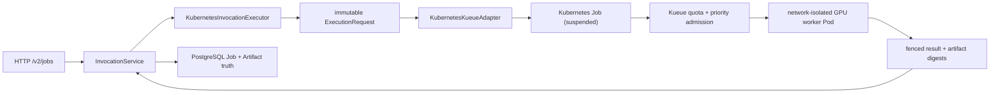

# Dirac Motif Kubernetes + Kueue

This is the production scheduler layer above `pueue`. Dirac remains the
scientific and workflow authority; Kubernetes runs one attempt, and Kueue
decides when declared resources may start.



## Authority boundaries

- Dirac owns Run, Job, Attempt, retry policy, fencing token, scientific
  identity, output validation, Artifact identity and audit events.
- Kueue owns resource quota, queueing, priority and preemption decisions.
- Kubernetes owns Pod lifecycle and logs. Kubernetes UIDs never become public
  Dirac identifiers; the adapter exposes `namespace/job-name` only.
- An ExecutionRequest cannot select an arbitrary command. The worker command is
  fixed when the adapter is built, and the image must be an immutable digest in
  the deployed allowlist.
- Worker Pods receive no database credential and no service-account token.
  Secret-looking environment variables fail admission; credentials travel only
  as opaque handles or scoped artifact sessions.
- Kubernetes `backoffLimit` is zero. A Kubernetes retry is not a Dirac Attempt;
  Dirac alone creates retries and increments fencing tokens.

## Installed local profile

- k3s: single node `icu`, Traefik and ServiceLB disabled.
- Kueue: LocalQueue `dirac-motif/motif` -> ClusterQueue `motif`.
- GPU Operator: host driver mode (`driver.enabled=false`), with the toolkit
  writing a k3s containerd v3 drop-in.
- Namespace: restricted Pod Security plus default-deny ingress and egress.
- Two deployment-owned local PersistentVolumes bridge the read-only runtime
  snapshot and read/write exchange into Restricted-PSS Pods. No `hostPath`
  permission or privileged worker is required.
- Worker Pods hold the main process behind a three-second policy-settle init
  barrier, closing the K3s per-Pod firewall installation race.
- Deadline termination has a five-second hard-kill grace by default; deployments
  that need longer checkpoint flushing must opt in explicitly.
- CPU quota: 20 cores (leaves four host cores for system services); memory: 48 GiB;
  ephemeral storage: 300 GiB.
- GPU quota starts at zero and fails closed until runtime health is proven.

Apply or reconcile the queue resources:

```bash
kubectl apply -f deploy/kubernetes/motif-kueue.yaml
```

After `nvidia-smi` works, GPU Operator reports `ready`, and node `icu`
advertises one `nvidia.com/gpu`, activate the queue quota:

```bash
deploy/kubernetes/activate-motif-gpu-quota
```

The activation command checks all three conditions before changing Kueue. It
will not turn on a quota for a GPU that Kubernetes cannot actually schedule.

## Runtime construction

The checked-in systemd profile selects this executor explicitly:

```ini
Environment=DIRAC_EXECUTOR=kubernetes
Environment=DIRAC_KUBERNETES_EXCHANGE_HOST=/home/ivan/dirac/.runtime/pv/exchange
```

GPU-class Motif methods then take this path automatically. CPU-class methods
stay in the API process. The worker verifies the input digest, method/source
version, Job/Attempt/fencing identities, output schema and artifact digests;
`InvocationService` remains the only component allowed to persist final public
Artifacts and terminal Job state.

The local profile mounts:

- PVC `dirac-motif-runtime` read-only at `/home/ivan/dirac`;
- PVC `dirac-motif-exchange` read/write at
  `/home/ivan/dirac/.runtime/kubernetes-exchange`.

The runtime PVC is an operational bridge for this single-node installation, not
the final multi-node packaging story. A production rollout should build the
worker and Python environment into a content-addressed OCI image and replace the
local exchange volume with scoped object-storage sessions. The ExecutionRequest
and fencing protocol do not change.

The lower-level adapter can also be assembled directly:

```python
import psycopg

from execution_control.allocation_store import (
    DurableSchedulerAdapter,
    PostgresAllocationStore,
)
from execution_control.router import SchedulerRouter
from executors.kubernetes_kueue import KubernetesKueueAdapter, StaticPvcMount

adapter = KubernetesKueueAdapter(
    worker_command=["python", "-m", "dirac_worker"],
    allowed_images=["registry/dirac-worker@sha256:<64 lowercase hex>"],
    policy_init_image="registry/dirac-policy-init@sha256:<64 lowercase hex>",
    static_pvc_mounts=[
        StaticPvcMount("runtime", "dirac-motif-runtime", "/opt/dirac", True),
        StaticPvcMount("exchange", "dirac-motif-exchange", "/exchange", False),
    ],
)
durable = DurableSchedulerAdapter(
    adapter,
    PostgresAllocationStore(
        lambda: psycopg.connect("dbname=dirac"), site="icu-k3s"
    ),
)
router = SchedulerRouter([durable])
status = router.submit(execution_request)
```

`DurableSchedulerAdapter.reconcile_active()` re-reads every non-terminal
allocation after a process restart and updates `app.execution_allocation`.

## Operational checks

```bash
kubectl get clusterqueue motif
kubectl get localqueue motif -n dirac-motif
kubectl get jobs,workloads -n dirac-motif
kubectl get pods -n gpu-operator
kubectl get node icu -o jsonpath='{.status.allocatable.nvidia\.com/gpu}'
curl -s http://127.0.0.1:8901/v2/meta
```

`/v2/meta` must report executor `kind=remote`, adapter `kubernetes`,
`gpu_execution=true`, and cancellation `cooperative+remote-hard`. A successful
GPU Job's provenance must include `remote_execution.backend=kubernetes`, Kueue,
and CUDA device evidence; a green Kubernetes Pod alone is not scientific
completion.

`pueue` remains a local development fallback during migration. It is no longer
the scale architecture: it has no cluster resource model, durable scheduler
reconciliation, topology placement, quota borrowing, or Kubernetes-native
preemption.
