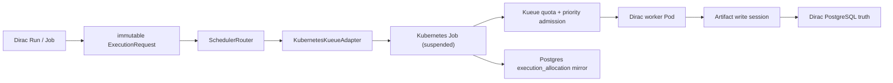

# Dirac Motif Kubernetes + Kueue

This is the production scheduler layer above `pueue`. Dirac remains the
scientific and workflow authority; Kubernetes runs one attempt, and Kueue
decides when declared resources may start.



## Authority boundaries

- Dirac owns Run, Job, Attempt, retry policy, fencing token, scientific
  identity, output validation, Artifact identity and audit events.
- Kueue owns resource quota, queueing, priority and preemption decisions.
- Kubernetes owns Pod lifecycle and logs. Kubernetes UIDs never become public
  Dirac identifiers; the adapter exposes `namespace/job-name` only.
- An ExecutionRequest cannot select an arbitrary command. The worker command is
  fixed when the adapter is built, and the image must be an immutable digest in
  the deployed allowlist.
- Worker Pods receive no database credential and no service-account token.
  Secret-looking environment variables fail admission; credentials travel only
  as opaque handles or scoped artifact sessions.
- Kubernetes `backoffLimit` is zero. A Kubernetes retry is not a Dirac Attempt;
  Dirac alone creates retries and increments fencing tokens.

## Installed local profile

- k3s: single node `icu`, Traefik and ServiceLB disabled.
- Kueue: LocalQueue `dirac-motif/motif` -> ClusterQueue `motif`.
- GPU Operator: host driver mode (`driver.enabled=false`), with the toolkit
  writing a k3s containerd v3 drop-in.
- Namespace: restricted Pod Security plus default-deny ingress and egress.
- CPU quota: 48 cores; memory: 48 GiB; ephemeral storage: 300 GiB.
- GPU quota starts at zero and fails closed until runtime health is proven.

Apply or reconcile the queue resources:

```bash
kubectl apply -f deploy/kubernetes/motif-kueue.yaml
```

After `nvidia-smi` works, GPU Operator reports `ready`, and node `icu`
advertises one `nvidia.com/gpu`, activate the queue quota:

```bash
deploy/kubernetes/activate-motif-gpu-quota
```

The activation command checks all three conditions before changing Kueue. It
will not turn on a quota for a GPU that Kubernetes cannot actually schedule.

## Runtime construction

```python
import psycopg

from execution_control.allocation_store import (
    DurableSchedulerAdapter,
    PostgresAllocationStore,
)
from execution_control.router import SchedulerRouter
from executors.kubernetes_kueue import KubernetesKueueAdapter

adapter = KubernetesKueueAdapter(
    worker_command=["python", "-m", "dirac_worker"],
    allowed_images=["registry/dirac-worker@sha256:<64 lowercase hex>"],
)
durable = DurableSchedulerAdapter(
    adapter,
    PostgresAllocationStore(
        lambda: psycopg.connect("dbname=dirac"), site="icu-k3s"
    ),
)
router = SchedulerRouter([durable])
status = router.submit(execution_request)
```

`DurableSchedulerAdapter.reconcile_active()` re-reads every non-terminal
allocation after a process restart and updates `app.execution_allocation`.

## Operational checks

```bash
kubectl get clusterqueue motif
kubectl get localqueue motif -n dirac-motif
kubectl get jobs,workloads -n dirac-motif
kubectl get pods -n gpu-operator
kubectl get node icu -o jsonpath='{.status.allocatable.nvidia\.com/gpu}'
```

`pueue` remains a local development fallback during migration. It is no longer
the scale architecture: it has no cluster resource model, durable scheduler
reconciliation, topology placement, quota borrowing, or Kubernetes-native
preemption.
