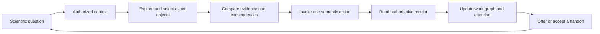
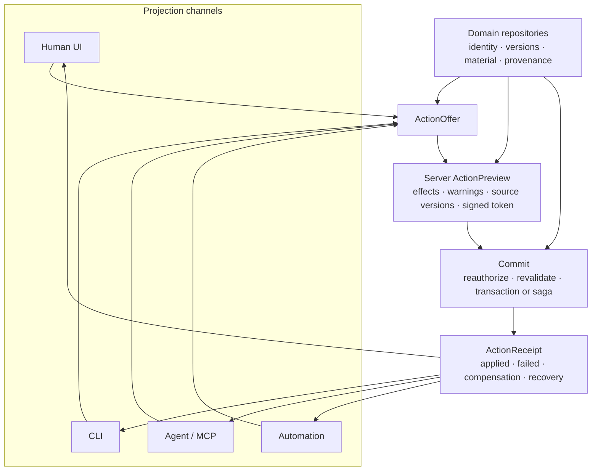
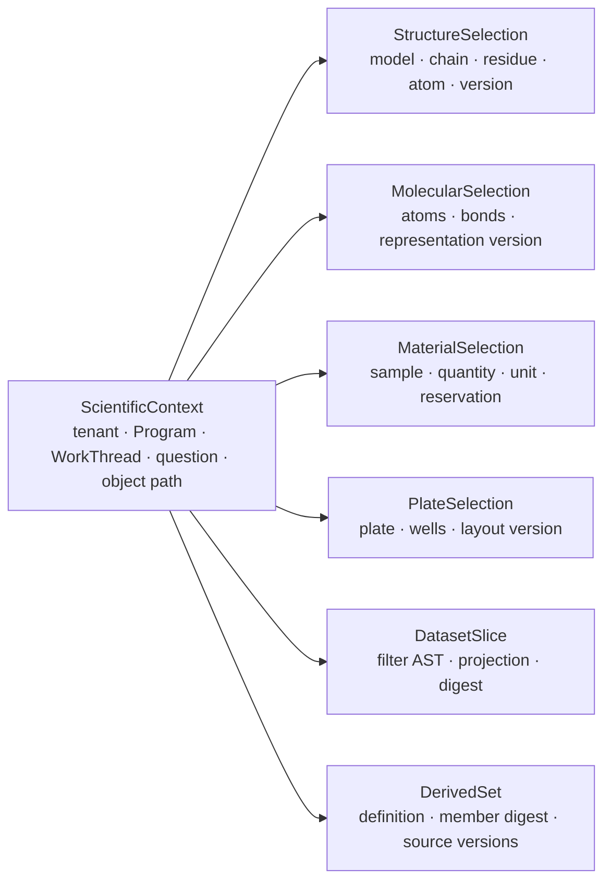
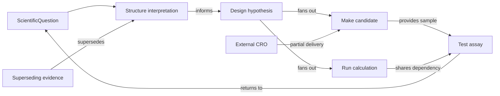
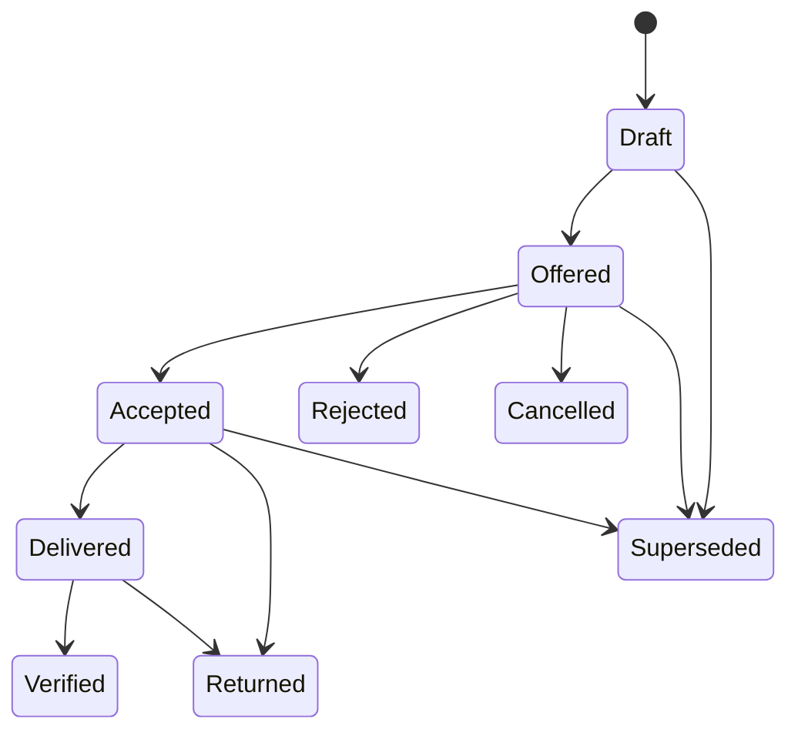
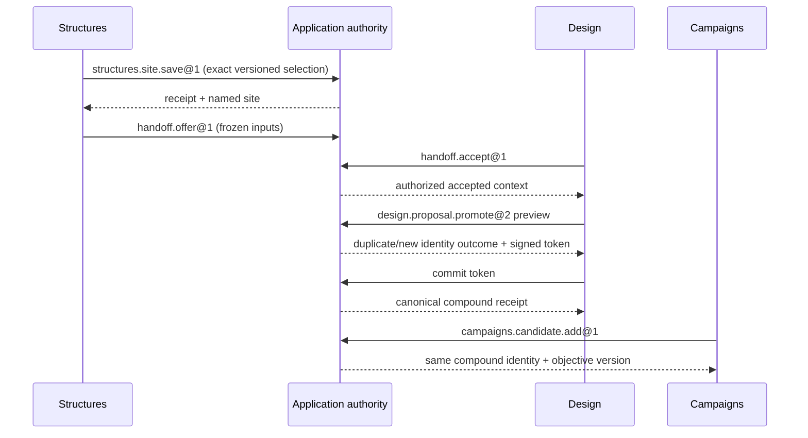

# Dirac HCI v2.1 — Visual Map

This map is explanatory. Normative behavior lives in the charter, semantic,
quality, acceptance, migration, and workspace contracts.

## 1. What the user is actually doing



The loop is question-centred and object-anchored. A workspace is a projection,
not a separate database or a mandatory linear stage.

## 2. The authority boundary



Direct manipulation, buttons, keyboard commands, drag/drop, and command-line
calls are affordances over the same stable application action. The UI never
invents readiness or owns the command plan.

## 3. The information architecture

```text
┌──────────────────────────────────────────────────────────────────────────┐
│ PROJECT / PROGRAM > QUESTION > CURRENT OBJECT     SEARCH  WORK QUEUE     │
├─────────┬───────────────────────────────────────────────────┬────────────┤
│ TASK    │ Human question + local view tabs                  │ Identity   │
│ DOMAINS │                                                   │ Evidence   │
│         │ Specialized workbench                             │ Lineage    │
│ Under-  │ 3D · molecule · landscape · route · plate · graph │ Actions    │
│ stand   │                                                   │ History    │
│ Design  │ Selection / comparison shelf                     │            │
│ Decide  ├───────────────────────────────────────────────────┤            │
│ Make    │ Next valid actions · blockers · handoff state     │            │
│ Test    │                                                   │            │
└─────────┴───────────────────────────────────────────────────┴────────────┘
```

Program home, Knowledge, and Compute/Work Queue are cross-cutting anchors.
Stable chrome can collapse for full-screen 3D, molecule, plate, or comparison
modes; current context and recovery remain reachable. Pixel widths are responsive
design guidance, not semantic invariants.

## 4. One typed context, many exact selections



Selections may be transient, named, comparison, or bulk. They can be cleared,
pinned, saved, shared, invalidated, or represented by a safe tombstone.

## 5. Work is a graph, not one item marching through eight pages



The same graph projects as next actions, dependency view, board, timeline/Gantt,
queue, or decision history. Critical path communicates uncertainty.

## 6. Handoff is a protocol



A handoff carries frozen and/or live inputs, permission envelope, acceptance
contract, structured rationale, accountable role, SLA/escalation, partial
delivery, and per-part verification. “Ready” is derived from the acceptance
contract.

## 7. State is deliberately orthogonal

| Axis | Example question |
|---|---|
| Draft | Is my change local, syncing, durable, or superseded? |
| Connectivity | Can the client reach authority? |
| Availability | Is required truth available, partial, unauthorized, or unknown? |
| Submission | Has the request been previewed and accepted? |
| Execution | Is work queued, running, waiting, failed, or complete? |
| Freshness | Are sources current, stale, superseded, or retracted? |
| Review | Is review required, accepted, changed, rejected, or waived? |

Cards may summarize these axes but cannot collapse them into a misleading green
“Ready” badge.

## 8. The first authoritative vertical slice



This slice is not released until stale previews, permission revocation,
duplicates, deliberate retries, duplicate transport, partial effects,
accessibility, large fixtures, and rollback all have evidence.
