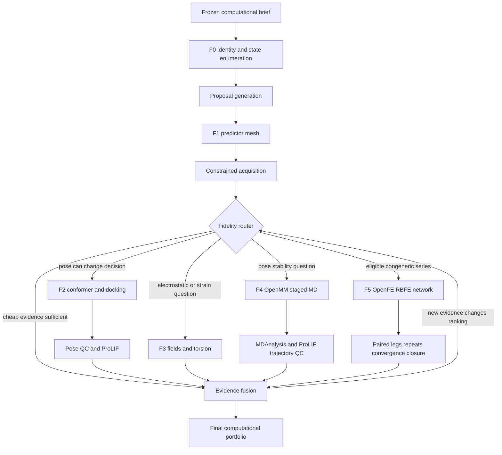

# Dirac Motif 单机 RTX 5080 计算药物设计系统规格

> **已废止 / 非规范性历史蓝图。** 本文件中的 `CandidateState`、F0–F5
> 路由阶梯、混合状态词汇、薄 EvidenceItem 和按少量样本直接放行 ML 的规则不得再作为
> 实现依据。当前可执行合同与需求追踪以
> [`motif-v3/README.md`](motif-v3/README.md) 为准。

**文档状态：** Superseded / historical blueprint

**适用范围：** `/home/ivan/dirac` 当前本机部署

**目标硬件：** AMD Ryzen 9 9900X、RTX 5080 16GB、单节点 Kubernetes/Kueue

**规格日期：** 2026-08-13
**证据边界：** 本文定义纯计算系统；不包含实验室自动化、ELN/LIMS、采购、CRO、权限安全、IP、融资或临床声明。

---

## 0. 一句话目标

在当前单机 5080 环境内，把 Motif 建成一个**会根据证据价值、科学适用性和计算成本，自动选择 RDKit、ML、Vina、QM、OpenMM 与 OpenFE；会在证据不足时拒绝；会把所有结果重新汇入同一候选组合决策**的纯计算药物设计系统。

系统的成功标准不是“安装了很多软件”，而是同时满足：

1. 每个软件只在其科学适用域内调用；
2. 每次升级计算都有可解释的触发条件；
3. 每个结果都有质量门禁，不把“运行完成”当“科学有效”；
4. 单 GPU、有限内存和有限磁盘下不会静默超卖资源；
5. 任一步失败都能重放、续跑、降级或明确拒绝；
6. 所有 fidelity 的证据最终进入同一个候选决策，而不是形成互不相连的报告。

---

## 1. 范围

### 1.1 本规格负责

- 输入化合物、靶点结构、计算目标和已有测量数据的计算级校验；
- 化学身份状态枚举与去重；
- 局部药化改造和反应模板枚举；
- 分子特征、ML 训练、预测、校准、适用域和不确定性；
- 多目标、带硬约束的候选组合选择；
- 构象生成、dock、pose QC、interaction fingerprint；
- classical/QM fields、torsion strain；
- OpenMM 分阶段 MD 与轨迹分析；
- OpenFE RBFE 网络、双腿、重复、收敛、cycle closure 和聚合；
- 多 fidelity 证据融合；
- 单机 Kubernetes/Kueue 资源调度、缓存、checkpoint、重试和恢复；
- 纯计算的 retrospective、golden、adversarial 和物理执行验证。

### 1.2 本规格明确不负责

- 实验室设备、ELN、LIMS、CRO、样品物流和实验自动化；
- 化合物采购、合同、库存和付款；
- 用户权限、租户隔离、法规合规和安全治理；
- 专利、FTO、发明人和知识产权；
- 融资叙事、商业定价和临床结论；
- 自动宣称发现药物；
- 在没有输入真实实验数据时伪造 potency 或 free energy。

### 1.3 外部结果的边界

系统可以接收调用方提供的计算或测量数据文件，但本文只规定：

- 文件如何校验；
- 如何形成 Dataset Snapshot；
- 如何进入模型；
- 如何改变下一轮计算组合。

本文不规定这些测量数据是如何在实验室产生的。

---

## 2. 当前环境事实与硬约束

### 2.1 现场实测硬件

| 资源 | 现场事实 | 本规格可用上限 |
|---|---:|---:|
| CPU | Ryzen 9 9900X，12 核 / 24 线程 | Motif 总配额 20 vCPU；保留 4 线程给系统 |
| GPU | NVIDIA GeForce RTX 5080 | 1 张，所有 GPU Job 串行 |
| VRAM | 16,303 MiB | 单任务 admission 上限 14 GiB，保留约 2 GiB |
| RAM | 操作系统可见约 59 GiB | Kueue 计算配额最多 48 GiB；单 GPU Job 默认不超过 16 GiB host RAM |
| Swap | 8 GiB，现场已饱和 | 新任务不得以 swap 作为容量计划 |
| 主盘 | 1.8 TiB，总剩余约 353 GiB | 重任务 admission 要求至少 100 GiB 可用 |
| `/tmp` | 约 6.1 GiB 可用 | 禁止作为 OpenFE/MD 持久 scratch 根目录 |

### 2.2 Kueue 现场配额

单一 `motif` ClusterQueue：

```yaml
cpu: 20
memory: 48Gi
ephemeral-storage: 300Gi
nvidia.com/gpu: 1
queueingStrategy: BestEffortFIFO
```

### 2.3 当前 runtime

必须冻结并记录完整版本，当前基线包括：

- RDKit 2026.3.5
- NumPy 2.5.2
- SciPy 1.18.0
- scikit-learn 1.9.0
- XGBoost CPU 3.4.0
- PyTorch 2.11.0 + CUDA 12.8
- Chemprop 2.3.1
- BoTorch 0.18.1 / GPyTorch 1.15.2
- Vina 1.2.7 / Meeko 0.7.1
- OpenMM 8.5.2
- MDAnalysis 2.10.0
- ProLIF 2.2.1
- OpenFE 1.11.1 独立固定 runtime

### 2.4 不可违反的资源规则

1. 同时最多一个 GPU workload。
2. 任何 GPU workload 必须通过 Dirac Job → Kubernetes → Kueue；禁止由业务代码直接启动 CUDA 子进程。
3. CPU 重任务不得在 API 请求线程执行。
4. SCF 并发最多 2。
5. 每个库显式设置线程数；不得让每个 worker 各自占用 24 线程。
6. `MemAvailable < 12 GiB` 时拒绝新的内存重任务。
7. 预计新增 scratch 超过可用空间 70% 时拒绝。
8. 主盘剩余 `< 100 GiB` 时拒绝新的 MD/OpenFE 生产任务。
9. 不允许 silent fidelity downgrade。
10. 不允许因资源不足把 GPU 方法偷偷切换成语义不同的 CPU 方法。
11. OOM 最多自动缩小 batch 一次；第二次失败进入 `attention`。
12. 所有随机过程必须记录 root seed、派生 seed 和硬件数值模式。

### 2.5 必须修正的配置漂移

现有 `local-5080-9900x.yaml` 声明 64 GiB hard minimum、2 TiB storage hard minimum，但现场机器分别约为 59 GiB RAM、1.8 TiB filesystem。实现不得把未满足的声明当成已满足事实。

规格要求：

- 将 `declared_capacity` 与 `observed_capacity` 分开；
- 每次 admission 读取 observed capacity；
- 配置文件只表达 policy，不表达当前健康；
- 不满足 hard gate 时返回结构化拒绝，不继续运行。

---

## 3. 系统不变量

以下规则优先于任何模型分数：

### INV-01：输入身份不确定，不进入高 fidelity

未解析的 salt、charge、tautomer、stereo 或原子价态，不能进入 docking、MD 或 RBFE。

### INV-02：计算完成不等于科学通过

每个计算输出必须同时带：

- `execution_status`
- `scientific_status`
- `quality_gates`
- `claim_boundary`

### INV-03：不同 fidelity 不共用一个假装可比的分数

ML prediction、Vina score、QM field、MD stability 和 RBFE ΔΔG 必须保留各自单位、方向、误差和适用域。

### INV-04：失败、拒绝和缺失不是零

- failed 不得转为最差数值；
- missing 不得转为 0；
- out-of-domain 不得标成低 potency；
- disconnected RBFE node 不得插值；
- non-converged simulation 不得进入有效均值。

### INV-05：所有升级必须可解释

每个 `escalate` 决策必须记录：

- 当前证据；
- 候选当前状态；
- 升级目标；
- 预计成本；
- 预计能改变的决策；
- policy version。

### INV-06：所有降级必须显式

资源不足只能产生：

- queued；
- refused；
- retry_scheduled；
- manual_attention；

不能自动替换为较便宜但语义不同的算法。

### INV-07：单张 5080 决定整个吞吐模型

所有 GPU workload 是一个全局串行资源。ML、OpenMM、OpenFE 之间必须由同一队列仲裁，不能各有一套看不见彼此的排队系统。

---

## 4. 总体计算 DAG



### 4.1 不是固定直线

候选不应无条件经过所有软件。Fidelity Router 必须允许：

- ML 后直接 selected/reserve/refused；
- docking 后停止；
- fields 后停止；
- MD 后停止；
- 只有极少数进入 RBFE；
- 某个结果触发重新计算另一条分支；
- 任何阶段因为适用域失败而退出。

---

## 5. 核心对象

### 5.1 `ComputationalBrief`

必须包含：

```json
{
  "program_ref": {},
  "campaign_ref": {},
  "target_ref": {},
  "protein_structure_refs": [],
  "endpoint_definitions": [],
  "objective_axes": [],
  "hard_constraints": [],
  "chemistry_state_policy_ref": {},
  "structure_preparation_policy_ref": {},
  "fidelity_policy_ref": {},
  "resource_envelope_ref": {},
  "root_seed": 0
}
```

### 5.2 `CandidateState`

一个候选不是一个 SMILES，而是：

```text
canonical parent identity
+ salt/fragment decision
+ formal charge
+ protonation state
+ tautomer
+ stereoisomer
+ conformer ensemble
+ optional bound pose
```

### 5.3 `EvidenceItem`

统一 envelope：

```json
{
  "candidate_state_ref": {},
  "evidence_kind": "prediction|pose|field|md|rbfe",
  "method_ref": {},
  "value": null,
  "unit": null,
  "uncertainty": null,
  "applicability": {},
  "quality_gates": [],
  "scientific_status": "valid|provisional|refused|failed",
  "artifact_refs": [],
  "claim_boundary": ""
}
```

### 5.4 `RoutingDecision`

```json
{
  "candidate_ref": {},
  "from_fidelity": "F1",
  "to_fidelity": "F2",
  "decision": "escalate|stop|refuse|retry|reserve",
  "reason_codes": [],
  "expected_decision_change": 0.0,
  "estimated_seconds": null,
  "estimated_cpu_hours": null,
  "estimated_gpu_hours": null,
  "estimated_scratch_bytes": null,
  "policy_release_ref": {}
}
```

---

## 6. F0：化学身份与状态枚举

### 6.1 输入

- SMILES、SDF 或已注册 compound reference；
- 可选实验 pH；
- 是否允许混合物、盐、金属、共价化合物；
- stereochemistry policy；
- tautomer/protonation policy。

### 6.2 必须实现的 RDKit 流程

1. parse；
2. sanitize；
3. fragment inspection；
4. largest organic fragment 或 policy-driven salt handling；
5. valence/aromaticity validation；
6. charge normalization；
7. canonical tautomer selection；
8. bounded tautomer enumeration；
9. potential stereo detection；
10. bounded stereoisomer enumeration；
11. canonical isomeric SMILES；
12. InChIKey；
13. duplicate collapse；
14. PAINS/reactive/forbidden SMARTS；
15. property window；
16. CandidateState Artifact。

### 6.3 枚举上限

单 parent：

- tautomers 最多 16；
- protonation states 最多 8；
- stereoisomers 最多 16；
- state product 最多 32；
- 超过上限不得随机截断；应按确定性 policy 排序后截断并报告丢弃数。

### 6.4 拒绝条件

- parse/sanitize 失败；
- 多个主要有机 fragment 且 policy 未定义；
- 未支持金属或配位化学；
- 未定义 stereo 且枚举超过上限；
- net charge 超出当前物理方法支持范围；
- 必需原子类型或力场参数不存在；
- 命中 hard forbidden chemistry。

### 6.5 必需 Artifact

- `chem.identity.report`
- `chem.state_ensemble.sdf`
- `chem.standardization.trace`
- `chem.gate.report`

---

## 7. Proposal Generation

### 7.1 策略

首版只允许可审计策略：

- versioned unary medicinal-chemistry transforms；
- unary/binary reaction templates；
- R-group substitution；
- linker length/heteroatom edits；
- ring contraction/expansion 的白名单变换；
- stereochemical exploration；
- matched-pair derived transformations。

不要求在本规格内加入无约束生成式模型。

### 7.2 每个 proposal 必须携带

- parent refs；
- transform/template version；
- atom mapping；
- root seed；
- identity policy；
- chemistry gate；
- route status；
- duplicate collapse reason；
- edit-locality metrics。

### 7.3 规模

在当前主机上：

- raw proposal 最大 50,000；
- F0-valid 最大 10,000；
- route-plausible 最大 5,000；
- 单 shard 1,000；
- 生成和 gate 均为 CPU Job；
- 每个 shard 峰值内存目标 `< 2 GiB`。

### 7.4 生成器质量门

- validity；
- uniqueness；
- parent recovery；
- duplicate rate；
- hard-gate refusal rate；
- scaffold/series diversity；
- edit distance distribution；
- stereochemistry completeness；
- route-known fraction。

任何指标只能描述生成器行为，不能称为药效成功率。

---

## 8. Dataset Snapshot 与训练输入

### 8.1 输入语义

支持：

- exact；
- less-than / less-or-equal；
- greater-than / greater-or-equal；
- interval；
- missing；
- not-tested；
- invalid。

### 8.2 训练准入

- 至少 3 个 exact train labels 才能训练完整 mesh；
- 少于 3 个只能运行 similarity/descriptor baseline；
- calibration 少于 2 个 exact labels 时不得输出 calibrated interval；
- held-out 为空时 model release 必须为 `candidate_unvalidated`；
- 任意 cross-split identity/series collision 必须拒绝整个 release。

### 8.3 Split

必须支持并冻结：

- train；
- calibration；
- validation；
- test；
- external。

可选 group keys：

- compound；
- canonical state；
- scaffold；
- medicinal-chemistry series；
- time block；
- protocol group。

### 8.4 输出

- immutable row manifest；
- endpoint definitions；
- split manifest；
- leakage report；
- censoring counts；
- feature access policy；
- content digest。

---

## 9. F1：Predictor Mesh

### 9.1 必需成员

每次正式训练至少包含：

1. 1-nearest-neighbor；
2. Ridge；
3. Random Forest；
4. XGBoost；
5. censored Tobit；
6. pairwise ranker；
7. Chemprop D-MPNN ensemble，仅当资源和数据门满足。

### 9.2 Chemprop 启用条件

不得仅因为默认参数为 true 就启用。

最低建议门：

- exact/censored usable train molecules `>= 50`：允许试验性启用；
- `>= 200`：默认启用；
- `< 50`：默认关闭，保留简单模型；
- GPU VRAM 预估 `< 14 GiB`；
- host RAM 预估 `< 16 GiB`；
- calibration/validation 策略已定义。

阈值必须是 policy 参数，不得硬编码在模型函数中。

### 9.3 GPU 路由修正

`ml.motif.mesh.train/predict` 不能继续以静态 Method 级 GPU 标记决定一切。

要求：

- `include_chemprop=false`：CPU worker；
- checkpoint 无 Chemprop：CPU predict；
- checkpoint 有 Chemprop：Kueue GPU；
- GPU OOM：batch probe 缩小一次；
- 不得切掉 Chemprop 后冒充同一 Model Release。

### 9.4 不确定性

输出至少包括：

- member predictions；
- ensemble mean；
- member disagreement；
- Tobit aleatoric sigma；
- nearest-neighbor distance；
- Mahalanobis distance；
- applicability status；
- conformal interval（若校准有效）；
- calibration provenance。

### 9.5 适用域

默认：

- `ratio <= 1.0`：in-domain；
- `1.0 < ratio <= 1.5`：borderline；
- `ratio > 1.5`：out-of-domain。

规则：

- in-domain：可参与 exploitation；
- borderline：可进入 reserve、exploration 或升级更高 fidelity；
- out-of-domain：不得仅依赖 ML 进入 selected；可作为明确 exploration 候选。

### 9.6 验证

每个 model × endpoint × split 全部报告：

- MAE；
- RMSE；
- R²；
- Spearman；
- interval coverage；
- interval width；
- bootstrap CI；
- domain-stratified errors。

不得只展示最佳模型或最佳 split。

---

## 10. Acquisition 与候选组合

### 10.1 两种 policy

#### A. Deterministic constrained Pareto

用于：

- 数据太少；
- GP 条件不满足；
- 决策需要完全确定性；
- smoke / regression tests。

#### B. Noisy Bayesian multi-objective acquisition

正式目标：

- qLogNEHVI，而非只做 q=1 独立 qLogEHVI；
- 支持 pending candidates；
- 支持联合 batch；
- 支持 observation noise；
- hard constraints 在 exact gate 层；
- cost 和 information value 单独披露。

### 10.2 组合分区

所有候选必须且只能进入：

- selected；
- reserve；
- rejected；
- refused。

### 10.3 当前 5080 默认容量

- selected 最大 48；
- reserve 最大 48；
- exploration 最少占 selected 的 15%；
- F2 最大 256 个 state；
- F3 最大 32 个 state；
- F4 MD 最大 8 个 state；
- F5 RBFE 每轮默认最多 4 个 compound node。

### 10.4 不允许隐藏总分

组合必须公开：

- objective vector；
- hard constraint failures；
- Pareto rank；
- expected hypervolume improvement；
- uncertainty；
- diversity；
- information value；
- estimated compute cost；
- reason codes；
- what changes the decision。

---

## 11. Fidelity Router

### 11.1 路由目标

Router 的目标不是让更多候选进入昂贵计算，而是在预算内最大化：

```text
expected probability that new evidence changes the final portfolio
---------------------------------------------------------------
expected compute cost and failure risk
```

### 11.2 通用升级门

候选进入下一 fidelity 前必须全部满足：

1. 当前阶段 scientific status 不是 failed/refused；
2. 下一方法适用域满足；
3. 必需输入存在；
4. 预计资源在 observed capacity 内；
5. 候选未被 hard constraint 淘汰；
6. 新证据可能改变 selected/reserve/refused 状态；
7. 本轮容量未耗尽。

### 11.3 决策变化概率

若有 calibrated posterior：

- 从 posterior 抽样；
- 每次样本重新执行 portfolio policy；
- 计算候选状态改变频率；
- 得到 `P(decision_change)`。

默认升级阈值：

- F1 → F2：`P(decision_change) >= 0.10`；
- F2/F3 → F4：`>= 0.20`；
- F2/F4 → F5：`>= 0.30`。

这些值必须可版本化，并通过 retrospective replay 调整。

若没有 calibrated posterior，必须把 decision-change 标为 heuristic，不得伪装为概率。

### 11.4 Stop

以下任一成立应停止升级：

- 当前证据已经稳定区分 selected/refused；
- 新方法不适用于该化学变化；
- 输入结构质量不够；
- 预计成本超过 cycle budget；
- 预计新证据无法改变组合；
- 前一 fidelity 已发现不可修复问题。

### 11.5 Router 必须生成普通 Dirac Job DAG

Router 不运行科学代码。它只：

- 读取 frozen inputs 和 EvidenceItem；
- 生成 RoutingDecision；
- 提交普通 Method Job；
- 等待/恢复；
- 读取 Artifact；
- 应用 quality gate；
- 继续或停止。

---

## 12. F2：构象与 AutoDock Vina

### 12.1 构象生成

默认：

- ETKDGv3；
- chirality enforced；
- 50 conformers/state；
- RMS prune 0.5 Å；
- MMFF94s，无法参数化则 UFF；
- energy rank；
- Butina cluster。

### 12.2 构象质量门

- 至少生成 1 个构象；
- 记录 MMFF/UFF fallback；
- 未收敛构象不得作为代表构象；
- 极高相对能量构象默认不进 docking；
- state/stereo 不得在 embed 中改变。

### 12.3 Receptor 输入门

Vina 前必须存在冻结的：

- receptor PDBQT；
- source protein structure ref；
- binding-site box；
- receptor preparation digest；
- protonation/cofactor/water policy；
- grid provenance。

系统不得自己猜 box center。

### 12.4 Vina 默认参数

- exhaustiveness 16；
- 每个 state 3 个独立 seeds；
- 每 seed 9 poses；
- energy range 3 kcal/mol；
- CPU 每 job 1–4；
- shard 16 states。

### 12.5 Vina 未使用能力补齐

首版必须增加：

- receptor ensemble 支持；
- optional AD4 scoring；
- flexible residue lane，只有显式配置时启用；
- pose clustering；
- consensus across seeds/receptors；
- reference ligand redocking；
- ProLIF interaction fingerprints。

### 12.6 Pose quality gate

若存在 reference ligand：

- redocking symmetry-aware RMSD 默认要求 `<= 2.0 Å`；
- 超过阈值，该 receptor/grid 不得用于生产 ranking。

每个 pose：

- 无严重 protein-ligand clash；
- ligand state 与 F0 一致；
- strain 可计算；
- pose 在不同 seeds 中有重复 cluster；
- 必需 interaction pattern 若被 brief 声明则满足；
- docking score 只作为 pose/粗筛证据。

### 12.7 Artifact

- `structure.poses_pdbqt`
- `structure.docking_report`
- `structure.pose_clusters`
- `structure.redocking_validation`
- `structure.interaction_fingerprint`
- `structure.pose_quality`

---

## 13. F3：Fields、Interaction 与 Torsion

### 13.1 触发问题

只有存在明确计算问题才调用：

- activity cliff 是否可能来自 electrostatics；
- 卤键/局部正电势是否存在；
- pose 中的取代基是否有高 torsional strain；
- lipophilic/hydrophilic field 是否支持观察到的 SAR；
- 某个局部改造是否改变关键 interaction。

### 13.2 Classical fields

最多 32 个 state：

- Gasteiger MEP；
- Crippen MLP；
- region fields；
- 与选定 pose 对齐。

### 13.3 QM fields

最多 8 个 decision-critical state：

- density；
- HOMO；
- LUMO；
- QM MEP；
- surface MEP；
- MEP-at-coordinates。

### 13.4 PySCF 限制

- 必须在运行前估算 cost；
- SCF 并发最多 2；
- basis/element coverage 必须前置验证；
- 需要 ECP 的元素必须显式附加并验证电子数；
- wall-clock budget 覆盖 SCF 和 post-SCF 全阶段；
- 不收敛必须拒绝；
- HF/QM field 不能解释为结合自由能。

### 13.5 Torsion strain

- 只扫描明确的 rotatable bond；
- pose torsion 必须映射到 relaxed scan；
- 输出 pose 所在能量与最近局部 minimum；
- 高 strain 是警报，不是自动 potency penalty；
- 多个耦合 torsion 时标记单维 scan 局限。

---

## 14. F4：OpenMM 分阶段 MD

### 14.1 当前缺口

当前 adapter 只接收调用方准备好的 `System XML + topology PDB`。生产链必须新增受控 system-builder，不得继续把最关键的参数化留在黑箱外部。

### 14.2 支持的 parameterization lane

每个 lane 必须固定版本且不得混用：

#### Lane A：OpenFF

- protein force field；
- water model；
- ligand OpenFF Sage；
- charge method；
- ion parameters。

#### Lane B：Amber/GAFF

- protein force field；
- water model；
- ligand GAFF2；
- AM1-BCC 或明确替代；
- ion parameters。

一个 RunPlan 必须绑定一个 lane release。

### 14.3 System preparation

必须显式完成：

- protein/ligand state validation；
- missing parameter detection；
- solvation；
- padding；
- ionic strength；
- neutralization；
- periodic box；
- constraints；
- barostat；
- positional restraints；
- atom mapping到 canonical refs。

### 14.4 两级 MD protocol

#### MD-QC

用途：发现明显不稳定 pose，不声称采样充分。

- minimization；
- restrained heating；
- restrained NVT；
- restrained NPT；
- 1 ns unrestrained production；
- 1 repeat；
- 最多 8 个 state。

#### MD-Decision

用途：对少量关键候选进行稳定性与 interaction persistence 比较。

- 独立 seeds；
- 3 repeats；
- 每 repeat 至少 5 ns production；
- 最多 4 个 state；
- 仍不得称为 binding free energy。

所有长度是 policy 默认值；必须允许按体系大小和实测 ns/day 调整。

### 14.5 OpenMM 运行约束

- 单 GPU 串行；
- mixed precision 默认；
- checkpoint 至少每 5 分钟或固定 steps；
- resume 必须验证 System digest、topology digest 和 platform；
- 每段 protocol 是独立可恢复 stage；
- 不得用一个长 `simulation.step()` 隐藏所有阶段。

### 14.6 MDAnalysis / ProLIF 必须接入

每个 trajectory 自动计算：

- protein backbone RMSD；
- ligand aligned RMSD；
- ligand internal RMSD；
- per-residue RMSF；
- protein-ligand contacts；
- H-bond occupancy；
- hydrophobic contacts；
- salt bridges；
- π stacking / cation-π；
- water bridges；
- pocket distance metrics；
- ligand COM departure；
- interaction fingerprint persistence；
- block-wise convergence。

### 14.7 MD quality gate

拒绝或标记 provisional：

- 温度/压力异常；
- energy drift 无法解释；
- ligand 完全离开 pocket；
- trajectory 或 checkpoint 损坏；
- repeats 结果互相冲突；
- equilibration 未通过；
- analysis frame 数不足。

通过只表示：

> 在指定 force field、时间尺度和初始 pose 下，没有观察到预注册的明显不稳定证据。

---

## 15. F5：OpenFE RBFE 完整科学链

### 15.1 首版适用域

只支持：

- 同一靶点、同一 binding mode 假设；
- congeneric series；
- net charge 不变；
- 无明确共价反应；
- 无未支持金属配位变化；
- 原子映射质量通过；
- 复合物 pose 已通过 F2，必要时通过 F4。

首版明确拒绝：

- 大规模 scaffold hop；
- charge-changing transformation；
- ring opening/closing 高风险映射；
- binding mode 改变；
- 未解析 tautomer/protonation；
- complex/solvent state 不一致。

### 15.2 Network planning

不得只依赖自有 Morgan+FMCS planner。必须调用 OpenFE 官方能力：

- LomapAtomMapper；
- KartografAtomMapper；
- default LoMap scorer；
- minimal spanning network；
- minimal redundant network；
- cycle-covering LoMap network。

### 15.3 当前 5080 network 大小

默认每轮最多 4 个 compound nodes。

目标网络：

- 先建立 connected backbone；
- 至少一条独立 cycle；
- 优先高质量 mapping；
- 低质量 edge 不得为了连通而强行执行；
- 无法形成合格 connected network 时整体拒绝。

### 15.4 Edge mapping gate

每条 edge 必须记录：

- mapper；
- mapper score；
- MCS；
- mapped heavy atom fraction；
- element changes；
- bond order changes；
- ring changes；
- chirality changes；
- net charge change；
- mapping disagreement。

至少两个 mapper 明显冲突时，edge 不得自动进入执行。

### 15.5 Transformation 构建

系统必须自动从：

- frozen protein structure；
- ligand states；
- atom mapping；
- force-field release；
- solvent/ion policy；
- OpenFE protocol settings；

构建并冻结：

- complex Transformation；
- solvent Transformation；
- transformation digests；
- thermodynamic cycle id。

### 15.6 执行矩阵

每条 edge：

```text
complex leg × repeats
solvent leg × repeats
```

默认：

- pilot：1 repeat/leg；
- production：3 independent repeats/leg；
- final analysis：1000 MBAR bootstraps；
- 20 bootstraps 只允许 smoke/QC，并必须进入 provenance。

### 15.7 单 GPU 调度

- 所有 OpenFE edge Job 串行占用 GPU；
- CPU request 根据实际 protocol，不得固定浪费 20 CPU；
- memory request 根据体系原子数估算；
- walltime 从 Transformation settings 和历史 telemetry 估算；
- pilot 先执行最高质量 edge；
- pilot 失败时不展开整张 network；
- 同一 edge resume 优先于重启；
- 不同 repeat 必须使用独立 seed。

### 15.8 Leg result

每个 leg 需要提取：

- estimate；
- uncertainty；
- overlap matrix；
- forward/reverse estimate；
- time-series/block estimate；
- replica/state mixing；
- structural stability；
- effective sample diagnostics；
- runtime/checkpoint provenance。

### 15.9 Convergence gate

以下全部通过，leg 才为 `scientifically_accepted`：

1. OpenFE process completed；
2. result/analysis artifacts 完整；
3. overlap graph 无断裂；
4. forward/reverse 差异在预注册阈值内；
5. 后半段 block estimate 无持续漂移；
6. 独立 repeats 一致；
7. complex 中 ligand 未出现不可接受的结构失稳；
8. uncertainty 有限且非零异常值已解释。

默认数值警报线：

- forward/reverse discrepancy `> max(1.0 kcal/mol, 2σ)`；
- repeat SD `> 1.0 kcal/mol`；
- cycle closure absolute residual `> max(1.0 kcal/mol, 2 pooled σ)`。

这些是初始 policy，不是物理常数；必须随 retrospective benchmark 版本化。

### 15.10 自适应延长

若只有采样不足而其他门正常：

- 允许 resume/extend 一次；
- 延长量由 block convergence 估计；
- 延长后仍不通过则 `refused_nonconverged`；
- 不允许无限续跑。

### 15.11 双腿合成

对同一 edge、同一 repeat：

```text
ΔΔG = ΔG_complex - ΔG_solvent
```

- complex/solvent 必须共享一致 transformation identity；
- 不得把不同 state/mapping 的 legs 相减；
- uncertainty 必须按明确独立性假设传播；
- repeat 聚合使用预注册 fixed/random-effects policy；
- failed repeat 不得静默丢弃。

### 15.12 Network aggregation

- 只使用 scientifically accepted edges；
- weighted graph fit；
- disconnected nodes 无估计；
- redundant edge residual 形成 cycle closure；
- 输出 node estimates、covariance、failed edges、cycle diagnostics；
- 任何 unresolved cycle failure 使相关 node provisional。

### 15.13 RBFE 输出边界

允许声明：

> 在冻结的结构、状态、mapping、force field 和 OpenFE protocol 下，网络产生了通过既定收敛与闭环门禁的相对自由能估计。

不允许声明：

- 绝对 binding affinity；
- 临床效力；
- 未测系列的普遍准确性；
- 未通过 convergence 的结果有效。

---

## 16. 多 Fidelity 证据融合

### 16.1 不做隐藏加权总分

每个候选保留 evidence vector：

```text
ML endpoint posterior
ML applicability
Vina pose confidence
pose QC
field/torsion evidence
MD stability evidence
RBFE ΔΔG posterior
compute failure risk
```

### 16.2 Evidence precedence

默认规则：

1. hard chemistry/identity refusal 最高；
2. 方法不适用导致的 refusal 不可被其他分数覆盖；
3. validated RBFE 可更新相对 affinity 证据，但不覆盖 ADME 等 endpoint；
4. docking score 不覆盖 potency ML；
5. MD pose instability 可降低 structure-derived evidence 的可信度；
6. OOD ML 可被更高 fidelity evidence 补充，但仍保留 OOD 标签；
7. evidence conflict 进入 explicit conflict state。

### 16.3 Conflict states

- `ml_positive_structure_negative`
- `ml_negative_structure_positive`
- `pose_stable_rbfe_nonconverged`
- `rbfe_positive_cycle_failed`
- `repeats_disagree`
- `state_uncertain`

每个 conflict state 必须有 deterministic next action 或 stop。

### 16.4 Portfolio refresh

每当新 evidence 到达：

1. 不覆盖旧 Artifact；
2. 更新候选 EvidenceItem 集合；
3. 重算 hard gates；
4. 重算 Pareto/acquisition；
5. 记录候选状态变化；
6. 由 Router 决定继续、停止或补算。

---

## 17. 执行器与资源调度规格

### 17.1 资源分类

| Class | 示例 | 默认执行 |
|---|---|---|
| CPU-light | identity、features、portfolio | local process worker |
| CPU-medium | RF/XGBoost、conformers、Vina | local process 或 K8s CPU Job |
| CPU-QM | PySCF、torsion | K8s CPU Job，SCF class 并发 2 |
| GPU-ML | Chemprop train/predict | Kueue GPU |
| GPU-MD | OpenMM | Kueue GPU |
| GPU-RBFE | OpenFE | Kueue GPU |

### 17.2 禁止 CPU 科学任务留在 API 进程

当前 Kubernetes executor 对非 GPU handler 仍本地调用。规格要求：

- API 只做 validation、Command 和 orchestration；
- CPU scientific methods 进入隔离 process worker；
- 超过 10 秒或 1 GiB 估算的 CPU Job 默认进 K8s CPU lane；
- estimator 必须实际参与 placement。

### 17.3 动态 placement

Placement 输入：

- method resource profile；
- payload size；
- estimate；
- observed RAM/disk/GPU；
- queue depth；
- checkpointability；
- deadline。

Placement 输出必须记录在 Job provenance。

### 17.4 GPU 优先级

默认从高到低：

1. 正在 resume 的 OpenFE/OpenMM；
2. 阻塞当前 portfolio 的短 predict；
3. 已批准的 RBFE pilot；
4. Chemprop training；
5. MD-Decision；
6. exploratory GPU tasks。

已经开始且有 checkpoint 的长任务不得被无意义短任务反复饿死。

### 17.5 Admission

在提交 Kubernetes workload 前检查：

- observed allocatable；
- Kueue quota；
- disk/scratch；
- MemAvailable；
- estimated VRAM；
- required image/runtime；
- required input Artifact；
- budget。

### 17.6 Retry matrix

| Failure | 自动动作 |
|---|---|
| transient scheduler | retry same attempt identity once |
| GPU OOM | reduce batch once；OpenFE 不改 protocol |
| checkpoint-compatible interruption | resume |
| invalid input | refuse，不重试 |
| scientific nonconvergence | extend once或refuse |
| artifact integrity | fail，禁止使用结果 |
| runtime digest mismatch | refuse |
| disk admission failure | queue/refuse，不启动 |

---

## 18. Checkpoint、恢复与幂等

### 18.1 Job identity

Job identity 至少包含：

- Method version；
- canonical input digest；
- runtime digest；
- policy release；
- seed scope；
- target/structure/state refs。

### 18.2 Resume identity

只有以下完全一致时允许 resume：

- method version；
- system/transformation digest；
- runtime version；
- topology；
- force field；
- seed/repeat identity；
- numeric mode。

### 18.3 API restart

控制平面启动时必须：

1. 查询 nonterminal Job；
2. 查询 Kubernetes allocation；
3. 验证 fencing token；
4. 若 worker 已成功，收集并验证 Artifact；
5. 若仍运行，重新 attach；
6. 若 allocation 消失但 checkpoint 存在，按 policy resume；
7. 不得因为 API 重启直接把科学任务判失败。

### 18.4 闭环 stage retry

- 已完成 stage 复用 Artifact；
- 只重跑失败 stage；
- retry 生成新 attempt，不覆盖旧 attempt；
- retry policy 与科学 policy 分开。

---

## 19. Artifact 与存储

### 19.1 PostgreSQL 与大文件分层

PostgreSQL 继续保存：

- metadata；
- digests；
- small JSON；
- Job/lineage；
- small reports。

大型数据必须进入本地 content-addressed filesystem：

- DCD；
- checkpoints；
- OpenFE work directories；
- large SDF/PDBQT；
- model checkpoints。

### 19.2 Scratch

- 不使用主机 `/tmp` 作为生产 scratch；
- 使用专用 `/home/ivan/dirac/.runtime/scratch` 或同盘受控目录；
- attempt 目录隔离；
- 终态 Artifact 持久化成功后才能回收 scratch；
- failed/resumable attempt 按 retention policy 保留。

### 19.3 Integrity

每个 Artifact：

- SHA-256；
- byte count；
- role；
- media type；
- producer Method/Job；
- input refs；
- creation time；
- storage location；
- integrity verification state。

### 19.4 Retention 默认

- model/data/policy release：永久；
- final scientific reports：永久；
- final trajectories：保留；
- intermediate trajectory：30 天；
- resumable checkpoints：任务完成后 7 天；
- failed OpenFE workdir：至少 14 天或确认不可恢复后清理。

任何删除不得破坏仍被引用的 Artifact。

---

## 20. 可观测性

### 20.1 运行指标

- queue wait；
- admission refusal；
- CPU/RAM/GPU/VRAM；
- scratch growth；
- Job runtime；
- cache hit；
- retry/resume；
- cancellation latency；
- Artifact integrity；
- worker/API reconciliation。

### 20.2 科学指标

- identity refusal counts；
- OOD fraction；
- conformer failures；
- docking redocking success；
- pose cluster reproducibility；
- MD instability/repeat disagreement；
- OpenFE convergence rate；
- edge failure category；
- cycle closure distribution；
- evidence conflict counts；
- fidelity escalation yield。

### 20.3 Router 指标

- 每级进入/退出数量；
- 每次升级成本；
- 升级后改变 portfolio 的比例；
- 无决策价值的昂贵计算比例；
- 被资源门拒绝的比例；
- heuristic vs calibrated routing 比例。

---

## 21. 失败码

必须补充并统一：

### Identity

- `IDENTITY_PARSE_FAILED`
- `IDENTITY_MULTIFRAGMENT_AMBIGUOUS`
- `IDENTITY_STEREO_UNRESOLVED`
- `IDENTITY_STATE_EXPLOSION`
- `IDENTITY_UNSUPPORTED_CHEMISTRY`

### ML

- `DATA_TOO_SMALL`
- `SPLIT_LEAKAGE`
- `CALIBRATION_UNAVAILABLE`
- `MODEL_OUT_OF_DOMAIN`
- `MODEL_RUNTIME_MISMATCH`
- `GPU_OOM_AFTER_RESIZE`

### Structure

- `RECEPTOR_UNPREPARED`
- `GRID_UNDEFINED`
- `REDOCKING_GATE_FAILED`
- `NO_VALID_CONFORMER`
- `NO_REPRODUCIBLE_POSE`
- `POSE_CLASH`

### MD

- `PARAMETERIZATION_FAILED`
- `SYSTEM_TOPOLOGY_MISMATCH`
- `MD_EQUILIBRATION_FAILED`
- `MD_LIGAND_DEPARTED`
- `MD_REPEATS_DISAGREE`
- `MD_CHECKPOINT_INCOMPATIBLE`

### RBFE

- `RBFE_MAPPING_UNSUITABLE`
- `RBFE_NETWORK_DISCONNECTED`
- `RBFE_LEG_INCOMPLETE`
- `RBFE_OVERLAP_FAILED`
- `RBFE_FORWARD_REVERSE_FAILED`
- `RBFE_REPEAT_DISAGREEMENT`
- `RBFE_CYCLE_CLOSURE_FAILED`
- `RBFE_NONCONVERGED_AFTER_EXTENSION`

### Resources

- `ADMISSION_MEMORY`
- `ADMISSION_VRAM`
- `ADMISSION_DISK`
- `ADMISSION_QUEUE_CAPACITY`
- `RUNTIME_DIGEST_MISMATCH`
- `ARTIFACT_INTEGRITY_FAILED`

---

## 22. 必须新增或修改的 Method

### P0

- `chem.motif.standardize`
- `chem.motif.state_enumerate`
- `structure.motif.receptor_prepare`
- `structure.motif.pose_analyze`
- `physics.motif.openmm_system_build`
- `physics.motif.md_analyze`
- `physics.motif.openfe_network_plan`
- `physics.motif.openfe_transform_build`
- `physics.motif.openfe_leg_analyze`
- `physics.motif.rbfe_pair_legs`
- `design.motif.fidelity_route`
- `design.motif.evidence_fuse`

### P1

- `ml.motif.mesh.validate`
- `design.motif.noisy_batch_acquire`
- `fields.motif.question_route`
- `physics.motif.rbfe_extend`
- `structure.motif.receptor_ensemble`

### 必须修改

- `ml.motif.mesh.train`：动态 CPU/GPU placement；
- `ml.motif.mesh.predict`：依据 checkpoint 动态 placement；
- `structure.motif.vina`：多 seed、receptor ensemble、pose analysis；
- `physics.motif.openmm_md`：staged protocol；
- `physics.motif.openfe_edge`：输出完整分析、与 leg gate 连接；
- `physics.motif.rbfe_aggregate`：只接受 paired/accepted observations；
- `result.ingest.closed_loop`：从固定四阶段升级为 Router 驱动 DAG。

---

## 23. 当前确认的问题清单

### P0：不修就不能称为完整计算系统

1. 自动闭环只到 `snapshot → train → predict → acquire`。
2. fidelity 配置没有被运行代码读取。
3. `run_compiler` 只被测试使用，没有真正 orchestrator。
4. GPU 路由是静态 Method 标记，不使用实际 estimator。
5. CPU scientific methods 仍可能在 API 进程执行。
6. chemical standardization/state enumeration 没有正式 Method。
7. receptor preparation 没有正式 Method。
8. OpenMM 没有 system builder 和 staged protocol。
9. MDAnalysis/ProLIF 安装但完全未接。
10. OpenFE 只执行调用方准备好的单 Transformation。
11. OpenFE network planning/mapping 未使用官方能力。
12. complex/solvent 双腿没有自动配对。
13. repeats、convergence、overlap 和 cycle closure 没有自动 gate。
14. RBFE 结果没有自动回到 acquisition。
15. API restart 后 remote worker reattachment 仍需完整证明。
16. 大 trajectory/checkpoint 仍需正式 tiered Artifact backend。
17. 当前 `/tmp` 和 swap 状态不适合无门禁重任务。

### P1：科学质量不足

1. Chemprop 高级 uncertainty/calibration 未使用。
2. 自动闭环没有使用 noisy Bayesian batch acquisition。
3. Vina 没有 redocking/receptor ensemble/pose cluster gate。
4. fields/torsion 没有 question-driven routing。
5. 多 fidelity evidence 没有冲突状态机。
6. exploration fraction 没有进入真实 Router。
7. model release 没有自动 validation/promotion gate。
8. 五个声明 Method 尚无主数据库 Job 证据：reaction enumeration、两个 region fields、calibrate、baseline predict。

### P2：效率与扩展

1. CPU Job 没有按 estimate 自动进入本地/K8s lane。
2. K8s GPU request 当前基本固定，未按体系大小调节 CPU/RAM/scratch。
3. GPU queue 没有科学优先级与 checkpoint-aware fairness。
4. 没有基于历史 telemetry 的 cost model。
5. 没有自动 shard/batch probing 的统一实现。

---

## 24. 验收规格

### 24.1 Contract tests

每个 Method：

- input schema property tests；
- output schema property tests；
- refusal tests；
- Artifact role tests；
- deterministic identity tests；
- version/digest tests。

### 24.2 Router tests

必须证明：

- out-of-domain 不会进入 exploitation selected；
- 无 receptor 不会进入 docking；
- redocking gate 失败不会进入生产 docking；
- 无 parameterization 不会进入 MD；
- 不合格 mapping 不会进入 OpenFE；
- 单 leg 不会成为 RBFE；
- nonconverged edge 不会进入 aggregate；
- cycle failure 会使相关 node provisional/refused；
- 资源不足不会 silent downgrade；
- 重复相同请求不会重复科学工作。

### 24.3 Resource tests

- 14 GiB VRAM admission；
- batch OOM 单次 resize；
- MemAvailable gate；
- disk/scratch gate；
- GPU 全局并发 1；
- SCF 并发 2；
- CPU 线程 oversubscription 检查；
- API 在 CPU/GPU 重任务期间保持响应。

### 24.4 Recovery tests

在每个阶段强制：

- kill API；
- kill worker；
- delete pod；
- interrupt OpenMM；
- interrupt OpenFE；
- corrupt checkpoint；
- corrupt Artifact；
- duplicate terminal result；
- stale fencing token。

必须证明恢复或正确拒绝，不得制造两个互相冲突的终态。

### 24.5 Scientific golden tests

- RDKit tautomer/stereo/state fixtures；
- known reaction enumeration fixtures；
- ML leakage adversarial fixtures；
- conformal coverage fixtures；
- Vina redocking fixtures；
- pose interaction fixtures；
- OpenMM stable/unstable pose controls；
- OpenFE official tutorial transformations；
- RBFE synthetic connected/disconnected/cycle-error networks；
- QM heavy-element/ECP fixtures。

### 24.6 End-to-end computational acceptance

一个正式 acceptance run 必须完成：

```text
brief
→ identity/state
→ proposal generation
→ dataset snapshot
→ predictor mesh
→ constrained acquisition
→ fidelity routing
→ conformer/docking/pose QC
→ selected fields or MD
→ 4-node OpenFE network
→ paired complex/solvent legs
→ repeats
→ convergence and cycle closure
→ evidence fusion
→ refreshed computational portfolio
```

所有阶段必须拥有普通 Dirac Job、Artifact、provenance、scientific status 和可重放 identity。

---

## 25. 性能目标：当前单机边界

这些是工程目标，不是科学准确率声明。

| 阶段 | 规模 | 目标 |
|---|---:|---|
| F0 identity/gate | 10,000 states | CPU 分片，可恢复 |
| F1 simple predict | 5,000 compounds | 分钟级 |
| Chemprop inference | 5,000 compounds | 单 GPU，batch probe |
| Conformers | 256 states × 50 | CPU shards |
| Vina | 256 states × 3 seeds | CPU shards，小时级预算 |
| Classical fields | 32 | 分片 |
| QM fields | 8 | cost-gated，SCF 并发 2 |
| MD-QC | 最多 8 | GPU 串行 |
| MD-Decision | 最多 4 × 3 repeats | GPU 串行，允许跨日 |
| RBFE | 最多 4 nodes | pilot 后展开，允许跨日/跨周 |

OpenFE wall time 由体系和 protocol 决定；不得承诺固定两小时闭环。

---

## 26. 实施顺序

### Phase 0：环境与 admission 真值

- observed capacity；
- scratch；
- swap/disk gates；
- dynamic resource request；
- CPU scientific worker isolation。

### Phase 1：执行 Router

- 将 YAML policy 变成运行配置；
- RoutingDecision；
- 真正执行 RunPlan DAG；
- condition/retry/stop。

### Phase 2：身份和受体准备

- state enumeration；
- receptor preparation；
- frozen structure policy。

### Phase 3：结构分析链

- Vina multi-seed/ensemble；
- redocking；
- pose clustering；
- ProLIF。

### Phase 4：OpenMM 科学协议

- system builder；
- staged MD；
- MDAnalysis/ProLIF；
- repeat gates。

### Phase 5：OpenFE 完整 RBFE

- official network planning；
- transformation builder；
- paired legs；
- repeats；
- convergence；
- cycle closure；
- aggregation。

### Phase 6：证据融合与闭环

- evidence conflict state；
- portfolio refresh；
- physics evidence 回到 acquisition；
- checkpoint-aware GPU priority。

### Phase 7：暴力验证

- resource saturation；
- crash/restart；
- corrupted artifacts；
- pathological chemistry；
- nonconverged simulations；
- full end-to-end acceptance。

---

## 27. Definition of Done

只有同时满足以下条件才算完成：

- [ ] 当前主机 observed capacity 成为 admission 真值；
- [ ] GPU 总并发严格为 1；
- [ ] CPU 科学计算与 API 隔离；
- [ ] fidelity policy 被运行代码真实读取；
- [ ] Router 根据证据价值和适用域生成 DAG；
- [ ] identity/state ensemble 可执行；
- [ ] receptor preparation 可执行；
- [ ] ML CPU/GPU 动态路由；
- [ ] qLogNEHVI batch acquisition 可执行；
- [ ] Vina redocking、pose cluster、ProLIF 可执行；
- [ ] OpenMM system build、staged MD、trajectory QC 可执行；
- [ ] OpenFE 官方 mapping/network planning 可执行；
- [ ] complex/solvent 双腿自动构建和配对；
- [ ] 独立 repeats 自动调度；
- [ ] overlap、forward/reverse、block convergence 自动 gate；
- [ ] cycle closure 自动 gate；
- [ ] failed/nonconverged edge 不进入有效聚合；
- [ ] RBFE evidence 自动回到 portfolio；
- [ ] 所有昂贵计算都有 cost estimate 和 stop rule；
- [ ] API/worker/pod 中断后能恢复或正确拒绝；
- [ ] 大 Artifact 不压垮 PostgreSQL；
- [ ] 端到端计算 acceptance run 通过；
- [ ] smoke、工程完成和科学有效三种状态始终分开。

---

## 28. 最终原则

当前 RTX 5080 不是限制系统科学严谨性的理由，只是限制吞吐量和并发度。

正确设计是：

- 便宜计算覆盖广；
- 昂贵计算覆盖窄；
- 每次升级都能改变决策；
- 每次失败都成为结构化证据；
- 每个物理结果都经过质量门；
- 单 GPU 串行但全链可恢复；
- 不用更多硬件掩盖错误的科学路由。

Motif 在当前机器上的终极形态，不是“把所有软件都跑一遍”，而是：

> 对每一个候选，知道下一美元和下一 GPU 小时最值得花在哪里；知道什么时候已有足够证据；知道什么时候方法不适用；知道什么时候必须停止，并能把这些判断完整重放。
