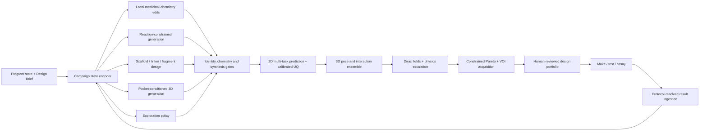
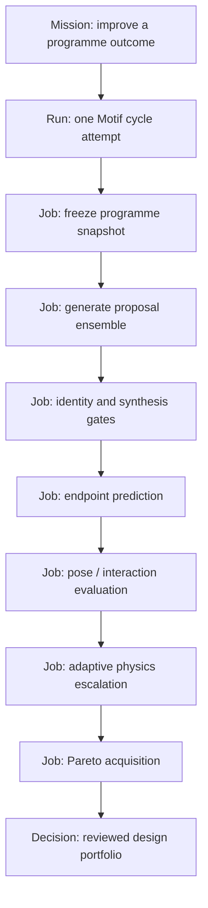

# Dirac Motif：工业级闭环 ML 药物设计引擎规格书

**状态：** Local algorithm stack implemented / scientific validation pending
**版本：** 2.0
**基线：** 2026-08-13 的 Dirac 仓库、运行服务与 PostgreSQL 架构
**产品定位：** 小分子药物发现的闭环、多目标、证据驱动设计引擎
**核心入口：** `design.generate`、`campaigns.optimize`、`campaigns.landscape`
**产品名：** Dirac Motif

---

## 0. 一句话定义

Motif 不是“生成一堆看起来像药的 SMILES”，也不是给化合物打一个神秘总分。

Motif 是运行在 Dirac 之上的**闭环药物设计决策系统**：它读取项目目标、靶点结构、历史实验和药化知识，提出可合成且有明确设计假设的新分子；用具有校准不确定性的 2D、3D 与物理模型逐级评估；在效力、选择性、ADME、安全性、新颖性、合成难度、成本和信息增益之间形成受约束的 Pareto 决策；再把完整实验结果回流到下一轮设计。

最终交付物不是“AI 生成的分子”，而是一个能反复选择更好实验、从完整结果中学习，并让下一次药化决策更快、更可解释、更可追溯的操作系统。

### 0.1 当前实现证据（2026-08-13）

当前仓库已落地 Motif 的生产级基础层，而不是宣称已完成药物发现：

- Dirac 现有 Command、Method、Job、Artifact、cache 与 PostgreSQL 控制面被保留，未建立第二套公共 API 或真值源；
- migrations 020–035 已应用到 live `dirac` 数据库；36 个迁移内容哈希检查通过；034–035 持久化闭环阶段、各阶段 Job、结果、attention 与重试次数；
- Motif 当前已注册 28 个 compute Methods、Dirac 共暴露 74 个 Commands；predictor mesh、Bayesian acquisition、conformer、Vina、OpenMM、RBFE network 与 OpenFE edge 均服从原有 Command/Method/Job/Artifact 控制面；
- predictor mesh 已包含 Morgan/RDKit descriptor release、ridge/1NN、random forest、XGBoost、删失 Tobit、pairwise rank、Chemprop D-MPNN ensemble、conditional conformal、适用域、bootstrap CI 与完整 specification curve；
- proposal chemistry gate 已加入 property window、required/forbidden SMARTS、未指派立体化学、PAINS 与显式 reactive-group 规则；采集层包含硬约束 Pareto、BoTorch qLogEHVI、information value 与 sensitivity，不使用隐藏总分；
- ETKDGv3 conformer、AutoDock Vina、OpenMM MD checkpoint/restart、RBFE network/aggregation 与 `physics.motif.openfe_edge` 已形成正式 Method 与 Artifact；OpenFE 1.11.1 runtime 固定到安装器 SHA-256，官方 CUDA alchemical MD slow test 已在 RTX 5080 通过；docking score 明确不是 binding free energy，单条 OpenFE leg 也不会被包装成已验证 RBFE；
- `dataset.snapshot.create` 的完成屏障会在 Job 标记 `done` 前原子注册 governed Dataset Snapshot、Endpoint linkage、四类必需 Artifact、lineage 与 outbox；`model.train` 同样在完成前注册 candidate Model Release、checkpoint、validation、local runtime manifest 和训练 Dataset linkage；投影失败会使 Job 失败，不能留下“Artifact 成功但领域 release 缺失”的假完成；
- live synthetic release smoke 已创建 valid Dataset Snapshot `83c18208-aa6a-4080-9147-09a4e75ecbdc` 和 candidate Model Release `8db47cac-0953-4026-a782-fa04544f5bb9`；精确重放复用同一领域身份并各保持一个 outbox 事件；训练行与 snapshot 数据 Artifact 的 canonical SHA-256 不一致时会 fail closed，且不创建 model release；
- Attempt 的 lease、takeover、fencing、stale completion rejection、idempotent completion 与 outbox 已在 PostgreSQL 集成验证；
- `endpoint.register`、`objective.save` 与 `result.ingest` 已通过 live CommandDispatcher 验证；规范文档、领域记录、Artifact 和 outbox 在同一 PostgreSQL 事务写入，重复提交按内容幂等；
- `result.ingest.closed_loop` 会验证 Program、Campaign、Target、Endpoint、单位、测量类型和优化方向一致，再异步推进 `snapshot → train → predict → acquire`；各阶段是可单独审计的普通 Dirac Job；`campaign.closed-loop.get` 提供状态读取，`campaign.closed-loop.retry` 能从失败阶段生成新的幂等尝试而复用已完成产物；
- live 闭环 run `f26b36f3-7106-442e-9581-233db86ed65f` 在部署故障后从 train 阶段恢复，完成 valid Dataset Snapshot、candidate Model Release、预测 Artifact 和下一轮 2 个候选；两个域外候选由默认 `model_domain_accepted` 硬门拒绝；
- `policy.release.register` 已为 generation、identity gate、fidelity、acquisition、diversity 与 explanation 建立真实 candidate releases；Objective 保存前会验证引用存在、policy kind 匹配、Program/Campaign/Target 一致以及 Objective/Endpoint 方向一致；
- protocol-resolved measurement v2 ledger 能原样保存 `not_tested`、`missing`、上下界删失和 QC 状态；这些记录不会被强制投影成 `bio.result.value_num = 0`；
- 本机 pueue GPU task 845 已在 RTX 5080/CUDA 12.8 完成两成员 Chemprop D-MPNN 训练、验证和预测；task 847 已用 OpenMM CUDA 写入 checkpoint 并恢复续跑；
- public `model.mesh.train` 链已持久化含两成员 Chemprop 的 valid Dataset Snapshot `35be1d08-6b27-43ea-b9c5-be0412ea7dde` 与 candidate Model Release `873a5bfe-539b-4a85-9691-508f203049c9`。它们是 synthetic control-plane fixture，只证明软件链，不证明模型科学效果；
- Kubernetes/Kueue 已作为 GPU Job 上位调度器接入本机 RTX 5080，Worker 使用固定 OCI digest、单 GPU 独占请求、默认拒绝网络、只读 runtime PV、可写 fenced exchange 和远程硬取消；DiffDock 仍只有外部执行门禁，Slurm 与 prospective wet-lab validation 仍未落地。
- 真实公共链验收 Job `7179e507-71ff-4a20-bb06-1d9319157db0` 已从 `/v2/jobs` 穿过 Kubernetes/Kueue，在 RTX 5080/CUDA 12.8 上由 OpenFE 1.11.1 执行 benzene self-transformation vacuum alchemical MD，主数据库终态为 `done`，持久化 `rbfe.openfe.result`、`rbfe.openfe.run_report`、`rbfe.openfe.log` 三个内容寻址 Artifact。该 smoke 显式声明 20 次 MBAR bootstrap；生产默认仍为 1000，每次运行都在 report 记录实际值。
- 暴力验证同时暴露一个未关闭的运维缺口：如果 API 控制面在远程 Worker 完成与 Artifact 回收之间被强制重启，当前 startup reaper 会将公共 Job 标成 `worker restarted while job was in flight`，即使 fenced worker-result 已落盘。正常运行和远程硬取消已验证，但“控制面重启后重附着并完成回收”仍是 production-readiness blocker，不得宣称已证明。

本节的 live 闭环仍是 `MOTIF-SMOKE-20260812` synthetic Program：靶点 organism 为 `synthetic`，Campaign 目标明确写着 `Synthetic control-plane verification only`，测试 IC50 也是构造值。它证明平台、恢复、科学门禁和下一轮编排，不证明任何真实生物靶点上的效力提升。真实项目必须提供具名 Target（如 UniProt）、受控蛋白结构、真实 protocol-resolved measurements、预注册验证拆分和 prospective 实验结果。

上述边界是融资和产品叙事必须遵守的证据边界：软件基础层已运行，不等于模型获得 prospective scientific validation，也不等于发现了临床候选物。

---

## 1. 产品决策

### 1.1 Motif 必须完成的五件事

1. **Generate**：在合成、结构和项目约束内提出候选设计，而不是无边界采样。
2. **Predict**：同时预测多个终点、置信区间、适用域和失败模式，而不是输出单点分数。
3. **Escalate**：按价值与成本把少量候选升级到 docking、学习型 affinity、Dirac fields、MD/FEP 或人工审查。
4. **Select**：选择一组互补的下一批实验，最大化项目进展和信息增益，而不是选排行榜前 N 名。
5. **Learn**：从成功、失败、删失值、阴性结果和批次差异中更新模型与决策策略。

### 1.2 Motif 不是什么

Motif MUST NOT 成为：

- 第二套产品、第二个前端或第二个公共 API；
- 绕过 Dirac Command、Method、Job 和 Artifact 的独立模型服务；
- 只优化 docking score 或 predicted affinity 的单目标系统；
- 把模型预测伪装成实验测量或证据的展示层；
- 只能在 notebook 中复现、无法冻结数据和模型版本的研究脚本；
- 依赖单一“明星模型”、升级模型就必须重写平台的架构；
- 自动宣称“发现药物”或未经人工授权就决定合成的自治代理。

### 1.3 真正可形成公司价值的资产

长期价值不来自某个公开 checkpoint，而来自五个相互增强的资产：

- 协议、批次、化学实体和终点均被解析清楚的专有实验数据；
- 连接 hypothesis → proposal → prediction → experiment → decision 的因果决策图谱；
- 知道何时使用便宜模型、何时值得支付物理计算成本的多保真策略；
- 能在真实药化约束中持续学习的设计与 acquisition policy；
- 可追溯、可重放、可审计的 Dirac 科学操作系统。

---

## 2. 规范性语言与成功边界

本文的 `MUST`、`MUST NOT`、`SHOULD`、`SHOULD NOT` 和 `MAY` 是规范性要求。

- **Platform-ready**：契约、执行、持久化、前端和失败路径可端到端工作。
- **Retrospectively validated**：冻结模型在时间外、系列外和 scaffold 外评估中通过门槛。
- **Prospectively validated**：在预注册的真实 DMTA 周期中，相对盲选或现有药化流程产生可测量增益。
- **Production-approved**：通过科学、运行、安全和人工审批门槛，并被具名 actor 晋升。
- **Fundable**：拥有可信的系统、可重现的技术证据和前瞻性结果；不等同于演示界面或回顾性 AUC。

融资叙事不得超越证据。平台完成、模型验证和前瞻性药物发现结果必须分开陈述。

---

## 3. Dirac 提供给 Motif 的条件与不可违反的约束

Motif 是 Dirac 的能力模块。下列条件是设计输入，不是建议。

### 3.1 单一规范身份系统

Dirac 已通过 canonical JSON 定义 ObjectKind、ObjectRef、RelationKind、Command、Method、Error 和 Artifact；Python 与 TypeScript 类型由这些契约生成。

Motif MUST 复用现有对象，包括：

```text
program, target, molecule, compound, series, prediction, campaign,
assay, measurement, dataset, model, artifact, mission, run, job,
evidence, decision
```

Motif MUST 复用现有关系，包括：

```text
derived_from, generated_by, used, measured_in, predicted_by,
belongs_to, member_of, selected_from, promoted_because,
rejected_because, supports, contradicts, part_of
```

所有跨层引用 MUST 是：

```json
{ "kind": "compound", "id": "<canonical-id>" }
```

不得引入 `MotifCompoundId`、`MLJobStatus` 或另一套 lineage vocabulary。

权威契约：

- [`contracts/domain/object-kinds.json`](../../contracts/domain/object-kinds.json)
- [`contracts/domain/relations.json`](../../contracts/domain/relations.json)
- [`contracts/commands/registry.json`](../../contracts/commands/registry.json)
- [`contracts/methods/`](../../contracts/methods)
- [`contracts/errors.json`](../../contracts/errors.json)

### 3.2 Command 是唯一语义入口

`CommandDispatcher` 是应用语义边界。它负责输入/输出校验、`human | agent | service` actor、request identity、command trace、授权和 required-Job policy。

前端和 agent MUST 通过 `DiracClient.execute(...)` 发出 Motif 操作。它们 MUST NOT 直接调用模型框架、Python 脚本、notebook、worker 或私有 `/ml/*` 路由。

建议的语义命令：

```text
objective.save
proposal.generate
molecule.evaluate
campaign.rank
proposal.review
compound.promote
model.describe
model.release.promote
```

权威实现：

- [`backend/dirac_app/dispatcher.py`](../../backend/dirac_app/dispatcher.py)
- [`src/app/services/dirac-client.ts`](../../src/app/services/dirac-client.ts)

### 3.3 Method 是唯一科学计算边界

`InvocationService` 已负责：

- Method 查找和严格 JSON Schema 校验；
- current-version cache lookup；
- durable Job 创建与 in-flight deduplication；
- Executor 分发；
- 输出校验；
- Artifact 写入与 Job linkage；
- typed warning、refusal 和 provenance；
- method version 与 request identity。

Motif handler MUST 返回 `HandlerResult`，不得自行构造 HTTP envelope、缓存键或 Job 状态。

建议的科学 Methods：

```text
design.motif.propose
ml.motif.evaluate
structure.motif.pose
design.motif.acquire
ml.motif.update
```

权威实现：

- [`backend/invocation.py`](../../backend/invocation.py)
- [`backend/catalog.py`](../../backend/catalog.py)
- [`backend/execution.py`](../../backend/execution.py)

### 3.4 单一运行拓扑

Motif MUST 保持当前公共拓扑：

| 组件 | 职责 |
|---|---|
| `dirac-fields.service`, `:8901` | Command、Method、Job、cache、artifact 统一控制面 |
| `dirac-web.service`, `:1360` | 唯一生产前端 |
| `dirac-ops.service`, `:1355` | 只读运维投影 |
| PostgreSQL `dirac` | 科学、领域和执行状态的持久权威 |

GPU worker、process worker 或 remote worker MAY 位于 Executor 后方，但不得新增面向客户端的公共控制面或独立真值源。

### 3.5 Dirac 持久状态是唯一真值源

Motif MUST 复用：

- `chem.compound`：标准化 parent chemical identity；
- `chem.form`、`chem.batch`：物理形态和实际批次；
- `bio.assay`、`bio.result`：实验定义、qualifier、删失值、单位与 QC；
- `design.program`、`design.series`、`design.campaign`：项目和药化上下文；
- `design.idea`：设计假设与候选意图；
- `meta.method`：计算方法身份和 current version；
- `app.mission`、`app.run`、`app.run_job`：意图、尝试和计算分离；
- `app.job`：持久计算生命周期；
- `app.blob`、`app.artifact`、`app.job_artifact`：内容寻址字节；
- `app.result_cache`：确定性结果复用；
- `app.object_relation`：actor-attributed lineage；
- `app.command_trace`：命令结果；
- `app.v_attention`：失败、审批和需人工处理事项。

CSV 目录、SQLite、MLflow 默认数据库、浏览器数组和 framework checkpoint folder 都不得成为数据集、模型、预测、Job 或决策的权威源。

### 3.6 单一前端、单一科学上下文、单一 3D 场景

Dirac 已有：

- 一个 AppShell registry；
- `ScientificContextStore`，拥有 program、campaign、focus、selection 和 staleness generation；
- 一个持久 Mol* `SceneService`；
- 一个 `DiracClient`；
- Runs 工作区用于 Job 状态、取消、历史与 provenance。

Motif MUST 进入现有的 `design.generate`、`campaigns.landscape` 和 `campaigns.optimize` 视图。不得新建第二 router、context store、轮询系统、artifact client 或 Mol* 实例。

权威实现：

- [`src/app/shell/workspace-plans.ts`](../../src/app/shell/workspace-plans.ts)
- [`src/app/shell/registries.ts`](../../src/app/shell/registries.ts)
- [`src/app/context/scientific-context-store.ts`](../../src/app/context/scientific-context-store.ts)

### 3.7 安全与计算治理

本地/LAN 模式可以按 Dirac 当前策略运行。远程模式 MUST fail closed，并使用现有 bearer identity、HTTPS proxy enforcement、scope、request-size limit、rate limit、durable cost quota 和 redacted audit evidence。

新能力必须能被现有 scope 模型表达：

```text
command:proposal.generate:execute
command:campaign.rank:execute
method:design.motif.propose:invoke
method:ml.motif.evaluate:invoke
method:structure.motif.pose:invoke
job:read
artifact:read
```

### 3.8 科学真值层级

Dirac 对 Motif 最重要的约束是：不同类型的“真”不得混写。

```text
Model prediction
    != experimental Measurement
    != reviewed Evidence
    != authorized Decision
```

每一个 UI badge、API field、导出表和投资人演示都 MUST 保留该边界。预测可支持决策，但不能自动升级为证据；实验值也必须带 assay、protocol、batch、unit、qualifier 和 QC 上下文。

---

## 4. 科学目标：从 Design Brief 到 Design Portfolio

### 4.1 输入不是一句 prompt，而是可执行 Design Brief

每轮设计必须冻结以下输入：

- program、campaign、target 与 target state；
- 可用实验结构、预测结构、binding-site 定义和 confidence；
- 起始 ligand、series、protected motif、禁止 motif；
- 必须满足和希望满足的 endpoints；
- 每个 endpoint 的方向、单位、阈值、优先级和缺失值策略；
- selectivity panel 与 antitarget；
- physicochemical、ADME、toxicity、novelty 和 IP proxy 约束；
- 可用 building blocks、reaction templates、供应状态和 synthesis budget；
- 候选数量、计算预算、周期时限和实验容量；
- 风险偏好、diversity policy 与人工审批点。

### 4.2 输出不是排序表，而是 Design Portfolio

输出必须是一组互补的设计决策，每个 proposal 至少包含：

- canonical compound identity 或明确的 proposed identity；
- parent、series、生成策略与 edit trace；
- synthesis route 或 reaction provenance；
- 多终点预测分布和适用域；
- pose/interaction hypothesis 及结构来源；
- Pareto status、selection probability 和 acquisition value；
- uncertainty decomposition；
- 支持、矛盾和缺失证据；
- 预计计算、采购、合成与实验成本；
- “为什么选”“为什么不选”“什么结果会改变决定”；
- 人工 review 状态和最终 disposition。

### 4.3 可执行的优化契约：先说清“针对什么”，再说“好不好”

Motif 不接受没有科学上下文的“把分数做高”。每个闭环必须同时冻结四类不同对象：

- **Target context**：具名生物靶点、organism、sequence/UniProt、蛋白构象、binding site、cofactor/water/protonation 状态与结构版本；
- **Experimental endpoint**：例如 biochemical IC50、cellular EC50、selectivity ratio、clearance 或 hERG，必须带 protocol、measurement type、canonical unit、qualifier、QC 和 `minimize`/`maximize` 方向；
- **Decision constraints**：效力、选择性、ADME、安全、合成可行性、成本、时间、实验容量和 applicability domain；其中硬约束不得被任何综合分数补偿；
- **Estimand**：默认不是预测值本身，而是“每单位实验成本带来的前瞻性 Pareto improvement”，辅以达到 milestone 的轮数、失败率、信息增益和 cycle time。

当前已落地的自动回路按以下方式优化：

1. `result.ingest` 仅接纳与 Program、Campaign、Target 和 Endpoint 语义一致的 protocol-resolved measurements；`missing`、`not_tested` 和未通过 QC 的记录不得偷渡成训练标签。
2. 系统生成不可变 Dataset Snapshot，在预定义 split 上训练 predictor mesh，并保留 ensemble mean、epistemic uncertainty、calibration 和 applicability-domain 判断。
3. 对候选分子预测后，把主 endpoint 的均值和可选的不确定性目标注入 acquisition；默认将 `out_of_domain` 作为硬拒绝，再按多目标 Pareto、证据缺口、信息价值和实验 capacity 选出下一轮 portfolio。
4. 只有当高成本物理计算有机会改变决策时才升级到 OpenFE；每个 RBFE edge 必须回到同一 target context，并在 complex/solvent 成对、独立 repeats、convergence 和 cycle closure 通过后才能作为 RBFE 证据。

因此，“这个系统好不好”必须分三层回答：工程回路是否可靠；在时间外/系列外数据上是否比强基线更好；在预注册 prospective DMTA campaign 中是否以更低成本获得更大的实验 Pareto improvement。前一层通过不代表后两层通过。

---

## 5. Motif 核心算法

### 5.1 总体架构



没有任何单个模型拥有最终决策权。Motif 是模型组合、约束、升级策略和证据循环。

### 5.2 Campaign State Encoder

State Encoder 把异构项目状态编码为可训练、可追溯的上下文：

- molecular graph、3D conformer ensemble 和 chemical series；
- target sequence、structure、binding site 与构象状态；
- assay protocol、endpoint、batch、qualifier、censoring 和 uncertainty；
- historical edits 与 matched molecular pairs；
- reaction、building block 和 synthesis evidence；
- compound–assay–model–decision provenance graph；
- 哪些化学空间已探索、哪些假设已失败；
- 当前项目约束、预算与实验吞吐。

编码器输出 MUST 保留缺失掩码和来源，不得把“未测”编码成阴性结果。

### 5.3 Proposal Ensemble：多策略生成而非单模型垄断

#### A. 局部药化改造

面向 lead optimization 的默认高价值路径：

- matched molecular pair transforms；
- R-group enumeration；
- bioisostere replacement；
- ring contraction/expansion、linker edit、stereochemistry exploration；
- 基于 series 和 endpoint 的 delta predictor；
- protected substructure 和 atom mapping 约束。

该路径 SHOULD 作为“最小可信改动”基线，并与所有深度生成器竞争。

#### B. 反应/合成子约束生成

生成动作空间 SHOULD 直接由可执行反应和可获得 building block 定义，而不是事后才做 synthetic accessibility filter。

候选实现可包括 reaction-based GFlowNet、reinforcement learning 或 conditional sequence/graph generator。每个 proposal MUST 记录：

- reaction template ID 与版本；
- reactant/building-block identities；
- atom mapping；
- route depth、estimated success、cost 与 lead time；
- 哪些约束在生成时满足，哪些仅在后过滤满足。

#### C. Scaffold、fragment 与 linker 设计

必须支持：

- fixed-substructure decoration；
- scaffold hopping；
- fragment growing；
- fragment linking；
- macrocyclization 或 constrained linker（在项目允许时）；
- shape/pharmacophore-conditioned replacement。

#### D. Pocket-conditioned 3D generation

在结构置信度足够时，可使用 E(3)-equivariant diffusion、flow 或 autoregressive 3D 模型，显式条件化 protein pocket、关键 interaction、excluded volume 和 ligand geometry。

该路径 MUST：

- 标出 receptor 来源是 experimental 还是 predicted；
- 记录 chain、residue、protonation、cofactor、water 和 binding-site preparation；
- 生成或保留多 pose / 多 conformer，不假装单一结构确定；
- 在结构置信度不足时降级或拒绝，不强行给精确答案。

#### E. Exploration policy

Motif 必须保留一部分预算用于：

- 高 epistemic uncertainty 区域；
- 新 scaffold 或新 reaction family；
- 对关键模型分歧最有诊断价值的候选；
- 能区分竞争机制假设的 experiment；
- 阴性对照、activity cliff 邻域和 boundary probe。

纯 exploitation 会让闭环快速坍缩到狭窄化学空间。

### 5.4 Chemical Identity 与硬门控

进入预测层前，所有候选 MUST 经过：

- parse、valence、charge 和 sanitization；
- canonicalization、tautomer/protomer policy；
- stereochemistry completeness；
- salt/solvent/parent identity separation；
- exact duplicate 与 near-duplicate 检查；
- forbidden chemistry、reactive group、PAINS/assay interference 警告；
- project-specific substructure constraints；
- synthesis route validity 或明确的 `route_unknown`；
- novelty 和 training-set proximity 计算。

规则过滤只能产生具体 reason code，不能把复杂药化判断压缩成一个不可解释的“drug-likeness score”。

### 5.5 Ligand 与 Endpoint Predictor Mesh

每个 endpoint 都是独立的科学对象，必须绑定：assay definition、protocol、units、direction、label transform、censoring policy 和 intended domain。

模型网格至少包括：

- classical fingerprints + RF/XGBoost/linear baseline；
- D-MPNN / graph neural network；
- pretrained molecular encoder 或 foundation embedding；
- series-aware delta model；
- multi-task heads，用于共享相关终点信号；
- censored regression、classification、ordinal 或 ranking head；
- ensemble 与 calibration layer。

复杂模型 MUST 与简单基线在同一冻结 split 上竞争。没有稳定增益就不得晋升。

典型 endpoints：

- biochemical/cellular potency；
- selectivity and antitargets；
- solubility、logD、permeability、efflux；
- microsomal/hepatocyte stability；
- plasma protein binding、clearance proxy；
- CYP/hERG/reactive-metabolite 等安全信号；
- project-defined phenotype 或 developability readout。

不得把跨 protocol、跨 species 或语义不同的 endpoint 静默合并。

### 5.6 Structure 与 Interaction Mesh

结构模块不是单一 docking score，而是证据组合：

1. experimental complex（若存在）；
2. predicted complex / target structure，带结构置信度；
3. diffusion docking 或 pose generation ensemble；
4. pose confidence 与 interaction fingerprint；
5. learned affinity/ranking model；
6. Dirac MEP、MLP、region field、torsion strain 和 surface features；
7. explicit physics escalation，如 minimization、MD、MM/GBSA 或 FEP/RBFE；
8. human structural review。

AlphaFold 3、Boltz、DiffDock 或后续模型都只是可替换实现。模型版本必须冻结，Motif 的公共契约不得绑定某一供应方或论文名称。

### 5.7 多保真计算阶梯

Motif MUST 依据候选价值、风险和计算成本逐级升级，而不是对全部分子运行最贵计算。

| 层级 | 典型计算 | 目的 | 默认规模 |
|---|---|---|---|
| F0 | identity、rules、2D descriptors、route checks | 剔除无效或违反硬约束的设计 | 全部 |
| F1 | 2D/multi-task ensemble、UQ、AD | 快速多终点评估 | 全部合法候选 |
| F2 | conformer、pose ensemble、interaction | 检查结构假设和几何可行性 | Top subset + uncertainty probes |
| F3 | Dirac fields、torsion、learned affinity | 提升物理与相互作用判别 | 更小 subset |
| F4 | MD/FEP/RBFE 或高成本计算 | 解决关键排序或机制问题 | 极少数 series-connected pairs |
| F5 | synthesis / purchase / assay | 获得真实信息 | 实验容量限定 portfolio |

升级策略本身是可学习 policy：预测“再花一单位成本能否改变最终选择”。

### 5.8 不确定性不是一个 error bar

Motif MUST 区分：

- **aleatoric uncertainty**：实验和体系噪声；
- **epistemic uncertainty**：训练数据不足；
- **structural uncertainty**：target/pose/protonation/conformation 不确定；
- **model disagreement**：模型家族之间冲突；
- **decision uncertainty**：目标权重或约束定义不确定；
- **out-of-domain risk**：与训练化学空间或 protocol 偏离。

每个 prediction MUST 返回 point estimate、interval/distribution、calibration context、applicability status 和 supporting model releases。

推荐组合：deep ensembles、conformal prediction、distance/domain estimators、temperature/isotonic calibration，以及在样本足够时的 heteroscedastic head。任何方法都必须用时间外或系列外数据验证 coverage。

### 5.9 Constrained Pareto 与 Value-of-Information Acquisition

Motif 的目标不是：

```text
argmax affinity_score
```

而是选择 portfolio `B`：

```text
maximize_B
    E[program progress | B]
  + λ_info * information_gain(B)
  + λ_div  * portfolio_diversity(B)
  - λ_cost * total_cost(B)
  - λ_risk * failure_risk(B)

subject to
    hard chemistry constraints
    synthesis and assay capacity
    endpoint feasibility probabilities
    campaign time and budget
    minimum exploration allocation
```

可采用 constrained qEHVI、Thompson sampling、Pareto bandit 或等价 acquisition 方法，但必须输出可解释的分解：

- feasibility probability；
- expected Pareto improvement；
- uncertainty / information value；
- diversity contribution；
- predicted cost 与 failure risk；
- 最终 selection reason。

### 5.10 Active Learning 与 DMTA 回流

每一轮必须遵循：

```text
Design -> Make -> Test -> Analyze -> Update
```

回流必须摄取全部可解释结果：正结果、负结果、删失值、failed synthesis、assay failure、protocol deviation 和 missingness reason。只摄取成功分子会造成严重 selection bias。

模型更新分两层：

- **rapid adaptation**：campaign-local calibration、delta model、nearest-neighbor evidence；
- **governed release**：冻结 dataset snapshot、重新训练、验证、model card、审批和 promotion。

在线结果不得静默改变已发布模型。任何更新都生成新 release 和新 method version。

### 5.11 Grounded Medicinal-Chemistry Explanation

解释层可以使用规则、retrieval 或 LLM，但 MUST grounding 到结构化事实：

- 具体原子/子结构 edit；
- matched-pair 或 series evidence；
- endpoint prediction 与 interval；
- pose/interaction/field evidence；
- synthesis route；
- conflict、missing evidence 和 out-of-domain warning。

语言模型不得发明实验值、合成路线、专利结论或确定性机制。每个自然语言结论必须可点击回源。

---

## 6. Dirac 执行模型：Mission → Run → Job DAG

一次 Motif cycle 不是一个巨大黑盒 Job。



每个 Job 必须可单独重试、取消、缓存和审计。Run 聚合 DAG；Mission 表达持续目标。UI 不得伪造进度。

---

## 7. 规范接口

### 7.1 `objective.save`

职责：保存版本化 Design Brief，不执行科学计算。

关键输入：

```json
{
  "program": { "kind": "program", "id": "..." },
  "campaign": { "kind": "campaign", "id": "..." },
  "target": { "kind": "target", "id": "..." },
  "objectives": [
    {
      "endpoint_id": "...",
      "direction": "maximize",
      "threshold": 7.0,
      "role": "constraint",
      "minimum_probability": 0.7
    }
  ],
  "chemistry_constraints": {},
  "compute_budget": {},
  "experimental_capacity": {}
}
```

输出：immutable `objective_spec_id` 和 digest。

### 7.2 `proposal.generate`

职责：在冻结目标下启动 `design.motif.propose`，创建 proposal objects 和 generation artifacts。

关键输入：

```json
{
  "objective_spec_id": "...",
  "program_snapshot_id": "...",
  "strategies": ["local_edit", "reaction", "scaffold", "pocket_3d", "explore"],
  "max_raw_proposals": 50000,
  "max_valid_proposals": 5000,
  "seed": 1729
}
```

### 7.3 `molecule.evaluate`

职责：启动 `ml.motif.evaluate`，按指定 fidelity plan 生成多终点预测与不确定性。

关键输入：

```json
{
  "compound_refs": [{ "kind": "compound", "id": "..." }],
  "dataset_snapshot_ids": ["..."],
  "model_release_ids": ["..."],
  "fidelity_policy_id": "...",
  "objective_spec_id": "..."
}
```

### 7.4 `campaign.rank`

职责：启动 `design.motif.acquire`，形成非支配前沿和推荐 portfolio。

它必须返回：selected、reserve、rejected 和 refused 四类状态；每项均带机器可读 reason codes。

### 7.5 `proposal.review` 与 `compound.promote`

`proposal.review` 记录人工判断、修改和冲突。`compound.promote` 是显式业务决策，必须记录 actor、依据、目标队列和 approval policy。模型本身不得调用底层数据库绕过该命令。

### 7.6 `model.describe` 与 `model.release.promote`

前者是只读透明度接口；后者是治理动作。晋升必须引用 validation artifact、model card、approver 和适用范围。

---

## 8. 核心数据契约

### 8.1 Design Brief

MUST 包含：

- `objective_spec_id`、schema version 和 digest；
- program/campaign/target ObjectRefs；
- endpoint definitions；
- hard constraints 与 soft objectives；
- protected/forbidden structures；
- synthesis resources；
- compute/experimental budget；
- policy releases；
- created actor/time。

### 8.2 Proposal

```json
{
  "proposal_id": "...",
  "compound": { "kind": "compound", "id": "..." },
  "parents": [{ "kind": "compound", "id": "..." }],
  "series": { "kind": "series", "id": "..." },
  "strategy": "reaction",
  "generator_release_id": "...",
  "edit_trace": [],
  "synthesis": {
    "route_artifact_id": "...",
    "status": "supported",
    "estimated_cost": 0,
    "estimated_days": 0
  },
  "hard_constraint_status": "pass",
  "warnings": []
}
```

### 8.3 Evaluation

```json
{
  "proposal_id": "...",
  "predictions": [
    {
      "endpoint_id": "...",
      "model_release_id": "...",
      "estimate": 0.0,
      "interval": [0.0, 0.0],
      "feasibility_probability": 0.0,
      "applicability": "in_domain",
      "uncertainty": {
        "aleatoric": 0.0,
        "epistemic": 0.0,
        "structural": 0.0
      }
    }
  ],
  "pose_artifact_ids": [],
  "field_artifact_ids": [],
  "conflicts": [],
  "warnings": []
}
```

### 8.4 Portfolio

MUST 包含：

- cycle、objective 和 program snapshot identity；
- selected/reserve/rejected/refused 分组；
- Pareto objectives 与 non-dominated rank；
- selection component breakdown；
- diversity coverage；
- capacity/cost totals；
- evidence graph links；
- policy version、random seed 和 solver settings；
- human review/approval state。

所有大规模逐候选矩阵以 Artifact 存储；PostgreSQL 保存索引、摘要、决策和 lineage，不把数百万行 dense tensor 塞入领域表。

---

## 9. Dataset、Model 与 Policy Release

### 9.1 Dataset Snapshot

每个 snapshot MUST 冻结：

- selection query 和 query digest；
- compound identity policy；
- endpoint/assay/protocol versions；
- label transform、unit normalization、qualifier/censoring policy；
- QC/exclusion reason；
- split manifest；
- row-level lineage 或内容寻址 manifest；
- created actor/time；
- artifact digest。

### 9.2 Split Manifest

至少支持：

- random split，仅用于调试或下限基线；
- scaffold split；
- series split；
- temporal split；
- project/site/protocol holdout；
- Lo-Hi / activity-cliff stress split。

最终报告必须给出 specification curve，而不是只展示最有利的一种 split。

### 9.3 Model Release

一个 model release MUST 冻结：

- dataset snapshot IDs；
- source commit/digest；
- checkpoint digest；
- featurizer/preprocessing digest；
- hyperparameters 与 random seeds；
- endpoint definitions；
- calibration artifact；
- applicability-domain policy；
- retrospective validation artifact；
- model card；
- intended use、known limitations 与 prohibited use；
- lifecycle state：`candidate | validated | production | retired`。

运行时身份 MUST 二选一并可审计：容器执行保存不可变 OCI image digest；本机执行保存由 Python、平台和完整 installed-distribution inventory 构成的 runtime manifest Artifact。本机 manifest 若没有 wheel/source archive hashes，必须在 limitations 中明示，不能伪装成完全可重建的 lockfile。

Dirac 的计算版本必须至少哈希：

```text
source + checkpoint + featurizer + calibration + decision policy
```

只按 Python source digest 版本化会产生错误缓存，MUST NOT 上线。

### 9.4 Policy Release

生成 policy、fidelity policy、acquisition policy 和 diversity policy 也必须版本化。它们决定“算什么”和“选什么”，与 predictor 一样影响结果。

---

## 10. PostgreSQL 最小扩展

建议通过顺序 migration 添加以下领域状态，具体列名以现有 migration 风格为准。

### 10.1 `app.dataset_snapshot`

保存 snapshot identity、schema version、manifest artifact、digest、creator 和状态。

### 10.2 `meta.model_release`

连接 `model` ObjectRef、Method version、checkpoint、dataset snapshots、validation/model-card artifacts、lifecycle 和 promotion evidence。

### 10.3 `design.objective_spec`

保存不可变 Design Brief、digest、program/campaign/target refs 和 supersession lineage。

### 10.4 扩展 `design.idea`

保存 proposal strategy、parent refs、generator release、route status、review status 和 disposition；详细 edit trace 进入 Artifact。

### 10.5 `design.motif_cycle`

连接 mission、run、objective spec、program snapshot、proposal/evaluation/portfolio artifacts、policy releases、审批和 cycle outcome。

### 10.6 关系要求

每轮至少形成：

```text
proposal generated_by model_release
proposal derived_from parent_compound
prediction predicted_by model_release
prediction used dataset_snapshot
measurement measured_in assay
portfolio selected_from campaign
decision promoted_because evidence
decision rejected_because evidence
cycle part_of run
job part_of run
```

---

## 11. Artifact 规范

建议新增 roles：

```text
motif.design_brief
motif.program_snapshot
motif.proposals
motif.proposals_sdf
motif.predictions
motif.poses
motif.interactions
motif.pareto
motif.selection
motif.explanations
motif.model_card
motif.split_manifest
motif.cycle_report
```

Artifact MUST content-addressed，记录 media type、schema version、producer method/job 和 digest。

当前 InvocationContext 需要补一个最窄的只读 `ArtifactReader` capability，使 handler 能按已授权 artifact ID 读取 dataset/checkpoint/input。不得让 handler 获得任意 filesystem 或数据库访问权。

---

## 12. Executor 与算力架构

### 12.1 Executor Router

在现有 Executor 抽象后增加内部 router，根据 Method metadata 的 `resource_class` 选择：

```text
inline        tiny deterministic transforms
cpu           featurization, classical inference, light generation
gpu           neural generation, ensembles, structure models
hpc_remote    MD/FEP or externally governed compute
```

这不是新 API；InvocationService 仍是唯一入口。

### 12.2 GPU 运行约束

本机 GPU 工作 MUST 通过现有 pueue / `gpu-run` 调度，禁止从 request thread 直接占用 CUDA。训练和重推理必须有显存估算、wall-time、heartbeat、checkpoint 和可恢复性。

### 12.3 预算与拒绝

提交前必须估算：

- proposal 数量；
- 每 fidelity 层预计进入数；
- CPU/GPU hours；
- artifact bytes；
- 第三方或 HPC 成本；
- expected completion range。

超出 quota 时返回 typed refusal，不得静默降级。用户可显式选择降低规模或 fidelity。

### 12.4 取消语义

当前 queued-only cancellation 不足以支持昂贵训练和 physics Jobs。上线相关能力前，Executor MUST 支持 cooperative running cancellation、worker heartbeat、lease expiry 和 idempotent recovery。

---

## 13. 前端产品规格

### 13.1 `design.generate`

工作流：

1. 编辑/选择 Design Brief；
2. 查看可用数据、模型与结构 readiness；
3. 配置 generation strategies 和预算；
4. 提交 Motif cycle；
5. 实时进入 Runs 查看真实 Job DAG；
6. 返回后比较 proposal family、edit trace、route 和预测；
7. 在共享 Mol* scene 查看 pose/interaction/field；
8. 发起 review 或加入 candidate portfolio。

### 13.2 `campaigns.landscape`

必须展示：

- observed vs predicted 的明确区分；
- endpoint coverage 和 missingness；
- chemical/embedding landscape；
- series、scaffold、assay 和 time 切片；
- train/test/prospective provenance；
- applicability domain 和 uncertainty；
- model disagreement 与 activity-cliff 区域。

### 13.3 `campaigns.optimize`

必须展示：

- Pareto frontier，而非默认总分排行榜；
- 每个候选的 feasibility、uncertainty、VOI、diversity 和 cost 分解；
- selected/reserve/rejected/refused；
- 目标权重或硬约束变化后的敏感性；
- 选择理由、反对证据和人工 reviewer；
- promote 操作与审批状态。

### 13.4 诚实文案

UI 使用：

- `Predicted`、`Measured`、`Reviewed evidence`、`Decision`；
- `In domain`、`Borderline`、`Out of domain`；
- `Experimental structure`、`Predicted structure`；
- `Retrospectively validated`、`Prospectively validated`。

UI 禁止无证据使用：

- “confirmed binder”；
- “clinically safe”；
- “synthesis guaranteed”；
- “AI discovered drug”；
- 将综合分数显示成概率却不说明 calibration。

---

## 14. 科学验证门槛

### 14.1 泄漏控制

训练前必须检测：

- exact molecule leakage；
- tautomer/salt/stereo duplicate leakage；
- scaffold/series leakage；
- temporal leakage；
- assay replicate/protocol leakage；
- target homolog leakage；
- label-derived feature leakage；
- pretrained model overlap，在可审计范围内披露。

### 14.2 Predictor 指标

按 endpoint 类型报告：

- regression：MAE、RMSE、R²、Spearman/Kendall；
- classification：PR-AUC、ROC-AUC、balanced accuracy、MCC；
- ranking：top-k enrichment、NDCG、pairwise accuracy；
- calibration：ECE、Brier、coverage、interval width；
- domain：in-domain 与 out-of-domain 分层性能；
- decisions：threshold precision/recall 与 expected utility。

所有指标必须给 bootstrap confidence interval，并按 scaffold、series、time、assay 和 chemical-distance 分层。

### 14.3 Generator 指标

必须报告：

- validity、uniqueness、novelty；
- hard-constraint pass rate；
- synthesis route support 和 route success proxy；
- scaffold/series diversity；
- predicted property distribution；
- out-of-domain rate；
- duplicate burden；
- human acceptance；
- prospective synthesis success；
- prospective experimental hit/quality rate。

Validity 和 novelty 不是药物设计成功指标，只是卫生指标。

### 14.4 Pose、Affinity 与 Physics 指标

- pose：symmetry-corrected RMSD、top-k success、pose confidence calibration；
- affinity/ranking：按 target/time/series 的 correlation 与 enrichment；
- FEP/RBFE：pairwise ΔΔG error、cycle closure、failure rate、coverage；
- robustness：protonation、receptor state、water/cofactor 和 seed sensitivity；
- utility：高成本计算实际改变了多少决策，以及改变是否更正确。

### 14.5 Acquisition 回顾测试

用历史时间切片模拟每轮只能看到当时数据，比较：

- random；
- nearest-neighbor / medchemist heuristic；
- uncertainty-only；
- greedy predicted score；
- Pareto without VOI；
- Motif full policy。

主要 estimands：每个实验成本带来的 Pareto improvement、达到 milestone 的轮数、失败率和信息增益。必须在完整策略网格上处理 multiplicity，不得只展示最好的一格。

### 14.6 前瞻性验证

Production claim 的最低证据是预注册的 prospective campaign：

- 在结果揭盲前冻结 Design Brief、模型和 selection policy；
- 设置现有流程或可接受 baseline；
- 明确实验容量和失败处理；
- 记录所有 proposed、selected、synthesized、failed 和 measured outcomes；
- 预先定义 primary/secondary endpoints；
- 报告 effect size、interval、成本和 cycle time；
- 不因结果不好而改写成功标准。

---

## 15. Model Promotion Gate

任何 model/policy 从 candidate 晋升到 production，必须同时满足：

1. 数据 snapshot 和 split 可重现；
2. 无已知泄漏；
3. 至少打败强简单基线或证明独特互补价值；
4. calibration 与 applicability domain 达标；
5. 失败模式和 intended use 写入 model card；
6. 端到端 Job/Artifact/provenance 可重放；
7. latency、cost、resource 和 cancellation 达标；
8. security/redaction/authorization 测试通过；
9. 有具名 scientific reviewer；
10. 需要高等级 claim 时已有 blinded/prospective evidence。

晋升必须是显式 `model.release.promote` 命令，不得因新 checkpoint 被复制到目录而自动发生。

---

## 16. 生产可靠性与监控

### 16.1 运行指标

- queue latency、run time、GPU utilization；
- Job success/retry/cancel/timeout；
- cache hit 与 deduplication；
- artifact bytes 和读取失败；
- cost estimate error；
- model load/warmup/fallback；
- command-to-decision end-to-end latency。

### 16.2 科学漂移

- input chemistry/domain drift；
- endpoint/protocol drift；
- prediction residual 与 calibration drift；
- series/scaffold coverage；
- generated chemistry collapse；
- model disagreement；
- synthesis and assay failure drift；
- selection propensity 与 feedback bias。

### 16.3 失败必须显式

以下情况必须 warning/refusal，而不是空结果或伪成功：

- model/dataset/policy artifact 缺失或 digest 不符；
- endpoint schema 不兼容；
- target structure 不满足用途；
- 全部候选 out of domain；
- route engine 不可用；
- GPU/HPC quota 不足；
- calibration 过期；
- portfolio infeasible；
- human approval required。

---

## 17. 安全、伦理与人类权限

- Motif 是研究决策支持系统，不直接给出临床安全结论。
- 涉及受控、高风险或 dual-use 化学空间时，必须有 policy gate、审计和拒绝能力。
- 训练数据必须有 license、consent/provenance 和用途记录。
- 对第三方模型、结构和数据库必须记录许可与版本。
- 模型不得覆盖实验原始值；修订通过新记录和 supersession 完成。
- 最终合成、外包、昂贵计算和模型晋升必须受角色权限与审批控制。
- LLM 只生成 grounded explanation 或辅助结构化操作，不拥有科学真值。

---

## 18. 护城河与公司级产品论证

### 18.1 为什么不是“又一个生成模型”

公开模型会快速商品化。Motif 的差异化是：

- 在 Dirac 内拥有 assay/protocol/batch-aware 数据真值；
- 生成动作受 reaction、inventory 和药化约束控制；
- 2D、3D、fields、physics 和实验处于同一 provenance graph；
- acquisition 优化下一次实验的项目价值；
- 所有失败和阴性结果都能进入学习闭环；
- 任一基础模型可替换，产品契约和历史证据不丢失。

### 18.2 数据飞轮

```text
更好的 identity/protocol capture
  -> 更干净的训练集
  -> 更可信的 uncertainty
  -> 更好的 experiment selection
  -> 更高信息密度的实验结果
  -> 更强的 campaign-local model
  -> 更好的下一轮设计
```

飞轮的单位不是“化合物数量”，而是**每个被完整解释的实验所减少的项目不确定性**。

### 18.3 融资时应展示的证据

可信的融资材料应该展示：

- 真实可运行的闭环产品，而非拼接截图；
- 冻结版本下可重放的 proposal-to-decision lineage；
- 对强基线的时间外、系列外和 prospective 增益；
- 每轮实验成本、周期时间和 Pareto progress 的改善；
- 至少一个深入 campaign 的设计故事，包含失败与模型修正；
- 平台能快速接入新 endpoint、target、模型和 external compute；
- 数据/IP/license 治理清楚；
- 哪些是已验证结果，哪些仍是路线图。

“融资十个亿”不是算法指标。Motif 能提供的是足以支持重大融资判断的技术资产、产品证据和可扩展经济模型。

---

## 19. 产品与融资里程碑

### Milestone A — Closed-loop Operating System

**证明：** 一个真实 campaign 从 Design Brief 经 Proposal、Evaluation、Portfolio、Review 到 Result ingestion 全链路完成；所有对象可追溯、可重放。

### Milestone B — Retrospective Scientific Advantage

**证明：** 在多个冻结 temporal/scaffold/series benchmark 上，Motif 对强简单基线在校准、top-k utility 或 sample efficiency 上有稳定增益，并公开失败切片。

### Milestone C — Prospective Learning Advantage

**证明：** 预注册 DMTA 周期中，相同实验预算下比现有流程更快达到项目 milestone，或用更少实验获得等价/更好 Pareto progress。

### Milestone D — Repeatable Portfolio Engine

**证明：** 跨多个 target/series 重复前瞻性结果；接入合作方或内部实验的周期、成本和质量可预测；模型和 policy 能在治理下持续升级。

估值叙事应由 A→D 的证据逐级支撑，不应把 A 的平台演示包装成 D 的药物发现能力。

---

## 20. 核心成功指标

### 20.1 产品指标

- Design Brief 到 reviewed portfolio 的 wall-clock time；
- proposal lineage completeness；
- reproducible run rate；
- human review time；
- Job failure/recovery rate；
- 新 endpoint/target onboarding time。

### 20.2 科学指标

- calibrated prospective hit/quality rate；
- Pareto hypervolume improvement per cycle；
- experiments to milestone；
- uncertainty coverage 与 domain-aware error；
- synthesis success 与 assay completion；
- scaffold/series diversity；
- expensive-compute decision utility；
- failed hypothesis learning rate。

### 20.3 商业指标

- cost per accepted design；
- cost and time per DMTA cycle；
- external programme onboarding time；
- repeat usage / expansion by programme；
- partner-validated milestones；
- proprietary, reusable protocol-resolved evidence growth。

---

## 21. 实施顺序

### Phase 0 — Contract Freeze

- 冻结 Design Brief、Proposal、Evaluation、Portfolio schemas；
- 注册 Commands、Methods、Errors、Artifact roles；
- 明确 prediction/measurement/evidence/decision UI language；
- 定义 resource class、cost 和 cancellation 语义。

### Phase 1 — Durable ML Foundation

- 实现 dataset snapshot、split manifest、model release、policy release；**当前基础切片已完成，promotion/model-card/calibration 的完整晋升流仍属于后续门禁；**
- 为 InvocationContext 增加最窄 ArtifactReader；
- 修复完整 computational version digest；
- 建立 model card、validation 和 promotion workflow。

### Phase 2 — Credible Predictor Baseline

- endpoint registry 与 assay-aware extraction；
- fingerprint/classical 与 D-MPNN competition；
- ensemble、calibration、applicability domain；
- `ml.motif.evaluate` 端到端 Job/Artifact/UI；
- temporal/scaffold/series validation suite。

### Phase 3 — Proposal Ensemble

- local medchem edits；
- reaction-constrained generation；
- synthesis route evidence；
- diversity/novelty/identity gates；
- `design.motif.propose` 与 `design.generate`。

### Phase 4 — Structure and Multi-fidelity

- structure source/confidence contract；
- pose ensemble 和 interaction artifacts；
- 接入现有 Dirac fields/torsion methods；
- Executor Router、GPU queue、heartbeat/cancel；
- 可选 MD/FEP escalation。

### Phase 5 — Acquisition and Human Decision

- constrained Pareto / VOI policy；
- sensitivity analysis；
- `campaign.rank`、review、promote；
- `campaigns.landscape` 与 `campaigns.optimize` 完整连接。

### Phase 6 — Prospective DMTA

- 预注册 evaluation plan；
- 接入 synthesis/assay outcomes；
- campaign-local rapid adaptation；
- blinded/prospective comparison；
- 依据真实失败更新模型、policy 和产品。

---

## 22. Definition of Done

Motif 只有在以下全部成立时才是“工业级”，而不是 demo：

- [ ] 所有公共操作通过 canonical Command/Method contracts；
- [ ] 前端只通过 `DiracClient`，且使用共享 context、Runs 和 Mol* scene；
- [ ] 数据集、模型、policy、结构和计算版本均不可变且内容寻址；
- [ ] 一个 cycle 是可恢复、可取消、可审计的 Run/Job DAG；
- [ ] 生成器产出 reaction/edit provenance，而非裸 SMILES；
- [ ] 每个 endpoint 有明确 assay/protocol/label 语义；
- [ ] 所有预测包含校准不确定性和 applicability status；
- [ ] 排名是 constrained portfolio decision，不是隐藏总分；
- [ ] 每个选择、拒绝和升级都有 reason code 与证据链接；
- [ ] experimental、predicted、reviewed 和 decided 在 UI/API 中严格分开；
- [ ] 简单基线、深度模型和不同 split 的完整比较可重放；
- [ ] GPU/remote compute 受 Executor、quota、heartbeat 和 cancellation 管理；
- [ ] 失败、阴性和删失实验结果进入学习闭环；
- [ ] model promotion 有 validation、model card、审批和回滚；
- [ ] 浏览器、契约、数据库、Job、artifact、权限和失败路径均通过测试；
- [ ] 至少完成一个预注册 prospective DMTA cycle；
- [ ] 所有对外科学和融资 claim 均能回到相应 evidence artifact。

---

## 23. 第一版交付切片

第一版不应试图一次实现所有 foundation model。最强的可交付纵切是：

```text
Design Brief
  -> local-edit + reaction-constrained proposals
  -> identity/synthesis gates
  -> classical + D-MPNN multi-endpoint ensemble
  -> calibrated uncertainty and applicability domain
  -> optional pose + existing Dirac fields
  -> constrained Pareto portfolio
  -> human review and promote
  -> assay result ingestion
  -> next-cycle recalibration
```

它已经完整体现 Motif 的核心护城河：不是“模型更大”，而是每一次设计、计算、选择和实验都成为下一轮可以使用的可信状态。

---

## 24. 主要技术依据

以下文献用于约束技术方向，不代表 Dirac 必须永久绑定这些实现：

- Abramson et al., **Accurate structure prediction of biomolecular interactions with AlphaFold 3**, Nature 2024: <https://www.nature.com/articles/s41586-024-07487-w>
- Passaro et al., **Boltz-2: Towards Accurate and Efficient Binding Affinity Prediction**, 2025: <https://pmc.ncbi.nlm.nih.gov/articles/PMC12262699/>
- Corso et al., **DiffDock: Diffusion Steps, Twists, and Turns for Molecular Docking**, ICLR 2023: <https://openreview.net/pdf?id=kKF8_K-mBbS>
- Jin et al., **Analyzing Learned Molecular Representations for Property Prediction** / D-MPNN, JCIM 2019: <https://doi.org/10.1021/acs.jcim.9b00237>
- Fialková et al., **LibINVENT: Reaction-based Generative Scaffold Decoration**, JCIM 2022: <https://pmc.ncbi.nlm.nih.gov/articles/PMC9093776/>
- Guo et al., **Reaction-GFlowNet for Synthesizable Molecular Generation**, NeurIPS 2024: <https://proceedings.neurips.cc/paper_files/paper/2024/file/53704142f230054140418ecd8857f391-Paper-Conference.pdf>
- Zhang et al., **TANGO: Constrained Synthesis Planning using Chemically Informed Rewards**, 2024: <https://arxiv.org/abs/2410.11527>
- Loeffler et al., **REINVENT 4: Modern AI-driven generative molecule design**, JCIM 2024: <https://pmc.ncbi.nlm.nih.gov/articles/PMC10882833/>
- Graff et al., **Accelerating high-throughput virtual screening through molecular pool-based active learning**, Chemical Science 2021: <https://pmc.ncbi.nlm.nih.gov/articles/PMC8188596/>
- van Tilborg et al., **Exposing the limitations of molecular machine learning with activity cliffs**, NeurIPS Datasets and Benchmarks 2023: <https://papers.nips.cc/paper_files/paper/2023/file/cb82f1f97ad0ca1d92df852a44a3bd73-Paper-Datasets_and_Benchmarks.pdf>

---

## 25. 最终原则

Motif 的最高优先级不是生成更多分子，而是提高每一次真实实验的决策价值。

如果系统不能说明一个分子为何被提出、依据什么数据被预测、为何值得升级计算、为何进入实验、实验如何改变下一轮，那么它还不是工业级药物设计算法。

当这些链条全部进入 Dirac 的对象、命令、方法、Job、Artifact、关系和证据体系后，Motif 才会成为一个可融资、可合作、可审计、可持续变强的公司级核心平台。
