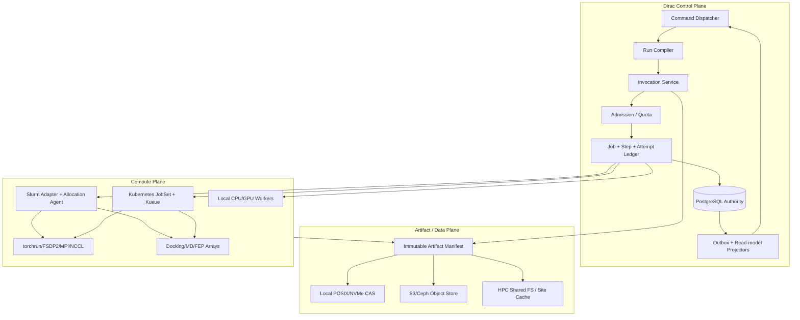
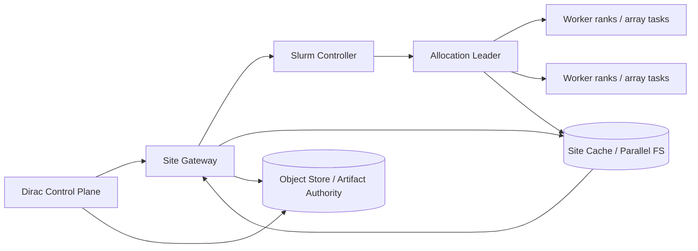

# Dirac Motif v2
## 可落地的本地—万卡同构闭环药物设计平台软件规格

**状态：** Normative implementation specification
**版本：** 2.0
**审查基线：** Dirac `main@9d38ca434c9404843640ed5d7a4cb5d0a315d135`
**源产品规格：** `source/MOTIF_ML_DRUG_DESIGN_SPEC_v1.md`
**目标本机：** Ryzen 9 9900X · RTX 5080 16 GB · 64 GB RAM minimum
**目标扩展：** 单节点 → Slurm/Kubernetes → 1,000–10,000 GPU/HPC
**公共产品入口：** `design.generate`、`campaigns.landscape`、`campaigns.optimize`
**公共语义入口：** Dirac Command / Method / Job / Artifact / ObjectRef

---

## 0. 这份规格解决什么

原 Motif 规格已经正确回答了“产品和科学系统应该做什么”：它不是生成一堆 SMILES，而是读取项目目标、结构、历史实验与药化知识，提出可合成设计，用校准的不确定性进行多保真评估，通过受约束 Pareto 与信息价值选择下一组实验，再将完整实验结果回流。

本规格补齐它尚未完全回答的工程问题：

1. 当前 Dirac 仓库哪些部分已经能承重，哪些不能；
2. 怎样在不引入第二套平台的前提下运行 ML、docking、MD、FEP 与生成任务；
3. 怎样让同一套语义既能在 9900X + 5080 上成为一台极强的科研 appliance，也能在 Slurm/Kubernetes 上扩到万卡；
4. Job、Attempt、Allocation、Shard、lease、fencing、checkpoint 和 Artifact 的精确协议是什么；
5. PostgreSQL、对象存储、Arrow/Parquet/Zarr、容器和调度器各自拥有哪一部分真值；
6. 第一版到底做哪些开源模型和工具，哪些坚决不做；
7. 每一阶段的文件、migration、测试、SLO 和 Definition of Done 是什么。

这不是路线图，也不是研究愿望清单。文中的 `MUST`、`MUST NOT`、`SHOULD`、`MAY` 是可验收要求。

---

## 1. 最终架构判断

### 1.1 Dirac 不缺“更大的框架”，缺的是工业级计算内核

当前 Dirac 已经拥有正确的上半身：canonical contracts、Command、Method、Invocation、Job、Artifact、provenance、AppShell、ScientificContext 与 PostgreSQL 权威状态。

真正缺失的是下半身：

```text
可编译的科学 DAG
+ durable execution attempt
+ scheduler allocation
+ shard manifest
+ lease / heartbeat / fencing
+ checkpoint / resume
+ streaming artifact commit
+ model/dataset/policy release
+ closed-loop decision read model
```

所以正确动作不是让 Ray、MLflow、Kubeflow、Airflow 或某个模型框架接管 Dirac；正确动作是让它们成为 **Dirac Executor 后的可替换实现**。

### 1.2 本地版与万卡版必须是同一软件

本地部署不是一个简化后端，HPC 也不是另一个产品。两者必须共享：

- 相同 Command IDs；
- 相同 Method descriptors；
- 相同 canonical input/output schemas；
- 相同 execution digest；
- 相同 Job/Artifact/provenance semantics；
- 相同 reason codes；
- 相同 dataset/model/policy release；
- 相同 UI read models。

唯一变化的是 `SchedulerAdapter`、`BlobBackend`、资源配置与分片拓扑。

### 1.3 第一版的竞争力来自闭环完整性，不来自最大模型

第一版必须完成：

```text
Design Brief
 -> local medicinal-chemistry + reaction-constrained proposals
 -> chemical identity / synthesis gates
 -> classical + D-MPNN multi-endpoint prediction
 -> calibrated uncertainty + applicability domain
 -> optional pose + current Dirac fields/torsion
 -> constrained Pareto / VOI portfolio
 -> human review / promote
 -> assay-aware result ingestion
 -> campaign-local recalibration
```

这一纵切已经比“一个更大的生成器”更接近真实公司价值，因为每个设计、预测、选择、拒绝、实验和失败都能成为下一轮可用的可信状态。

---

## 2. 不可违反的系统不变量

### INV-01 — 单一语义控制面

客户端、前端、CLI、SDK、MCP 与 agent 只通过 Dirac Command 调用产品意图；科学计算只通过 Method 调用。禁止公共 `/ml/*`、`/ray/*`、`/slurm/*` 或 framework-native API。

### INV-02 — 单一科学真值

```text
Prediction != Measurement != Reviewed Evidence != Authorized Decision
```

数据库、API、UI、导出、日志和自然语言解释全部 MUST 保留此边界。

### INV-03 — PostgreSQL 管状态，不管大字节

PostgreSQL 是身份、生命周期、关系、审批、索引、摘要和治理的权威。大规模矩阵、轨迹、模型和 checkpoint MUST 位于 content-addressed Artifact backend。

### INV-04 — Scheduler ID 不是科学 ID

Slurm Job ID、Kubernetes UID、Ray task ID、PID 和容器 ID 只能是 Allocation/Attempt metadata，不能替代 Dirac Job/ObjectRef。

### INV-05 — 完成态是提交屏障

若任何 required Artifact 不存在、digest 不一致、未 linkage、输出 schema 不通过或 fencing token 已过期，Job MUST NOT 进入 `done`。

### INV-06 — 不允许静默降级科学语义

资源不足、模型缺失、结构不可靠、全部 out-of-domain、route engine 不可用、calibration 过期或 portfolio infeasible 时，返回 typed refusal/warning。不得偷偷改用更便宜模型后仍宣称执行了原计划。

### INV-07 — 每次重算都有完整计算身份

缓存和 provenance 使用 composite execution digest，而不是单一源码版本。

### INV-08 — Worker 没有任意数据库或文件系统权限

科学 handler 只能通过注入的受限 capability 读取授权 Artifact、写输出、写 checkpoint、报告进度和检查取消。禁止把 PostgreSQL DSN、整个 S3 credential 或主机根目录交给 handler。

### INV-09 — 不为每个分子创建 Job

Job 是可理解、可重试的科学单元；批量候选通过 Artifact manifest + Shard 表达。一个 50,000 分子的阶段通常是一个 Step、一个或少量 Jobs、若干 Allocations 和数十到数千 Shards。

### INV-10 — 模型框架永远可替换

公共 schema 不出现 `RayObjectRef`、`MLflowRunId`、`BoltzCheckpointPath`、`KubeflowTrial` 等实现身份。实现信息只能进入 release、execution 或 provenance metadata。

---

## 3. 三平面架构



### 3.1 Control Plane

Control Plane 拥有：

- Command 语义、actor、request identity、授权与 trace；
- Design Brief / objective version；
- Run DAG 编译；
- Method 选择、输入输出 schema；
- admission、quota、预算和 cost reservation；
- Job、Step、Allocation、Shard、Attempt、lease、fencing；
- dataset/model/policy lifecycle；
- Artifact metadata 与 lineage；
- approval、review、promotion；
- read-model projection。

Control Plane 不执行大型模型本体，不存放大字节，不依赖某个 scheduler 的生命周期作为权威。

### 3.2 Artifact / Data Plane

Data Plane 拥有不可变字节及其 manifests：

- Design Brief snapshot；
- dataset rows / split manifests；
- proposal tables / SDF；
- prediction matrices；
- conformers、poses、fields；
- model checkpoints；
- distributed checkpoints；
- logs、metrics summary、failure bundles；
- MD trajectories / FEP networks；
- portfolio / explanations / cycle reports。

Artifact ID 和 digest 在所有后端一致。后端 locator 不进入科学合同。

### 3.3 Compute Plane

Compute Plane 只负责：

- 领取带 lease 的 `ExecutionRequest`；
- 获取授权输入；
- 在固定镜像和数值模式下执行；
- 报告聚合进度/心跳；
- 生成 checkpoint 与 output manifest；
- 响应取消和 preemption；
- 提交可验证结果。

它不决定产品目标，不晋升模型，不写业务决策，不直接修改科学领域表。

---

## 4. 规范执行层级

Motif MUST 使用以下层级，解决当前 Mission → Run → Job 过于扁平的问题。

| 层级 | 语义 | 例子 | 是否稳定身份 |
|---|---|---|---|
| Mission | 持续项目意图 | 改善某系列的 cellular potency 与 hERG window | 是 |
| Run | 一次冻结输入的 Motif cycle | 2026-08-12 cycle #4 | 是 |
| Step | DAG 中的科学阶段 | `predict_endpoints_f1` | 是 |
| Job | 一次 Method invocation 的持久语义 | 对 5,000 候选运行模型网格 | 是 |
| Allocation | 一次 scheduler 资源提交 | Slurm array 88731 / K8s JobSet UID | 可替换 |
| Shard | 批量数据的确定性分区 | compounds 1000–1999 | 可重建 |
| Attempt | 一次执行尝试 | preempt 后 attempt 2 | 是，隶属 Job/Shard |
| Rank/Task | scheduler 内部进程 | torch rank 37 | 否，仅 telemetry |

### 4.1 为什么不能用一个巨型 Job

“完整 Motif cycle”如果是单 Job，将导致：

- 任何一步失败都必须重跑全部；
- 无法缓存 proposal 与 prediction；
- 无法在 F1 后自适应决定 F2 数量；
- 无法在人工审批点暂停；
- 无法分别比较策略和模型；
- lineage 退化成一条不可解释日志。

### 4.2 为什么不能用每分子一个 Job

每分子一个 Job 将导致：

- PostgreSQL 和 UI 被数百万状态淹没；
- scheduler 提交开销大于计算；
- provenance 无法以 portfolio/阶段理解；
- dedup/cache 粒度过细；
- 心跳和日志写放大。

正确模式是：Job 指向输入 manifest；Shard 记录 deterministic range/hash partition；output manifest 记录每行成功、失败和 reason code。

---

## 5. Run Compiler

### 5.1 输入

`cycle.start` 或等价 Command 接收：

- immutable `objective_spec_id`；
- immutable `program_snapshot_id`；
- generation policy release；
- predictor/model release set；
- fidelity policy release；
- acquisition/diversity policy release；
- compute budget；
- experimental capacity；
- actor、approval policy；
- deterministic root seed。

### 5.2 输出

Run Compiler MUST 生成不可变 `RunPlan` Artifact，包含：

```json
{
  "run_id": "uuid",
  "schema_version": "2.0",
  "root_seed": 1729,
  "objective_spec_id": "uuid",
  "program_snapshot_id": "uuid",
  "steps": [],
  "edges": [],
  "policies": {},
  "resource_envelope": {},
  "approval_gates": [],
  "digest": "sha256"
}
```

### 5.3 Step 类型

第一版至少支持：

```text
snapshot.freeze
proposal.local_edit
proposal.reaction_enumerate
chemistry.identity_gate
synthesis.route_gate
prediction.f1
structure.conformer
structure.pose_f2
structure.fields_f3
acquisition.portfolio
review.human
result.ingest
model.recalibrate
```

### 5.4 条件边

Step edge MUST 支持：

- `on_success`；
- `on_failure`；
- `if_metric`；
- `if_artifact_present`；
- `if_approval`；
- `fan_out` / `fan_in`；
- `always` cleanup。

条件表达式 MUST 使用受限 DSL 或结构化 JSON，不得执行任意 Python。

### 5.5 计划不可静默修改

Run 开始后，任何策略、模型或预算变化都产生新 RunPlan version 或新 Run。动态 escalation 由冻结的 fidelity policy 根据当前结果做出，而不是后台人员手改队列。


---

## 6. ExecutionRequest 与 SchedulerAdapter 协议

### 6.1 `ExecutionRequest`

所有本地、Slurm、Kubernetes 和远程 HPC 执行 MUST 消费同一逻辑请求。规范 schema 位于 `contracts/execution-request.schema.json`。

核心字段：

```json
{
  "execution_id": "uuid",
  "job_id": "uuid",
  "step_id": "uuid",
  "attempt": 1,
  "fencing_token": 7,
  "method_id": "ml.motif.predict",
  "execution_digest": "sha256:...",
  "container_image": "registry/dirac-motif-pytorch@sha256:...",
  "entrypoint": ["python", "-m", "dirac_motif.worker"],
  "input_manifest_artifact_id": "uuid",
  "output_contract_digest": "sha256:...",
  "resource_request": {
    "cpu_cores": 4,
    "memory_bytes": 17179869184,
    "gpus": 1,
    "gpu_arch": ["blackwell", "hopper"],
    "scratch_bytes": 107374182400,
    "walltime_seconds": 7200
  },
  "placement": {
    "backend": "local_gpu",
    "queue": "motif",
    "account": null,
    "node_constraints": {},
    "topology": "single_node"
  },
  "retry_policy": {},
  "checkpoint_policy": {},
  "security_context": {},
  "determinism": {},
  "created_at": "..."
}
```

### 6.2 `SchedulerAdapter` interface

```python
class SchedulerAdapter(Protocol):
    kind: str

    def admit(self, request: ExecutionRequest) -> AdmissionDecision: ...
    def submit(self, request: ExecutionRequest) -> AllocationRef: ...
    def inspect(self, allocation: AllocationRef) -> AllocationStatus: ...
    def request_cancel(self, allocation: AllocationRef, *, grace_seconds: int) -> None: ...
    def suspend(self, allocation: AllocationRef) -> None: ...
    def resume(self, allocation: AllocationRef) -> None: ...
    def collect_events(self, cursor: str | None) -> EventPage: ...
    def reconcile(self, allocation: AllocationRef) -> ReconciliationResult: ...
```

禁止让 adapter 接收任意 Python callable。远程 scheduler 必须执行固定、版本化的 worker entrypoint；调用内容由 `ExecutionRequest` 与 input manifest 描述。

### 6.3 Adapter 实现

第一版实现：

- `InlineAdapter`：小于约 100 ms 的确定性 metadata transform；
- `LocalProcessAdapter`：隔离 RDKit、classical ML、featurization；
- `LocalGpuAdapter`：单 GPU 排他队列；
- `SlurmAdapter`：`sbatch`/REST、job arrays、`srun`/`torchrun`；
- `KubernetesAdapter`：Job / JobSet + Kueue；
- `HpcRelayAdapter`：面向受限/air-gapped site 的 submit-agent。

Ray MAY 在一个已获批 Allocation 内用于动态 task graph 或 data-parallel dispatch，但 MUST NOT 成为跨项目 admission、Job truth 或 public control plane。

---

## 7. Job、Attempt、lease 与 fencing

### 7.1 公共 Job 状态保持稳定

为避免破坏已有客户端，公共 Job 状态继续使用：

```text
queued | running | done | failed | cancelled
```

内部 Attempt 状态更细：

```text
created
admitted
submitted
starting
running
checkpointing
succeeded
failed
cancel_requested
cancelled
preempted
lost
superseded
```

公共状态由当前有效 Attempt 投影：

- Job `queued`：无 running Attempt，仍可调度；
- Job `running`：存在持有效 lease 的 Attempt；
- Job `done`：terminal completion barrier 已提交；
- Job `failed`：retry policy 耗尽或 non-retryable；
- Job `cancelled`：已确认中断且无后续 Attempt。

### 7.2 Lease

每个 running Attempt MUST 有：

- `lease_owner`；
- `lease_expires_at`；
- `heartbeat_at`；
- `fencing_token`；
- `scheduler_allocation_id`；
- `checkpoint_artifact_id`（可空）；
- `progress_summary`。

Attempt 只可在 transaction 中领取：

```sql
SELECT ... FOR UPDATE SKIP LOCKED;
UPDATE ...
SET lease_owner = :worker,
    lease_expires_at = now() + :ttl,
    fencing_token = fencing_token + 1
WHERE ...;
```

### 7.3 Fencing

每次新 Attempt 或 lease takeover 都获得单调递增 token。所有 progress、checkpoint 和 terminal commit MUST 携带 token。若 token 小于数据库当前 token，写入被拒绝，并记录 `STALE_ATTEMPT_RESULT`。

这防止以下场景：

1. worker A 失联；
2. control plane 认为 lease 过期并启动 worker B；
3. worker A 之后恢复并提交旧结果；
4. 没有 fencing 时，旧结果可能覆盖新结果。

### 7.4 Heartbeat

本地 appliance 可每 5–10 秒更新 Attempt。大规模集群 MUST 聚合：

- rank/task 只向 Allocation Agent 报告；
- Agent 每 15–30 秒向 Control Plane 写一条 allocation summary；
- Shard completion 通过批量 event page 或 manifest 写入；
- PostgreSQL 不接收每 GPU 高频心跳。

### 7.5 Reconciler

Control Plane MUST 有周期性 reconciler：

```python
def reconcile_attempt(attempt):
    scheduler = adapter.inspect(attempt.allocation)
    if attempt.lease_expired and scheduler.running:
        renew_or_fence_by_policy()
    elif attempt.lease_expired and scheduler.terminal:
        recover_terminal_manifest_or_mark_lost()
    elif attempt.db_running and scheduler.missing:
        mark_lost_and_retry()
    elif attempt.cancel_requested:
        ensure_cancel_propagated()
```

Reconciler 的动作全部 idempotent，且写审计 reason code。

---

## 8. 取消、preemption 与 checkpoint

### 8.1 `CancellationToken`

`InvocationContext` MUST 扩展：

```python
@dataclass
class InvocationContext:
    method_id: str
    execution_digest: str
    job_id: str
    attempt_id: str
    fencing_token: int
    artifact_reader: ArtifactReader
    artifact_writer: ArtifactWriter
    checkpoint_writer: CheckpointWriter
    cancellation: CancellationToken
    progress: ProgressReporter
    resources: GrantedResources
    deadline: float | None
    seed_scope: SeedScope
```

Handler 在以下边界 MUST 检查取消：

- 批次之间；
- epoch 之间；
- docking shard 之间；
- MD checkpoint interval；
- FEP window/replica safe point；
- Artifact upload 前；
- terminal commit 前。

### 8.2 取消阶段

```text
cancel_requested
 -> cooperative signal
 -> optional checkpoint
 -> grace period
 -> scheduler soft kill
 -> hard kill if policy allows
 -> confirmed cancelled / failed-to-cancel
```

`cancel_requested_at` 不是 `cancelled_at`。

### 8.3 Checkpoint policy

Checkpoint policy 至少包含：

- interval seconds/steps；
- maximum retained checkpoints；
- upload mode：sync / async；
- resume compatibility digest；
- preemption signal；
- checkpoint timeout；
- whether partial results are scientifically admissible。

训练使用 PyTorch distributed checkpoint；MD/FEP 使用工具原生 restart/checkpoint；批量预测使用 completed-shard manifest，不重复已完成 shard。

### 8.4 Resume 兼容性

Checkpoint 只能在以下全部相同或明确兼容时恢复：

- Method execution digest；
- model architecture；
- optimizer/state schema；
- world-size reshard policy；
- data snapshot and sampler state；
- numeric mode；
- adapter-declared runtime compatibility。

不兼容时必须 typed refusal `CHECKPOINT_INCOMPATIBLE`，不得尝试“能 load 就 load”。

---

## 9. Retry 与错误分类

### 9.1 Retry 不是所有失败再跑一次

错误分为：

| 类别 | 例子 | 默认策略 |
|---|---|---|
| invalid_input | schema、identity、unit、endpoint 不合法 | 不重试 |
| scientific_refusal | out-of-domain、结构不可靠、portfolio infeasible | 不重试，返回解释 |
| deterministic_failure | 相同输入稳定失败 | 不重试或一次诊断重试 |
| transient_infra | node lost、object-store timeout | 指数退避重试 |
| preemption | Slurm/Kueue 抢占 | checkpoint 后重试 |
| resource_exhaustion | OOM、scratch 不足 | 允许 policy-driven resize 一次 |
| numeric_instability | NaN、SCF/MD/FEP convergence | 使用已冻结 fallback policy |
| corrupted_artifact | digest mismatch | 隔离 artifact，禁止重试使用同一字节 |
| stale_attempt | fencing rejection | 丢弃旧结果，不计科学失败 |

### 9.2 Retry policy

```json
{
  "max_attempts": 3,
  "retryable_codes": ["NODE_LOST", "OBJECT_STORE_TIMEOUT", "PREEMPTED"],
  "backoff": {"kind": "exponential", "initial_seconds": 10, "max_seconds": 300},
  "resize_on": {
    "CUDA_OOM": {"batch_scale": 0.5, "max_resizes": 1}
  },
  "preserve_seed": true,
  "resume_from_checkpoint": true
}
```

任何 resize/fallback 都进入 provenance，并改变 execution profile；若改变科学输出语义，必须形成新 execution digest 或明确的 child attempt profile。

---

## 10. 可靠完成协议

### 10.1 Worker 输出

Worker 不直接把大结果放进响应。它写：

- required Artifacts；
- optional Artifacts；
- `output-manifest.json`；
- compact result summary；
- provenance bundle；
- metrics/failure summary。

### 10.2 Output Manifest

```json
{
  "schema_version": "1.0",
  "job_id": "uuid",
  "attempt_id": "uuid",
  "fencing_token": 7,
  "execution_digest": "sha256:...",
  "artifacts": [
    {
      "role": "motif.predictions",
      "sha256": "...",
      "size_bytes": 123,
      "media_type": "application/vnd.apache.parquet",
      "required": true,
      "row_count": 5000,
      "schema_digest": "..."
    }
  ],
  "result_summary": {},
  "warnings": [],
  "started_at": "...",
  "finished_at": "..."
}
```

### 10.3 Terminal commit transaction

Control Plane 进行：

```python
def commit_success(manifest, token):
    with db.transaction():
        attempt = lock_attempt(manifest.attempt_id)
        assert attempt.fencing_token == token
        validate_output_manifest(manifest)
        for entry in manifest.artifacts:
            assert blob_backend.verify(entry.sha256, entry.size_bytes)
            artifact_id = upsert_artifact(entry)
            link_job_artifact(manifest.job_id, artifact_id, entry.role)
        assert_required_roles_satisfied()
        write_result_summary()
        mark_attempt_succeeded()
        mark_job_done()
        write_outbox("job.completed")
```

任意一步失败，transaction rollback，Job 保持 running/recovering；不得返回成功 envelope。

### 10.4 Outbox

同一 transaction 写 `app.outbox_event`。投影器随后异步更新：

- Runs UI；
- campaign read model；
- notification；
- OpenTelemetry export；
- optional MLflow mirror。

投影失败不会改变 scientific truth，但可以重放。

---

## 11. Artifact Capability 与存储后端

### 11.1 Capability interface

```python
class ArtifactReader(Protocol):
    def stat(self, artifact_id: str) -> ArtifactStat: ...
    def open(self, artifact_id: str, *, byte_range=None) -> BinaryIO: ...
    def materialize(self, artifact_id: str, destination: Path) -> MaterializedArtifact: ...

class ArtifactWriter(Protocol):
    def begin(self, *, role: str, media_type: str, metadata: dict) -> UploadSession: ...
    def write(self, session: UploadSession, chunk: bytes) -> None: ...
    def commit(self, session: UploadSession) -> PendingArtifact: ...
    def abort(self, session: UploadSession) -> None: ...

class CheckpointWriter(ArtifactWriter):
    def publish_latest(self, artifact: PendingArtifact, *, fencing_token: int) -> None: ...
```

### 11.2 Blob backend

```python
class BlobBackend(Protocol):
    kind: str
    def put_stream(self, stream, expected_digest=None) -> BlobLocation: ...
    def open(self, digest, byte_range=None): ...
    def verify(self, digest, size_bytes=None) -> VerificationResult: ...
    def delete(self, digest) -> None: ...
```

实现：

- `PostgresInlineBlobBackend`：只保留 <= 1 MiB 小对象兼容；
- `LocalCasBackend`：`<root>/sha256/ab/cd/<digest>`；
- `S3BlobBackend`：immutable key + multipart + checksum；
- `SharedFsBackend`：HPC parallel/shared filesystem；
- `TieredBackend`：local cache + object store authority。

### 11.3 Artifact metadata

PostgreSQL MUST 记录：

- digest；
- decoded/stored size；
- media type；
- encoding/compression；
- schema version/digest；
- backend kind；
- immutable locator；
- producer Method/Job/Attempt；
- retention class；
- license/data classification；
- encryption key reference（非密钥）；
- verification state/time。

### 11.4 数据格式

| 数据 | 首选格式 | 原因 |
|---|---|---|
| 小型 contract/manifest | canonical JSON | 跨语言、可审计、可哈希 |
| tabular dataset/prediction/proposal | Parquet | 列式、压缩、predicate pushdown |
| 进程内/流式列数据 | Arrow IPC | 零拷贝/跨语言 |
| 分子结构集合 | SDF + Parquet sidecar | 保留结构语义与列分析 |
| 大型 N-D fields/tensors | Zarr | chunk/range/cloud-friendly |
| 模型权重 | safetensors 或框架原生受治理格式 | 安全/性能；按适配器 |
| 分布式训练 checkpoint | PyTorch Distributed Checkpoint | multi-rank / reshard |
| MD trajectory | XTC/DCD/TRR + topology + manifest | 工具互操作 |
| FEP network/results | Parquet/JSON manifest + engine files | 图与数值分开 |
| 日志 | structured JSON lines, compressed | 可过滤与归档 |

### 11.5 Artifact 生命周期

Retention classes：

- `ephemeral_scratch`：Attempt 临时，失败后短期保留；
- `cacheable`：可重算但高成本；
- `scientific_record`：dataset/model/prediction/decision lineage；
- `regulated_record`：需法律/合作协议保留；
- `checkpoint`：按 release/policy 保留最近 N 个。

垃圾回收必须基于引用图和 retention policy；不得仅因 `referencing_jobs = 0` 自动删除，因为 Artifact 可能被 dataset release、evidence 或 decision 引用。

---

## 12. PostgreSQL 扩展

本 bundle 提供三份 migration 草案。实际 merge 前必须在当前 schema 上 clean apply、rollback rehearsal（若可逆）与数据迁移演练。

### 12.1 Migration 020 — contract alignment

目标：

- 追加缺失 ObjectKind/RelationKind enum；
- 加 CI 可查询 registry view；
- 修复 canonical contract 与 SQL drift；
- 为后续从 ENUM 迁移到 registry table 预留。

### 12.2 Migration 021 — execution control plane

新增：

```text
app.run_step
app.run_step_edge
app.execution_allocation
app.job_attempt
app.job_shard
app.job_lease / attempt lease fields
app.outbox_event
app.blob_location
```

#### `app.run_step`

关键字段：

- `id`, `run_id`, `step_key`, `method_id`；
- `state`, `ordinal_hint`；
- `input_manifest_artifact_id`；
- `policy_release_id`；
- `required`, `approval_gate`；
- `created_at`, `started_at`, `finished_at`。

#### `app.run_step_edge`

- source/target step；
- edge kind；
- condition JSON；
- unique edge identity。

#### `app.execution_allocation`

- Job/Attempt；
- backend/site；
- scheduler identifier；
- resource request/grant；
- submitted/started/finished；
- raw scheduler state summary；
- no credentials。

#### `app.job_attempt`

- job, attempt number；
- execution digest；
- state；
- fencing token；
- lease owner/expiry/heartbeat；
- checkpoint Artifact；
- retry/failure classification；
- allocation；
- unique `(job_id, attempt_no)`。

#### `app.job_shard`

仅存 shard metadata，不存每行结果：

- shard index/key；
- input/output manifest Artifact；
- item count；
- state summary；
- attempt count；
- deterministic partition digest。

#### `app.outbox_event`

- aggregate kind/id；
- event type/version；
- payload；
- occurred/published timestamps；
- retry count/error；
- unique event key。

### 12.3 Migration 022 — Motif foundation

新增：

```text
app.dataset_snapshot
meta.model_release
meta.policy_release
design.endpoint_definition
design.objective_spec
design.motif_cycle
```

扩展：

- `design.idea` proposal metadata；
- Artifact relations；
- campaign read model inputs。

### 12.4 不应放进 PostgreSQL 的内容

MUST NOT 存为领域表行：

- 每个候选 × 每个 endpoint × 每个 ensemble member 的 dense matrix；
- 每个 conformer 原子坐标；
- trajectory frame；
- model tensor；
- millions of per-task logs；
- distributed optimizer shards。

PostgreSQL 存索引、摘要、可查询决策字段和 Artifact refs。


---

## 13. Scientific data contracts

### 13.1 ObjectRef

所有跨层引用必须引用 canonical ObjectKind。已知类型的字段 MUST 使用 kind-specific const：

```json
{
  "type": "object",
  "required": ["kind", "id"],
  "additionalProperties": false,
  "properties": {
    "kind": {"const": "compound"},
    "id": {"type": "string", "minLength": 1}
  }
}
```

不得使用 `{kind: string}` 作为所有领域对象的最终约束。

### 13.2 Endpoint Definition

Endpoint 是可版本化科学对象，不是任意列名。MUST 包含：

- endpoint ID/version；
- assay/protocol refs；
- target、species、system/cell line/tissue；
- readout 与 measurement type；
- direction；
- canonical unit/dimension；
- raw-to-label transform；
- censoring/qualifier policy；
- replicate aggregation；
- QC/exclusion policy；
- intended use/domain；
- created actor/time/digest。

### 13.3 Measurement v2

`contracts/measurement-v2.schema.json` 定义：

- `equal`：必须有 value；
- `less_than`/`less_or_equal`：必须有 upper bound；
- `greater_than`/`greater_or_equal`：必须有 lower bound；
- `interval`：必须有 lower/upper；
- `not_tested`/`missing`：禁止数值，必须有 missing reason；
- unit、endpoint、assay、protocol、sample、batch、replicate、QC；
- raw/derived status；
- uncertainty；
- LLOQ/ULOQ；
- source Artifact。

### 13.4 Unit policy

Dirac SHOULD 使用受控 unit vocabulary，并记录 quantity dimension。第一版可维护经过审查的 UCUM-compatible subset；禁止任意字符串静默进入训练。

Normalization 必须产出：

- original value/unit；
- normalized value/unit；
- conversion rule version；
- transform（如 pIC50）及参数；
- invalid/out-of-range reason。

### 13.5 Missingness 是信息

未测、合成失败、assay failed、below LLOQ、above ULOQ、protocol deviation、样本 QC fail 都是不同状态。不得把它们转换为 0、inactive 或删除而不留 reason。

### 13.6 Dataset row identity

每个训练 row MUST 可回到：

```text
compound parent identity
 -> form
 -> batch
 -> sample
 -> assay/protocol version
 -> measurement record
 -> normalization/aggregation transform
 -> dataset snapshot row
```

Row manifest 至少含 row digest 与 source refs。完整 row lineage 可位于 Parquet/Artifact，而 PostgreSQL 保存 snapshot identity 与 queryable summary。

---

## 14. Dataset Snapshot

### 14.1 `dataset.snapshot.create`

这是 long-running Command，编译 `data.motif.snapshot` Method。输入：

- program/campaign refs；
- endpoint versions；
- selection query；
- chemical identity policy；
- QC/exclusion policy；
- unit/label transform policy；
- split policy；
- actor；
- root seed。

输出：immutable `dataset_snapshot_id`、manifest Artifact、data Artifact、split Artifact、summary 与 warnings。

### 14.2 Snapshot 内容

MUST 冻结：

- selection SQL/DSL 与 digest；
- query plan/runtime version；
- source table watermark或 transaction snapshot identity；
- exact included/excluded row identities；
- compound standardization release；
- endpoint/protocol versions；
- unit transforms；
- censoring model；
- replicate aggregation；
- split assignment；
- data license/classification；
- created actor/time；
- row/column schema digest。

### 14.3 Split

至少支持：

```text
random_debug
scaffold
series
temporal
protocol_holdout
site_holdout
project_holdout
lo_hi_activity_cliff
```

Production promotion 不能只靠 random split。报告必须形成 specification curve：模型 × split × endpoint × domain slice，而不是挑最好一格。

### 14.4 Leakage gate

Snapshot 创建或训练前 MUST 检测：

- exact molecule duplicates；
- salt/tautomer/stereo policy duplicates；
- scaffold/series leakage；
- temporal leakage；
- replicate/protocol leakage；
- target homolog leakage（适用时）；
- label-derived features；
- pretrained overlap disclosure（可审计范围内）。

发现 P0 leakage 时 snapshot 可创建为 `invalid` 供审计，但不能用于 candidate→validated promotion。

---

## 15. Model、Calibration 与 Policy Release

### 15.1 Model Release

`meta.model_release` MUST 冻结：

- canonical model ObjectRef；
- model family；
- source commit；
- container image digest；
- lockfile/SBOM digest；
- dataset snapshot IDs；
- featurizer release；
- architecture/hyperparameters；
- seeds；
- checkpoint Artifact(s)；
- endpoint versions；
- calibration Artifact；
- applicability-domain policy；
- validation Artifact；
- model card；
- intended/prohibited use；
- lifecycle `candidate | validated | production | retired`；
- approver/evidence。

### 15.2 Calibration Release

Calibration 不是 checkpoint 附带的小 JSON。它有独立 digest，并记录：

- fit split；
- method（temperature/isotonic/conformal/etc.）；
- coverage target；
- slice results；
- valid-through data/protocol window；
- recalibration trigger；
- endpoint/domain restrictions。

### 15.3 Policy Release

以下全部必须版本化：

- proposal strategy mix；
- identity/chemistry gate；
- synthesis gate；
- fidelity/escalation；
- acquisition；
- diversity；
- missing-evidence penalty；
- fallback/retry；
- explanation grounding。

这些 policy 决定“算什么、选择什么”，对结果的影响不小于 predictor。

### 15.4 Promotion

`model.release.promote` 是显式治理 Command。必须引用：

- validation Artifact；
- model card；
- leakage report；
- calibration/domain report；
- runtime/cost/cancellation tests；
- reviewer；
- intended scope；
- rollback target。

把 checkpoint 复制到目录不得产生 production model。

---

## 16. Motif scientific pipeline

### 16.1 Stage F0 — Design Brief 与 program snapshot

冻结：

- program/campaign/target/target state；
- compound/series history；
- available structures and confidence；
- endpoint constraints/objectives；
- antitarget/selectivity panel；
- protected/forbidden motifs；
- available reactions/building blocks；
- synthesis/time/compute/assay capacity；
- diversity/exploration policy；
- approval gates。

`program_snapshot` MUST 包含数据水位和关系图摘要，防止 cycle 中途后台数据改变导致不可重放。

### 16.2 Stage G0 — Proposal ensemble

第一版实现三类，第四类延后：

#### G0-A Local medicinal-chemistry edits — V1 REQUIRED

- R-group enumeration；
- matched molecular pair transforms；
- bioisostere replacement；
- ring/linker edit；
- stereo exploration；
- protected atom/substructure constraints；
- series-aware edit priors。

实现基于 RDKit + versioned transform library。每个 proposal 记录 atom mapping、parent、edit trace、transform ID/version 与 rule evidence。

#### G0-B Reaction-constrained enumeration — V1 REQUIRED

动作空间由 reaction template + available building blocks 定义。每个 proposal 记录：

- reaction template release；
- reactants/building blocks；
- atom map；
- route depth；
- inventory status；
- cost/lead-time estimate；
- predicted route support；
- generation-time vs post-filter constraints。

#### G0-C Scaffold/fragment/linker — V1 LIMITED

第一版支持 fixed-core decoration、fragment growing 和受限 scaffold replacement；macrocycle 与复杂 linker generation 进入后续 adapter。

#### G0-D Pocket-conditioned generative model — OPTIONAL ADAPTER

只有结构置信度和 runtime compatibility 通过后接入。它不能成为第一版关键路径，也不能在 16 GB GPU 上吞掉全部产品预算。

### 16.3 Generation budgets

本地默认：

```text
raw proposals: 50,000 hard cap
identity-valid: <= 10,000
synthesis/constraint-valid: <= 5,000
F1 prediction: <= 5,000
F2 structure: 128–256
F3 fields/learned affinity: 16–64
experimental portfolio: 24–48 + reserve
```

大集群改变数量，但不改变语义。所有 cap 由 immutable policy release 定义。

### 16.4 Chemical identity gate

MUST 执行：

- parsing/sanitization/valence；
- charge；
- parent/form/salt separation；
- tautomer/protomer policy；
- stereo completeness；
- exact/near duplicate；
- forbidden/reactive/assay-interference warning；
- project substructure constraints；
- route status；
- novelty/training proximity；
- canonical compound identity mint/reuse。

输出是 pass/refuse/warn + reason codes，不是神秘 drug-likeness score。

### 16.5 Synthesis gate

第一版策略：

1. reaction-generated proposal 默认有 route evidence；
2. local edit 尝试 template route / retrosynthesis adapter；
3. route unknown 不一定拒绝，但必须被 objective/policy 显式处理；
4. vendor/inventory data 通过 adapter 版本化；
5. license/proprietary route engine 不能渗透公共 contract。

### 16.6 F1 Predictor mesh

每个 endpoint 至少竞争：

- fingerprint + ElasticNet/linear baseline；
- fingerprint + Random Forest / XGBoost；
- D-MPNN/Chemprop；
- nearest-neighbor/series delta；
- optional pretrained embedding model；
- ensemble + calibration。

复杂模型没有稳定击败强简单基线时，不得晋升。多任务共享只能在 endpoint semantics 兼容且验证增益稳定时启用。

### 16.7 Censored and structured labels

根据 endpoint 类型选择：

- regression；
- binary/multiclass classification；
- ordinal；
- ranking；
- censored regression/survival-like likelihood；
- pairwise delta。

不得先把所有 `<x`/`>x` 强行当作等于 x 再训练。

### 16.8 Uncertainty

每个 prediction 输出：

- estimate/distribution；
- interval；
- aleatoric；
- epistemic；
- structural（结构阶段）；
- model disagreement；
- applicability status；
- calibration context；
- supporting releases。

第一版推荐：

- 5-seed deep ensemble（本机顺序加载）；
- conformal interval/class set；
- chemical-distance/domain estimator；
- isotonic/temperature calibration；
- series/temporal coverage report。

### 16.9 F2 Structure

第一版：

1. RDKit ETKDG conformer ensemble；
2. AutoDock Vina pose baseline；
3. optional DiffDock adapter；
4. interaction fingerprint + pose confidence；
5. shared Mol* scene Artifact loading。

结构 provenance 必须记录：

- experimental/predicted source；
- chain/residue/site；
- protonation；
- cofactors/waters；
- preparation release；
- receptor conformation；
- random seeds；
- pose ensemble，不假装单 pose 确定。

### 16.10 F3 Dirac fields and learned affinity

复用当前 Dirac fields/torsion Method，不复制实现。对 16–64 个候选运行：

- MEP/MLP/region field；
- torsion strain；
- surface/interaction features；
- optional learned affinity/ranker。

F3 的价值必须通过“是否改变且改善选择”评估，而不是只报告相关系数。

### 16.11 F4 Physics escalation

后续实现：

- minimization/short MD：OpenMM adapter；
- longer MD：OpenMM/GROMACS adapter；
- RBFE/FEP：OpenFE + engine adapter；
- series-connected pair network；
- convergence/failure/cycle-closure metrics。

F4 只用于少数能解决关键排序或机制问题的候选。第一版 local demo MAY 做 1–4 个小规模 proof，但不得把它作为产品主路径或宣称 production FEP。

### 16.12 Acquisition

选择 portfolio `B`：

```text
maximize
  expected_program_progress(B)
  + λ_info * information_gain(B)
  + λ_div * diversity(B)
  - λ_cost * cost(B)
  - λ_risk * failure_risk(B)

subject to
  hard chemistry constraints
  endpoint feasibility
  synthesis/assay capacity
  compute/time budget
  minimum exploration allocation
```

第一版 MUST 有确定性、可审计 baseline：

- constrained Pareto ranking；
- feasibility probability；
- uncertainty bonus；
- MaxMin/cluster diversity；
- cost penalty；
- missing-evidence penalty；
- exploration quota。

BoTorch qEHVI/qNEHVI/Thompson 等作为 policy adapter，与 deterministic baseline 在历史 replay 上竞争。

### 16.13 Portfolio output

每个 proposal 输出：

- selected/reserve/rejected/refused；
- non-dominated rank；
- feasibility；
- objective vector；
- uncertainty/VOI；
- diversity contribution；
- cost/risk；
- route status；
- evidence/support/conflict；
- why selected/not selected；
- what result would change decision；
- human review state。

### 16.14 Result ingestion

`result.ingest` MUST 接收全部结果：

- positive/negative；
- censored；
- synthesis failed；
- not tested；
- assay failed；
- protocol deviation；
- sample/QC failure；
- missing reason。

写入后不直接静默改变 production model。它更新 campaign evidence/read model，并可触发：

- local recalibration；
- nearest-neighbor evidence；
- delta model；
- candidate retraining Run。

---

## 17. Public Commands

### 17.1 Command registry additions

| Command | Job policy | 作用 |
|---|---|---|
| `objective.save` | none | 保存 immutable Design Brief version |
| `dataset.snapshot.create` | required | 生成 governed snapshot |
| `cycle.start` | required | 编译并启动 Motif Run DAG |
| `proposal.generate` | required | 单独运行 proposal phase |
| `molecule.evaluate` | required | 对候选执行 fidelity plan |
| `campaign.rank` | required | 生成 portfolio |
| `proposal.review` | none | 记录人工 review / modifications |
| `compound.promote` | none/approval | 授权进入采购/合成/实验队列 |
| `result.ingest` | none 或 required | 小批同步，大批异步 ingestion |
| `model.train` | required | 候选模型训练 |
| `model.validate` | required | 冻结验证 |
| `model.release.describe` | none | 透明度 |
| `model.release.promote` | approval | governance promotion |
| `dataset.snapshot.describe` | none | snapshot 透明度 |
| `run.describe` | none | DAG/read model |

### 17.2 Mutation idempotency

所有 mutation Command MUST 支持：

- `request_id` / idempotency key；
- actor；
- optional `expected_version` / `expected_current_digest`；
- conflict response；
- command trace；
- immutable result identity。

`objective.save` 不能覆盖旧 objective；它创建新 version 和 supersession relation。

### 17.3 Agent boundary

Agent 可以：

- 查询模型/数据 readiness；
- 创建草稿 objective；
- 提交允许的计算；
- 解释结果；
- 提议 review action。

Agent 不可默认：

- promote compound；
- approve synthesis/procurement；
- promote model；
- 超预算升级 F4；
- 修改 experimental measurement。

权限由现有 scope/actor 模型表达。

---

## 18. Scientific Methods

Method 必须是可缓存、可重试、科学上有意义的单元。

| Method | 资源类 | 主要 Artifacts |
|---|---|---|
| `data.motif.snapshot` | cpu | dataset, split manifest, leakage report |
| `chem.identity.standardize` | cpu | standardized compounds, reject report |
| `design.motif.local_edits` | cpu | proposals, edit trace |
| `design.motif.reaction_enumerate` | cpu/gpu optional | proposals, routes |
| `synthesis.motif.assess` | cpu/remote | route assessment |
| `ml.motif.train` | gpu | checkpoint, metrics, model card draft |
| `ml.motif.predict` | cpu/gpu | predictions, UQ, AD |
| `ml.motif.calibrate` | cpu | calibration release candidate |
| `structure.motif.conformers` | cpu | conformer SDF/Parquet |
| `structure.motif.pose` | cpu/gpu | poses, interactions |
| existing fields/torsion | cpu | field/torsion Artifacts |
| `physics.motif.md` | gpu/hpc | trajectory, observables, checkpoint |
| `physics.motif.rbfe` | hpc | network, ΔΔG, convergence |
| `design.motif.acquire` | cpu | Pareto, selection, sensitivity |
| `ml.motif.update` | cpu/gpu | local adaptation/release candidate |

### 18.1 Method descriptor additions

每个 descriptor SHOULD 增加：

```json
{
  "resource_class": "gpu",
  "determinism": "statistical",
  "checkpointable": true,
  "cancellation": "cooperative",
  "artifact_access": ["read:dataset", "read:model", "write:predictions"],
  "supported_adapters": ["local_gpu", "slurm", "kubernetes"],
  "scale_profile": {
    "shardable": true,
    "distributed": false,
    "min_gpus": 0,
    "max_gpus": 10000
  }
}
```

### 18.2 Determinism classes

- `bitwise`：同硬件/运行时 bit-identical；
- `numeric_tolerant`：允许预定义 epsilon；
- `statistical`：比较分布/置信区间与 seed ensemble；
- `non_deterministic`：必须解释来源，不可进入严格 cache，除非输入包含完整 stochastic trace。

Generator 和 GPU reductions 通常不能轻率宣称 bitwise reproducible。


---

## 19. 本地 appliance：9900X + RTX 5080

配置模板：`config/local-5080-9900x.yaml`。

### 19.1 设计目标

本机不是“勉强跑通”。它必须成为一台可演示、可开发、可重放、可做真实小型 campaign 的科学 appliance：

- 一个命令启动完整服务；
- 浏览器能完成 Design Brief → portfolio → review → ingestion；
- 重启不丢 Job；
- 任务可取消/恢复；
- 结果和模型有 digest；
- 资源超限可预估/拒绝；
- 与 HPC 运行使用同一 contracts 和 worker image。

### 19.2 硬件事实与约束

目标 CPU：12 cores / 24 threads。目标 GPU：RTX 5080 16 GB。现实约束是显存而非纯算力：

- 不能并发常驻多个大型结构/生成模型；
- ensemble 应顺序加载或共享 backbone；
- 训练需要 gradient accumulation、mixed precision、dynamic batching；
- CPU featurization/chemistry 可并行，但 RDKit/OpenMP/BLAS 线程必须受控；
- 64 GB RAM 可以运行 V1，128 GB 更舒适；
- NVMe scratch 对 Parquet、conformer、pose 和 checkpoint 很重要。

### 19.3 推荐系统布局

```text
systemd / compose
├── dirac-web                  1360
├── dirac-fields/control       8901
├── dirac-ops                  1355
├── postgresql
├── dirac-projector
├── dirac-local-cpu-worker × N
├── dirac-local-gpu-worker × 1
└── local artifact CAS + scratch
```

GPU worker MUST 排他领取整张 GPU。HTTP request thread 禁止初始化 CUDA 或加载模型。

### 19.4 CPU 配置

64 GB 机器默认：

- control/web/db/projector：保留 4 logical CPUs；
- CPU worker processes：默认 8，硬上限 12，需 benchmark；
- `OMP_NUM_THREADS=1`；
- `MKL_NUM_THREADS=1`；
- `OPENBLAS_NUM_THREADS=1`；
- 单个需要线性代数多线程的方法由 Method profile 显式申请；
- conformer/reaction shards 每进程有 memory budget；
- PostgreSQL 与 page cache 不得被 proposal enumeration 吃光。

不要把 24 个 logical threads 直接等同于 24 个高吞吐 RDKit workers。超订阅会增加尾延迟和 OOM 风险。

### 19.5 GPU 配置

- 一次只运行一个 `gpu_exclusive` Allocation；
- BF16 优先，若 adapter 验证不支持则 FP16；
- 每个 Method 声明 estimated peak VRAM；
- admission 保留 1.5–2 GB safety margin；
- dynamic batch probe 从保守 batch 开始；
- CUDA OOM 允许一次 policy-defined batch shrink，不无限重试；
- model unload 后执行显式 adapter cleanup，但不得把 `empty_cache()` 当作内存正确性的替代；
- 结构模型和 D-MPNN 使用不同 worker image/process，避免依赖和 CUDA allocator 污染。

### 19.6 内存预算示例

| 组件/阶段 | 默认上限 |
|---|---:|
| PostgreSQL + OS/page cache reserve | 12–16 GB |
| control/web/projector | 4 GB |
| CPU worker aggregate | 28–32 GB |
| local CAS metadata/cache process | 2 GB |
| per large CPU shard | 4–8 GB |
| GPU host staging | 8–12 GB |
| emergency headroom | >= 6 GB |

若机器为 64 GB，任何需要 >32 GB working set 的单阶段必须 shard/stream；不得依赖 swap 完成 scientific Job。

### 19.7 Storage layout

```text
/var/lib/dirac/postgres
/var/lib/dirac/artifacts/sha256/...
/var/lib/dirac/cache/models/...
/var/lib/dirac/checkpoints/...
/var/tmp/dirac/attempt/<attempt-id>/
```

建议 NVMe：

- 2 TB hard minimum；
- 4 TB 推荐；
- scratch 与 durable CAS 可同盘起步，但目录/quotas 分离；
- Artifact commit 使用原子 rename 或 fsync-safe temp→final protocol；
- scratch 在 terminal state 后按 policy 清理；
- 每日 integrity sampling，release Artifact 定期 full verify。

### 19.8 本地 V1 workload envelope

```text
50,000 raw proposals
  -> <=10,000 identity-valid
  -> <=5,000 synthesis/constraint-valid
  -> 5,000 F1 predictions
  -> 256 conformer/pose candidates
  -> 32 fields/torsion candidates
  -> 24–48 selected + reserve
```

这是一组默认 hard cap，不是性能承诺。提交前 estimator 输出：

- CPU core-hours；
- GPU hours；
- peak RAM/VRAM；
- scratch bytes；
- Artifact bytes；
- expected range；
- optional stages。

### 19.9 本地性能验收目标

在固定 benchmark fixture 上验证，而不是口头承诺：

| 指标 | V1 gate |
|---|---:|
| Command accepted and Job visible | P95 < 2 s |
| non-compute UI read model | P95 < 200 ms local |
| 50k→5k F0 gate | benchmark-defined, no OOM, resumable |
| F1 5k multi-endpoint ensemble | no OOM, complete output manifest |
| 256-pose F2 | shard-resumable |
| complete medium cycle | P50 target <= 120 min; P95 target <= 4 h, excluding optional long MD/FEP |
| process restart recovery | Job reconciled <= 60 s |
| cancellation acknowledgement | <= 5 s; actual stop per safe point |
| terminal Artifact integrity | 100% required roles verified |
| replay | identical release IDs and accepted determinism tolerance |

这些是 release gate。若当前实现未达到，报告实测，不修改 benchmark 来“通过”。

### 19.10 本地演示必须展示的真实故事

一个最强 demo 不是点击生成动画，而是：

1. 选择一个真实 public/internal campaign snapshot；
2. Design Brief 显示 endpoint、threshold、capacity、structure confidence；
3. 生成多策略 proposals，并能看到 edit/reaction lineage；
4. Runs 显示真实 DAG 和资源估算；
5. Landscape 区分 measured/predicted/missing/out-of-domain；
6. Optimize 展示 Pareto、VOI、diversity、cost、conflict；
7. 在同一 Mol* scene 查看 selected pose/field；
8. reviewer 拒绝一个“高分但 out-of-domain/route weak”的候选；
9. promote 一个 portfolio；
10. ingestion 一批包含失败/删失/阴性的结果；
11. 下一 cycle 的 calibration/selection 发生可解释变化；
12. 全链路可导出 replay bundle。

---

## 20. Slurm / HPC scale profile

配置模板：`config/slurm-10000gpu.yaml`。

### 20.1 拓扑



### 20.2 Site Gateway

对于直接允许控制面访问 Slurm REST 的站点，Gateway 可与 Control Plane 同域。对于受限 HPC，Gateway 运行在站点边界，负责：

- 接收签名 Execution bundle；
- 验证 image/input digests；
- staging 到 site cache；
- 提交 scheduler；
- 聚合状态；
- 上传/relay output manifests；
- 不暴露主数据库凭据给 compute nodes。

### 20.3 Slurm mapping

| Dirac | Slurm |
|---|---|
| ExecutionAllocation | batch job / job array / heterogeneous job |
| Shard | array index or manifest range |
| Attempt | resubmission/requeue generation |
| resource request | partition/account/QOS/GRES/memory/time |
| cancel | `scancel` / signal |
| checkpoint signal | preemption/time-limit signal |
| distributed topology | `srun` + `torchrun`/MPI |

Slurm job arrays适合大规模同构 shard，但 Dirac 不能假设所有 cluster 的 `MaxArraySize`、QOS 或 backfill 配置相同。Adapter 从 site profile 读取上限，并可把 1M shards 分成多个 arrays。

### 20.4 Allocation Agent

每个大 Allocation SHOULD 有 leader/agent：

- 读取 immutable shard manifest；
- 向 ranks/tasks 分发 shard；
- 聚合每 task 状态；
- 管理本地 retries；
- 限速写日志；
- 定期写 completed-shard manifest；
- 对 Control Plane 每 15–30 秒发 summary；
- 在 preemption 前协调 checkpoint；
- 最终生成 allocation output manifest。

这让 10,000 GPU 不是 10,000 个数据库客户端。

### 20.5 Embarrassingly parallel workload

Docking、conformer、ensemble inference、FEP edge/window 等使用：

```text
input Parquet/SDF manifest
 -> deterministic shard partition
 -> Slurm arrays
 -> per-shard atomic output
 -> allocation-level manifest
 -> fan-in validation
```

Shard 大小以 5–30 分钟目标运行时间起步并 benchmark；过小浪费 scheduler，过大增加 preemption 重算。

### 20.6 Distributed training

大模型/大数据训练：

- `torchrun` elastic entrypoint；
- DDP/FSDP2/TP 按 adapter profile；
- NCCL/torchcomms telemetry；
- distributed checkpoint；
- world-size reshard test；
- topology-aware placement；
- deterministic sampler state；
- rank 0 不独占所有 Artifact upload；
- metrics 先聚合再提交。

### 20.7 10,000 GPU 写放大预算

MUST 避免：

- 每 rank 5 秒 PG heartbeat；
- 每 batch HTTP progress；
- 每 molecule Job；
- 每 tensor shard 单独 command trace；
- centralized log tail of all ranks。

推荐：

- rank→node/Allocation Agent：本地高频；
- Agent→Control Plane：15–30 秒 summary；
- shard terminal events：批量 100–10,000 条或 manifest；
- logs：object store compressed blocks；
- UI：step/allocation/shard summary，按需 drill-down。

### 20.8 Scheduler/backpressure

Dirac admission 负责项目预算和科学 policy；Slurm 负责站点 capacity、priority、fair-share 与 backfill。二者不能互相伪装。

Control Plane MUST：

- reserve cost/quota before submit；
- limit outstanding allocations；
- respect site array/job limits；
- throttle Artifact staging；
- distinguish `admitted_by_dirac` 与 `pending_in_scheduler`；
- expose queue reason without伪造预计开始时间。

### 20.9 Failure cases

必须演练：

- login/site gateway restart；
- Slurm controller temporary unavailable；
- node lost；
- partial array failure；
- preemption；
- walltime exceeded；
- parallel FS full；
- object-store upload interrupted；
- output manifest written but DB commit unavailable；
- duplicate relay；
- stale Attempt late return；
- checkpoint incompatible with new world size；
- scheduler reports terminal but output missing。

每类都有 typed failure and reconciliation rule。

---

## 21. Kubernetes scale profile

配置模板：`config/kubernetes-kueue.yaml`。

### 21.1 组件边界

- Kubernetes：container lifecycle/network/storage primitives；
- Kueue：batch admission、quota、cohort borrowing、priority；
- JobSet：多 Job 作为一个 unit、replicated topology；
- optional operator：PyTorch/LeaderWorkerSet/KubeRay，只在 Allocation 内；
- Dirac：科学 DAG、Job truth、releases、lineage、approval。

### 21.2 Mapping

| Dirac | Kubernetes |
|---|---|
| Allocation | Job / JobSet / custom workload UID |
| resource request | requests/limits, ResourceFlavor, topology |
| queue/account | LocalQueue / ClusterQueue |
| project quota | Dirac quota + Kueue quota |
| cancel | delete/suspend workload |
| Attempt | recreated workload generation |
| Shard | indexed Job / manifest partition |

### 21.3 Required controls

- image by digest, not mutable tag；
- namespace/service account per trust boundary；
- no default cluster-wide credential；
- GPU request and limit both present；
- network policy；
- pod security context；
- ephemeral storage request/limit；
- termination grace for checkpoint；
- topology-aware scheduling for multi-node；
- Kueue priority/preemption recorded in Allocation provenance。

### 21.4 Multi-cluster

MultiKueue or cloud multi-region MAY be used for capacity. Dirac MUST still mint one scientific Job and separate Allocations/Attempts per site. Data residency policy decides eligible clusters before Kueue admission。

---

## 22. Scale classes

| Class | Hardware | Execution | Intended use |
|---|---|---|---|
| S0 | CPU only | inline/local process | contracts, identity, classical baseline |
| S1 | 1 GPU | local GPU worker | local Motif appliance |
| S2 | 2–8 GPUs, one node | local/slurm/k8s | ensembles, moderate training |
| S3 | 8–128 GPUs | Slurm/JobSet | distributed training, large screening |
| S4 | 128–1,024 GPUs | hierarchical allocation | large campaign, model training |
| S5 | 1,024–10,000 GPUs | multi-allocation/site-aware | exceptional fleet-scale workloads |

每个 Method release 声明已验证的 scale class。支持 S1 不等于自动支持 S5。


---

## 23. Open-source ecosystem strategy

详细矩阵见 `OPEN_SOURCE_ECOSYSTEM.md`。

### 23.1 总原则

最大化开源生态不等于把所有项目装进一个环境。正确策略是：

1. **公共合同稳定，模型实现可插拔；**
2. **核心依赖少而可控；**
3. **重型/脆弱工具独立镜像与 process boundary；**
4. **许可证进入 release metadata；**
5. **每个 adapter 有 golden fixture、资源估算和失败翻译；**
6. **没有 license/provenance 的 checkpoint 不进入 production；**
7. **同一能力保留简单 baseline，防止明星模型失效时系统瘫痪。**

### 23.2 Core libraries

#### Chemistry

- **RDKit**：identity、descriptors、fingerprints、substructure、reaction、conformer、MMP 基础；
- **MolVS/自有标准化规则的受控子集**：若使用，规则必须版本化；
- **PyArrow/Parquet**：tabular data path。

#### Classical ML

- **scikit-learn**：linear/RF/calibration/baseline；
- **XGBoost**：strong tabular/fingerprint baseline；
- **NumPy/SciPy**：数值基础。

#### Deep molecular prediction

- **PyTorch**：统一深度运行时；
- **Chemprop / D-MPNN**：V1 deep predictor baseline；
- optional PyTorch Geometric/DGL 只在确有模型需求时，不同时扶正两套 graph runtime。

#### Optimization

- **BoTorch/GPyTorch**：高级 acquisition adapter；
- deterministic Pareto/diversity baseline 由 Dirac 自有实现或轻依赖实现，确保可解释与可靠 fallback。

#### Structure/physics

- **AutoDock Vina**：轻量 docking baseline；
- **OpenMM**：本地/集群 MD adapter；
- **OpenFE**：后续 RBFE orchestration；
- **GROMACS**：HPC MD adapter；
- **MDAnalysis/MDTraj**：trajectory analysis，按镜像选择。

### 23.3 Optional adapters

- **DiffDock**：pose generation adapter；
- **Boltz**：structure/affinity adapter，必须独立兼容性测试；
- **REINVENT 4**：generative strategy adapter；
- **AiZynthFinder**：retrosynthesis/route evidence adapter；
- **SynFlowNet / reaction GFlowNet implementations**：R&D strategy；
- **GNINA**：独立 process/image，并通过许可证 gate；
- **Ray**：Allocation 内动态并行；
- **MLflow**：只读 mirror/experiment UX，非 registry authority；
- **Weights & Biases**：若企业采用，仅 telemetry mirror，不是 release truth。

### 23.4 禁止成为核心的依赖

- 许可证不清的模型/数据；
- 只能通过 notebook 重现的 research repo；
- 将 checkpoint folder 作为生产 registry 的框架；
- 强迫客户端理解 scheduler/model-native IDs 的工具；
- GPL linkage 未经过产品分发法律决策的库；
- 无法冻结参数/数据/镜像的 SaaS 黑盒；
- 将 proprietary prediction 伪装为实验 truth 的服务。

### 23.5 PyTorch baseline

2026-08-12 候选基线为 PyTorch 2.13。使用原因包括当前 distributed/fault-tolerance/FSDP2 能力，但 production MUST 固定经过测试的：

- Python version；
- PyTorch wheel/image；
- CUDA runtime；
- NVIDIA driver range；
- NCCL/torchcomms；
- Triton/CuTe backend；
- GPU architecture matrix。

“安装 latest”不是部署策略。若某个科学 adapter 只能运行在旧 PyTorch/CUDA，它进入独立镜像，而不是拖低全平台。

### 23.6 Container image split

```text
dirac-motif-core
  RDKit, Arrow, sklearn, XGBoost, acquisition baseline

dirac-motif-pytorch
  PyTorch, Chemprop, distributed checkpoint

dirac-motif-diffdock
  isolated DiffDock dependencies/checkpoint

dirac-motif-boltz
  isolated Boltz dependencies/checkpoint

dirac-motif-openmm
  OpenMM + analysis

dirac-motif-openfe
  OpenFE + selected engines

dirac-motif-gromacs
  GROMACS/MPI/HPC profile
```

每个 image：

- pinned by OCI digest；
- lockfile；
- SBOM；
- license manifest；
- vulnerability scan；
- signature/attestation；
- worker protocol version；
- hardware compatibility tests；
- golden output tolerance。

HPC 使用从同一 OCI 构建/转换的 Apptainer SIF，digest relation 进入 release provenance。

---

## 24. Frontend product specification

### 24.1 不创建第二前端

Motif 进入现有 AppShell、ScientificContextStore、DiracClient、Runs 与 SceneService。页面状态由 read-model API 驱动，不把 50k proposals 留在浏览器数组里。

### 24.2 `design.generate`

#### 左侧：Design Brief

- objective versions；
- endpoint constraints/objectives；
- protected/forbidden motifs；
- structure readiness；
- dataset/model readiness；
- reaction/inventory readiness；
- compute/experiment budget；
- warnings/refusals。

#### 中央：Proposal families

- strategy family；
- parent/edit/reaction lineage；
- validity/route/domain summary；
- family diversity；
- progressive loading；
- selected compound focus 与 shared Mol* scene sync。

#### 右侧：Run / evidence inspector

-真实 Step DAG；
- queue/running/terminal；
- cost estimate vs actual；
- current model/policy releases；
- required/available Artifacts；
- typed failure；
- review actions。

### 24.3 `campaigns.landscape`

MUST 显示：

- measured vs predicted strict encoding；
- endpoint coverage/missingness；
- chemical/scaffold/series landscape；
- temporal/protocol slices；
- applicability domain；
- uncertainty/model disagreement；
- activity cliffs；
- train/validation/prospective provenance；
- result filters backed by server-side projection。

### 24.4 `campaigns.optimize`

MUST 显示：

- Pareto front, not hidden total score；
- feasibility、uncertainty、VOI、diversity、cost、risk decomposition；
- selected/reserve/rejected/refused；
- sensitivity to thresholds/weights；
- conflict/missing evidence；
- reviewer/approval；
- promote action；
- portfolio capacity totals。

### 24.5 Shared Mol* scene

一个 scene：

- target structure source/confidence badge；
- selected proposal pose ensemble；
- measured/reference ligand；
- interaction/field overlays；
- provenance-linked representation；
- no duplicate Mol* instance per view；
- heavy geometry loaded via Artifact range/stream。

### 24.6 Honest progress

UI 不得根据 timer 伪造百分比。Progress 来源：

- completed shards / total known shards；
- epoch/step metrics；
- scheduler state；
- Artifact commit stage；
- unknown denominator 时显示 indeterminate + stage。

### 24.7 Honest language

允许：

```text
Predicted
Measured
Reviewed evidence
Decision
In domain / Borderline / Out of domain
Experimental structure / Predicted structure
Retrospectively validated / Prospectively validated
```

禁止无证据：

```text
confirmed binder
clinically safe
synthesis guaranteed
AI-discovered drug
```

### 24.8 Frontend performance

- list/plot server pagination/aggregation；
- Arrow/Parquet 不直接整文件送浏览器；
- Web Worker 只做交互计算，不成为科学 truth；
- 2D/3D render data 与 numerical table Artifact 分离；
- stale scientific context generation 必须使旧请求结果失效；
- no custom per-view polling；统一 Job/read-model subscription/polling。

---

## 25. CLI、SDK 与 MCP

### 25.1 CLI

CLI 是 Command client，不是脚本入口包装器：

```bash
dirac objective save --file brief.json --json
dirac cycle start --objective <id> --profile local_appliance_v1 --json
dirac run describe <id> --watch
dirac artifact fetch <id> --verify
dirac campaign rank --run <id> --json
dirac proposal review <id> --decision reject --reason ROUTE_WEAK
dirac model release describe <id>
```

所有命令支持 machine-readable JSON；退出码与 typed errors 稳定。

### 25.2 Python/TypeScript SDK

SDK 只包含：

- generated contract types；
- `DiracClient.execute()`；
- Artifact streaming client；
- Job wait/cancel；
- auth/transport；
- no RDKit/PyTorch runtime dependency。

### 25.3 MCP

MCP 是 Command wrapper。高风险 mutation 工具带 explicit confirmation/approval schema。不要为 MCP 创建独立 scientific tool implementation。

建议工具：

- `dirac_describe_program`；
- `dirac_create_design_brief_draft`；
- `dirac_start_motif_cycle`；
- `dirac_get_run`；
- `dirac_compare_proposals`；
- `dirac_review_proposal`；
- `dirac_explain_selection`；
- `dirac_fetch_artifact_metadata`。

---

## 26. Security and governance

### 26.1 Remote mode fail closed

复用现有 bearer identity、HTTPS proxy enforcement、scope、request size、rate limit、durable quota 与 redacted audit。

新增 scopes：

```text
command:objective.save:execute
command:dataset.snapshot.create:execute
command:cycle.start:execute
command:proposal.generate:execute
command:molecule.evaluate:execute
command:campaign.rank:execute
command:proposal.review:execute
command:compound.promote:execute
command:result.ingest:execute
command:model.release.promote:execute
method:data.motif.snapshot:invoke
method:design.motif.local_edits:invoke
method:ml.motif.predict:invoke
method:structure.motif.pose:invoke
artifact:read
artifact:write
job:read
job:cancel
```

### 26.2 Worker identity

Worker 使用短期、scope-limited execution credential 或 signed URLs：

- 只读指定 input Artifact；
- 只写指定 output session；
- 只报告自己的 Attempt；
- 不能查询其他 project；
- credential expiry <= Attempt lease + grace；
- secret 不进入 Artifact/log。

### 26.3 Data classification

每个 Artifact/Dataset release 标记：

```text
public
internal
partner_confidential
restricted
regulated
```

Placement policy 根据 classification 决定允许的 site/region/backend。禁止仅靠 UI 隐藏敏感数据。

### 26.4 Supply chain

- OCI digest pin；
- signed image；
- SBOM；
- dependency/license scan；
- checkpoint digest/license/source；
- reproducible build where feasible；
- CVE exception 有 owner/expiry；
- no runtime `pip install` in production worker。

### 26.5 Dual-use / chemical policy

高风险或受控化学空间必须在 proposal gate、review 和 external action 前执行 policy。拒绝记录最小必要信息，避免产生不必要的敏感详情。Motif 不自动授权采购/合成。

---

## 27. Observability

### 27.1 OpenTelemetry

使用 OpenTelemetry SDK/Collector 将 traces、metrics、logs 输出到可替换后端。OTel 是 telemetry 管道，不是 scientific provenance source。

Trace hierarchy：

```text
Command
  -> Run compilation
  -> Step
  -> Job
  -> Allocation
  -> Attempt
  -> Artifact commit
```

跨 scheduler 使用 trace context in ExecutionRequest。

### 27.2 Runtime metrics

- command latency/error；
- admission latency/refusal；
- scheduler queue/start；
- Job/Attempt success/retry/cancel/preempt/lost；
- lease expiry/takeover/stale return；
- GPU utilization/memory；
- CPU/RAM/scratch；
- Artifact throughput/failure/integrity；
- cache/dedup hit；
- cost estimate error；
- checkpoint duration/size；
- end-to-end brief→portfolio latency。

### 27.3 Scientific metrics

- domain drift；
- endpoint/protocol drift；
- residual/calibration drift；
- scaffold/series coverage；
- generator collapse/duplicate burden；
- route support/synthesis failure；
- model disagreement；
- expensive-compute decision utility；
- selection propensity/feedback bias；
- failed hypothesis learning rate。

### 27.4 Cardinality policy

禁止将 compound ID、full SMILES、Artifact ID、rank ID 作为高频 metrics label。细节放 structured logs/Artifacts；metrics 使用 bounded labels（method、release family、failure code、site、resource class）。

### 27.5 Scientific provenance vs telemetry

- Telemetry 可采样、丢失、过期；
- Scientific provenance 不可依赖采样；
- 关键 input/release/digest/reason 必须写 Control Plane/Artifact；
- 日志不能替代 contract output。

---

## 28. SLO 与错误预算

### 28.1 Control plane SLO

本地/小集群：

- Command availability target 99.9%；
- accepted Job visible P95 < 2 s；
- read-model P95 < 200 ms local / < 500 ms remote；
- no acknowledged mutation lost；
- terminal completion integrity 100%；
- request idempotency 100% under retry tests。

### 28.2 Execution SLO

- queue estimate 是 range，不承诺 scheduler start；
- restart reconciliation <= 60 s local，cluster profile 可更长但有明确 gate；
- no orphan running Job beyond 2× lease TTL；
- stale Attempt terminal commit rejection 100%；
- retry policy deterministic；
- required checkpoint success rate by Method class。

### 28.3 Artifact SLO

- digest verification on write 100%；
- release Artifact periodic verify；
- local CAS read success >99.99% target；
- object-store multipart retry；
- no Job done with missing required Artifact；
- restore drill for database + Artifact metadata + bytes。

### 28.4 Scientific SLO

SLO 不是模型 accuracy 单值。包括：

- calibration coverage；
- out-of-domain refusal correctness；
- snapshot reproducibility；
- release replay；
- baseline comparison completeness；
- result ingestion lineage completeness；
- selection reason coverage 100%。

---

## 29. Cost model and admission

### 29.1 Estimate before execution

每个 Method estimator 输出 range：

```json
{
  "cpu_core_seconds": [100, 200],
  "gpu_seconds": [300, 900],
  "peak_memory_bytes": [8000000000, 12000000000],
  "peak_vram_bytes": [6000000000, 10000000000],
  "scratch_bytes": [1000000000, 5000000000],
  "artifact_bytes": [10000000, 100000000],
  "external_cost_usd": [0, 0],
  "confidence": "medium",
  "assumptions": []
}
```

### 29.2 Reservation

Admission 在 expensive work 前原子 reserve：

- project/campaign quota；
- actor daily quota；
- GPU/CPU budget；
- external/vendor/HPC cost；
- Artifact storage budget；
- experimental capacity（portfolio stage）。

结束后 reconcile actual；估算偏差进入 estimator calibration。

### 29.3 Refusal

超预算返回：

- exact limiting resource；
- requested vs available；
-可选择的、显式的降级 plan；
- 重新提交所需 new objective/fidelity policy；
- 不自动降级。

---

## 30. Model and policy evaluation

### 30.1 Predictor metrics

按 endpoint/report type：

- regression：MAE/RMSE/R²/Spearman/Kendall；
- classification：PR-AUC/ROC-AUC/MCC/balanced accuracy；
- ranking：NDCG/top-k enrichment/pairwise accuracy；
- calibration：ECE/Brier/coverage/interval width；
- decisions：threshold precision/recall/expected utility；
- domain：in/borderline/out 分层；
- bootstrap confidence intervals。

### 30.2 Generator metrics

- validity/uniqueness/novelty；
- hard-constraint pass；
- route support；
- scaffold/series diversity；
- duplicate burden；
- out-of-domain；
- human acceptance；
- prospective synthesis success；
- prospective quality/hit rate。

Validity 和 novelty 只是 hygiene，不是发现成功。

### 30.3 Structure/physics

- symmetry-corrected pose RMSD/top-k；
- pose confidence calibration；
- ranking/enrichment by target/time/series；
- FEP ΔΔG error/cycle closure/failure/coverage；
- protonation/receptor/water/seed sensitivity；
- expensive compute 改变了多少 decision、是否更正确。

### 30.4 Acquisition replay

历史时间切片比较：

```text
random
nearest-neighbor / medchemist heuristic
uncertainty-only
greedy predicted score
Pareto without VOI
deterministic Motif baseline
advanced Motif policy
```

主要 estimand：

- Pareto improvement per experimental cost；
- experiments to milestone；
- cycle count/time；
- failure rate；
- information gain；
- diversity/series coverage。

必须报告完整策略网格和 multiplicity，不挑最好结果。

### 30.5 Prospective gate

Production scientific claim 需要 pre-registered DMTA cycle：

- before unblinding freeze objective/models/policies；
- baseline；
- capacity/failure handling；
- all proposed/selected/synthesized/failed/measured outcomes；
- primary/secondary endpoints；
- effect size/interval/cost/cycle time；
- no post-hoc success rewrite。


---

## 31. Repository layout

增量式目录，不大爆炸重写：

```text
contracts/
  execution/
    execution-request.schema.json
    output-manifest.schema.json
  domain/motif/
    design-brief.schema.json
    measurement-v2.schema.json
    proposal.schema.json
    evaluation.schema.json
    portfolio.schema.json
  methods/
    data.motif.snapshot.json
    design.motif.local_edits.json
    design.motif.reaction_enumerate.json
    ml.motif.train.json
    ml.motif.predict.json
    structure.motif.pose.json
    design.motif.acquire.json

backend/
  motif/
    commands.py
    run_compiler.py
    release_service.py
    read_models.py
  execution_control/
    protocol.py
    admission.py
    leases.py
    reconciler.py
    completion.py
    outbox.py
  executors/
    inline.py
    local_process.py
    local_gpu.py
    slurm.py
    kubernetes.py
    hpc_relay.py
  artifact_backends/
    protocol.py
    postgres_inline.py
    local_cas.py
    s3.py
    shared_fs.py
    tiered.py

science/motif/
  pyproject.toml
  src/dirac_motif/
    worker.py
    identity/
    proposals/
    datasets/
    models/
    uncertainty/
    structure/
    acquisition/
    adapters/

containers/
  core/
  pytorch/
  diffdock/
  boltz/
  openmm/
  openfe/
  gromacs/

deploy/
  local/
  slurm/
  kubernetes/

scripts/
  bench_motif_local.py
  verify_execution_recovery.py
  verify_contract_db_alignment.py
  verify_artifact_integrity.py
```

### 31.1 Compatibility facades

现有 `backend/execution.py`、`backend/invocation.py`、`backend/artifacts.py` 不立即删除。它们先成为 façade：

- old Method 路径保持工作；
- new execution protocol 只用于声明 `durability=scientific` / new resource classes；
- parity tests 确保 fields/torsion output 不回归；
- 完成迁移后逐步删除旧 process-local Future ownership。

### 31.2 SDK purity

`python/` SDK 保持轻依赖。`science/motif` 是独立 runtime package，不让 RDKit、PyTorch、OpenMM 污染客户端安装。

---

## 32. Implementation sequence

机器可读 backlog 见 `IMPLEMENTATION_BACKLOG.yaml`。以下顺序是依赖关系，不是建议。

### PR-00 — Baseline pin and architecture drift gates

**目标：** 让“当前是什么”可验证。

改动：

- pin audit baseline and runtime profile；
- repair README/STATUS/ARCHITECTURE counts；
- architecture twin source commit clearly exposed；
- contract↔generated clients↔SQL vocabulary fitness test；
- clean migration test 000–019；
- snapshot current golden Command/Method list。

验收：

- CI 在 ObjectKind/RelationKind 漂移时失败；
- twin and repository commit distinction visible；
- no undocumented count mismatch。

### PR-01 — Contract hardening and migration 020

改动：

- shared fail-closed JSON Schema validator；
- `FormatChecker`；
- negative fixtures；
- kind-specific ObjectRefs；
- measurement-v2；
- append SQL enum values；
- medchem schema conditional fixes；
- all contract examples validate。

验收：

- remove jsonschema → service startup fails；
- invalid `date-time` fails；
- `not_tested` with numeric value fails；
- current 36/24 vocabularies round-trip DB；
- generated TS/Python compile。

### PR-02 — Composite execution identity

改动：

- `ExecutionIdentity` builder；
- image/lock/checkpoint/featurizer/calibration/policy digests；
- deterministic seed scope；
- cache key v2；
- provenance envelope v2；
- backward-compatible read of old Method version。

验收：

- changing checkpoint invalidates cache；
- changing calibration invalidates prediction cache；
- changing non-scientific UI code does not；
- identical input/release yields same digest；
- missing required digest refuses production execution。

### PR-03 — Artifact streaming and backend abstraction

改动：

- `ArtifactReader/Writer/CheckpointWriter`；
- Local CAS；
- Postgres inline compatibility；
- `app.blob_location`；
- streaming/multipart digest；
- output manifest schema；
- range fetch and verify CLI。

验收：

- generate and verify >10 GB synthetic Artifact without holding bytes in RAM；
- interrupted upload leaves no committed Artifact；
- duplicate bytes dedup；
- range read works；
- required Artifact missing blocks Job completion。

### PR-04 — Execution control plane and migration 021

改动：

- Run Step DAG；
- Allocation/Shard/Attempt；
- lease/fencing；
- cancellation token；
- retry classification；
- reconciler；
- outbox；
- atomic terminal completion。

验收：

- kill worker mid-job → lease expires and retry resumes；
- stale worker return rejected；
- duplicate completion idempotent；
- control-plane restart recovers；
- cancel queued/running semantics correct；
- DAG fan-out/fan-in/approval wait works。

### PR-05 — Local appliance executor

改动：

- local process workers；
- exclusive GPU worker；
- resource estimator/admission；
- local config；
- scratch quotas；
- systemd/compose deployment；
- OTel local collector；
- recovery service。

验收：

- reboot/restart no lost Job；
- GPU never initialized in request thread；
- CUDA OOM one controlled resize；
- resource refusal before swap/OOM；
- 8-hour soak test；
- local artifact corruption drill。

### PR-06 — Motif foundation and migration 022

改动：

- dataset snapshot；
- endpoint registry；
- objective spec；
- model/policy release；
- motif cycle；
- release describe/promote；
- result ingestion semantics。

验收：

- snapshot bit-identical manifest from frozen source；
- all rows trace to measurement；
- protocol/unit incompatibility refuses merge；
- model release immutable；
- promotion requires evidence/approver；
- rollback target resolves。

### PR-07 — Credible predictor baseline

改动：

- Morgan/ECFP + linear/RF/XGBoost；
- Chemprop D-MPNN；
- split suite；
- censored labels；
- ensemble/calibration/AD；
- `ml.motif.train/predict/calibrate`；
- prediction Artifacts/read model。

验收：

- all models run same snapshot/splits；
- bootstrap CIs；
- calibration coverage report；
- out-of-domain slices；
- simple baseline cannot be omitted from promotion report；
- local 5080 fixture completes without OOM。

### PR-08 — Proposal ensemble and chemistry gates

改动：

- local edits/MMP/bioisostere；
- reaction enumeration；
- transform/reaction release；
- identity gate；
- route evidence adapter；
- proposal/edit/route Artifacts；
- `proposal.generate`。

验收：

- every proposal has parent/strategy/edit or reaction provenance；
- no naked SMILES output；
- protected/forbidden constraints property tests；
- duplicate/tautomer/stereo policy tests；
- 50k raw cap honored；
- generator metrics report complete。

### PR-09 — Structure and fields

改动：

- conformers；
- Vina baseline；
- optional DiffDock adapter；
- structure source/preparation contract；
- interaction Artifact；
- reuse fields/torsion；
- shared SceneService loading。

验收：

- receptor provenance complete；
- pose ensemble preserved；
- optional adapter failure falls back only when policy permits；
- current fields golden parity；
- Mol* does not create second scene；
- Artifact streaming works。

### PR-10 — Acquisition and product views

改动：

- deterministic constrained Pareto baseline；
- diversity/cost/missing-evidence；
- optional BoTorch adapter；
- sensitivity；
- `campaign.rank`；
- review/promote；
- full `design.generate/landscape/optimize` read models。

验收：

- selected/reserve/rejected/refused exhaustive；
- every item has reason codes；
- capacity constraints exact；
- no hidden total score；
- historical replay baselines；
- UI truth labels and stale context tests。

### PR-11 — Slurm adapter

改动：

- Site Gateway；
- Slurm profile；
- arrays；
- distributed `torchrun`；
- allocation agent；
- staging/cache；
- preemption/checkpoint；
- scheduler reconciliation。

验收：

- fake Slurm integration test；
- real small cluster smoke；
- 10k simulated shard metadata without PG write explosion；
- partial array retry；
- gateway restart；
- stale relay rejection；
- no compute-node DB credential。

### PR-12 — Kubernetes/Kueue/JobSet adapter

改动：

- Job/Indexed Job/JobSet；
- Kueue LocalQueue/ClusterQueue mapping；
- topology/resource flavors；
- network/service account policy；
- preemption；
- multi-cluster optional。

验收：

- quota/priority/preemption tests；
- JobSet fan-in；
- image digest enforcement；
- GPU isolation；
- control-plane restart reconciliation；
- no Kubernetes UID leaks into public contract。

### PR-13 — Physics escalation

改动：

- OpenMM minimization/MD；
- checkpoint/restart；
- optional GROMACS；
- OpenFE RBFE network；
- physics fidelity policy；
- convergence/failure Artifacts。

验收：

- checkpoint/resume numerical tolerance；
- pair/network provenance；
- cycle closure/failure report；
- expensive-compute decision utility；
- no automatic full-candidate FEP。

### PR-14 — Prospective closed loop

改动：

- pre-registration Artifact；
- blinded result ingestion；
- baseline arm；
- campaign-local adaptation；
- cycle report；
- external claims gate。

验收：

- all proposed/selected/failed/measured accounted；
- primary endpoints frozen；
- effect/cost/cycle-time report；
- negative result retained；
- claim wording linked to evidence。

---

## 33. Testing strategy

完整方案见 `TEST_AND_BENCHMARK_PLAN.md`。

### 33.1 Contract tests

- positive/negative examples；
- unknown fields fail；
- format checks；
- generated TS/Python round-trip；
- DB vocabulary alignment；
- backwards compatibility fixtures；
- reason-code registry completeness。

### 33.2 Property-based chemistry tests

- standardization idempotent；
- canonical identity stable；
- atom mapping preserved；
- protected motif never edited；
- duplicate detection invariant；
- reaction products satisfy template；
- stereochemistry policy explicit。

### 33.3 Execution fault injection

- kill -9 worker；
- control-plane restart；
- DB unavailable at completion；
- object store timeout/corruption；
- duplicate event；
- stale token；
- lease expiry；
- cancellation race；
- checkpoint upload failure；
- scheduler orphan；
- partial shard output；
- disk full/CUDA OOM。

### 33.4 Migration tests

- clean 000→latest；
- snapshot upgrade from 019；
- enum alignment；
- indexes/constraints；
- concurrent Job claims；
- transaction rollback；
- large synthetic data planning；
- schema dump diff reviewed。

### 33.5 Scientific regression

- frozen molecules/datasets；
- exact or tolerance-based expected outputs；
- split determinism；
- calibration coverage；
- baseline comparison；
- pose symmetry handling；
- fields parity；
- acquisition capacity/reason codes。

### 33.6 Scale tests

阶段：

```text
1 -> 8 -> 64 -> 512 -> 1,024 -> 10,000 simulated/real as available
```

10,000 GPU claim requires至少 scheduler/control-plane metadata simulation；真实 10,000 GPU science run 只有在实际资源可用时才声称。验证：

- PG write rate；
- outbox lag；
- allocation event size；
- artifact throughput；
- heartbeat aggregation；
- retry storm；
- UI projection size；
- scheduler submission throttling。

---

## 34. Release gates

### Gate A — Durable local substrate

- P0 blockers closed；
- local process/GPU worker；
- streaming Artifact；
- composite digest；
- restart/cancel/retry；
- no lost completion。

### Gate B — Credible local Motif

- snapshot/endpoint/model release；
- proposal ensemble；
- predictor baseline + UQ/AD；
- structure baseline；
- portfolio；
- UI/review/ingestion；
- medium benchmark completes。

### Gate C — Retrospective advantage

- temporal/scaffold/series suite；
- strong baselines；
- policy replay；
- no cherry-picking；
- failure slices。

### Gate D — Distributed durability

- Slurm/K8s adapter；
- checkpoint/preemption；
- hierarchical heartbeat；
- data staging；
- fault injection；
- scale evidence。

### Gate E — Prospective scientific advantage

- pre-registered DMTA；
- baseline；
- all outcomes；
- effect/cost/cycle-time；
- repeatability across programs before broad claims。

---

## 35. Risk register

| Risk | Severity | Detection | Mitigation |
|---|---:|---|---|
| schema/DB drift | critical | CI live vocabulary diff | migration 020 + registry gate |
| stale worker overwrites result | critical | fencing fault test | monotonic token + terminal transaction |
| Job done without Artifact | critical | integrity gate | required-role completion barrier |
| model checkpoint changes without version | critical | digest test | composite execution identity |
| unit/protocol label corruption | critical | snapshot QC | endpoint registry + refusal |
| local 64 GB OOM | high | admission/soak | streaming, shard, worker caps |
| 16 GB VRAM incompatibility | high | adapter probe | separate images, dynamic batch, optional stages |
| Ray/MLflow becomes truth | high | architecture fitness | adapters/mirrors only |
| PG heartbeat overload | high | scale simulation | Allocation Agent aggregation |
| scheduler retry storm | high | chaos test | backoff/budget/circuit breaker |
| GPL/license contamination | high | SBOM/license CI | process isolation/legal gate |
| generated chemistry collapse | high | diversity/drift metrics | exploration quota + strategy ensemble |
| feedback selection bias | high | propensity/drift audit | ingest all failures + policy logging |
| physics cost without utility | medium/high | decision-change metric | value-based escalation |
| foundation model dependency rot | medium/high | compatibility matrix | optional image adapter + baseline fallback |
| UI overclaims science | high | copy/contract tests | truth vocabulary + evidence links |
| air-gapped site cannot reach store | medium | site preflight | gateway/cache/offline bundle |
| artifact storage growth | medium | retention metrics | lifecycle/GC/reference graph |

---

## 36. Explicit kill list

V1 MUST NOT spend core effort on：

1. building a new universal molecular foundation model；
2. training a pocket-conditioned 3D generator from scratch；
3. making Ray cluster the product backend；
4. installing MLflow as model truth；
5. one Job per molecule；
6. full-database vector store before a concrete read-model need；
7. automatic FEP for all candidates；
8. LLM-generated medchem explanations without structured grounding；
9. a second Mol* viewer or second router；
10. a hidden weighted “AI score”；
11. production claims from random-split AUC；
12. self-modifying autonomous agent with promotion/synthesis authority；
13. one giant Python environment containing every open-source chemistry project；
14. silently accepting unknown schema fields “for flexibility”；
15. direct worker writes to domain tables。

These are seductive because they look advanced. Most would reduce scientific and operational integrity.

---

## 37. Definition of Done

### 37.1 Platform

- [ ] all public operations through canonical Commands/Methods；
- [ ] schema validator fail-closed + FormatChecker；
- [ ] canonical/DB/generated vocabularies aligned；
- [ ] composite execution digest；
- [ ] local/HPC adapters share one protocol；
- [ ] Job/Attempt/Allocation/Shard/lease/fencing implemented；
- [ ] cooperative cancel + confirmed cancellation；
- [ ] checkpoint/resume by Method policy；
- [ ] atomic terminal completion；
- [ ] outbox/read-model projection；
- [ ] streaming Artifact backend；
- [ ] restart/reconciliation/fault tests pass。

### 37.2 Science

- [ ] immutable Design Brief/program snapshot；
- [ ] endpoint/protocol/unit/censoring semantics；
- [ ] dataset snapshots/splits/leakage report；
- [ ] model/calibration/policy releases；
- [ ] local/reaction proposals with provenance；
- [ ] strong classical + D-MPNN baseline；
- [ ] calibrated UQ/applicability；
- [ ] structure/pose provenance；
- [ ] constrained portfolio, not hidden score；
- [ ] all selected/rejected/refused reason codes；
- [ ] failure/negative/censored ingestion；
- [ ] model promotion governance；
- [ ] prospective cycle before production claim。

### 37.3 Product

- [ ] one AppShell/context/DiracClient/Mol* scene；
- [ ] `design.generate` operational；
- [ ] `campaigns.landscape` operational；
- [ ] `campaigns.optimize` operational；
- [ ] Runs shows real DAG/progress/cost/failure；
- [ ] predicted/measured/evidence/decision visually distinct；
- [ ] review/promote approval；
- [ ] replay/export bundle；
- [ ] local medium benchmark meets release target。

### 37.4 Scale

- [ ] Slurm and/or Kueue/JobSet adapter；
- [ ] site gateway/no worker DB credential；
- [ ] allocation-level heartbeat aggregation；
- [ ] arrays/distributed training/checkpoint；
- [ ] scheduler/control-plane reconciliation；
- [ ] 10k-shard/gpu metadata simulation；
- [ ] no public scheduler IDs；
- [ ] explicit tested scale class per Method release。

---

## 38. Final product cut

### 38.1 What ships first

A local appliance that can truthfully say：

> Given a frozen campaign objective and evidence state, Dirac Motif can propose chemically and synthetically grounded candidate families, evaluate them with versioned calibrated models and optional structural evidence, select a capacity-constrained portfolio with explicit reasons, record human decisions, ingest complete experimental outcomes, and replay the entire cycle from immutable releases and Artifacts.

### 38.2 What it does not claim first

It does not claim autonomous drug discovery, clinical safety, guaranteed synthesis, universal target generalization, production FEP or prospective advantage before evidence exists.

### 38.3 Why this architecture can become a company-scale core

The compounding asset is not a public checkpoint. It is：

```text
clean identity/protocol capture
 -> reproducible dataset releases
 -> calibrated uncertainty
 -> better experiment selection
 -> higher-information outcomes
 -> stronger campaign-local models/policies
 -> faster next cycle
```

Because the entire chain stays inside Dirac’s canonical objects, Commands, Methods, Jobs, Artifacts, relations and decisions, switching a foundation model or scheduler does not destroy the product’s memory.

---

## 39. Normative conclusion

The correct next move is not to add more “AI-looking” surface area. It is to turn the existing Dirac semantic substrate into an honest scientific execution system, then place a deliberately bounded Motif closed loop on top.

The local RTX 5080/9900X release should be treated as the reference appliance and correctness environment. Slurm/Kubernetes scale should be a deployment adapter of the same execution contract. PostgreSQL should remain the authority for scientific state; Artifacts should carry large immutable data; scheduler frameworks should remain replaceable; every expensive result should be fenced, verified and committed; every model should be a governed release; every portfolio decision should expose its evidence and uncertainty.

When those conditions hold, Dirac is no longer a polished molecular workbench with ambitious architecture. It becomes a real AI-native scientific operating system that can run one researcher’s workstation today and a multi-site HPC drug-discovery program later without rewriting its scientific truth.
